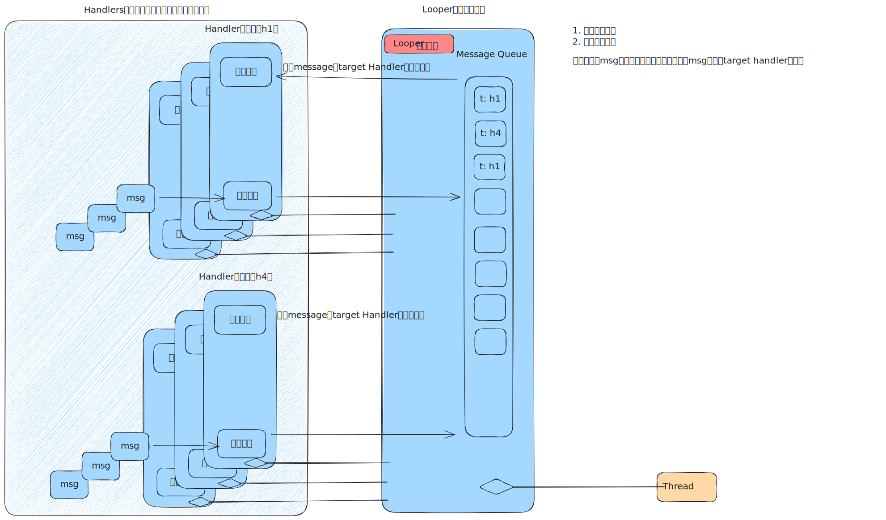

# Message、Handler和Looper

## Handler和Looper



如上图所示，Looper是核心，它持有线程资源，并被众多的Handler绑定。

当它开始从消息队列里取出消息并分发时，会调用消息的处理Handler的处理逻辑，这就相当于将自己的线程资源，按照消息队列的顺序，分配给了各个Handler去做消息处理。

Handler是某类消息的处理逻辑入口，当进入到Handler时，这个消息会根据类型，再被调用到具体的处理函数中。

> 例如，亮度相关的消息，会把自己的处理Handler设置为DPC的Handler（DisplayControllerHandler）。当来到mq的front时，进入到该Handler的处理逻辑入口，会根据消息的类型，直接转向DPC内部的实现。相当于Handler做了一个入口，借来了Looper的线程资源，给DPC用于消息处理。

## Message

Message虽然叫message，实际上可以认为是一个异步的task。它内部一定会绑定某个Handler（外部处理function），有时会直接存储了一个function对象。

Looper会让Handler去执行message，这里有一个message被谁执行的优先级：

```Java
    /**
     * Handle system messages here.
     */
    public void dispatchMessage(@NonNull Message msg) {
        if (msg.callback != null) {
            handleCallback(msg);
        } else {
            if (mCallback != null) {
                if (mCallback.handleMessage(msg)) {
                    return;
                }
            }
            handleMessage(msg);
        }
    }
```

1. 直接使用message自带的function对象
2. 使用message绑定的Handler的function对象
3. 使用Handler的空handleMessage函数兜底（或者子类实现的handleMessage）

> 例如，DPC的DisplayControllerHandler，就没设置2，实现了3。
>
> 但是，发给DPC的message，其实不是发给DPC的，因为DPC根本没用上层传来的handler，只是获取了looper来保证线程安全。
>
> 那么，DPC是如何接管到外部的message的？其实外面根本没人给它发消息，而是DMS直接调用的DPC的`putScreenBrightnessSetting`函数：
>
> ```java
> @Override // Binder call
>         public void setBrightness(int displayId, float brightness) {
>             mContext.enforceCallingOrSelfPermission(
>                     Manifest.permission.CONTROL_DISPLAY_BRIGHTNESS,
>                     "Permission required to set the display's brightness");
>             if (!isValidBrightness(brightness)) {
>                 Slog.w(TAG, "Attempted to set invalid brightness" + brightness);
>                 return;
>             }
>             final long token = Binder.clearCallingIdentity();
>             try {
>                 synchronized (mSyncRoot) {
>                     DisplayPowerController dpc = mDisplayPowerControllers.get(displayId);
>                     if (dpc != null) {
>                         // call dpc putScreenBrightnessSetting
>                         dpc.putScreenBrightnessSetting(brightness);
>                     }
>                     mPersistentDataStore.saveIfNeeded();
>                 }
>             } finally {
>                 Binder.restoreCallingIdentity(token);
>             }
>         }
> ```
>
> 然后在DPC内部，再层层调用，最后给自己发一个message：
>
> ```java
> 	// 1. 外部调用
> 	void putScreenBrightnessSetting(float brightnessValue) {
>         putScreenBrightnessSetting(brightnessValue, false);
>     }
> 	
> 	// 2. 由 BrightnessSetting 处理，封装了亮度值的存储与变化通知
> 	private void putScreenBrightnessSetting(float brightnessValue, boolean updateCurrent) {
>         if (!isValidBrightnessValue(brightnessValue)) {
>             return;
>         }
>         if (updateCurrent) {	// false
>             setCurrentScreenBrightness(brightnessValue);
>         }
>         mBrightnessSetting.setBrightness(brightnessValue);	// 这里
>     }
> 
> 	// 3. BrightnessSetting 通知每一个监听它的对象
>     void setBrightness(float brightness) {
>         if (Float.isNaN(brightness)) {
>             Slog.w(TAG, "Attempting to set invalid brightness");
>             return;
>         }
>         synchronized (mSyncRoot) {
>             if (brightness == mBrightness) {
>                 return;
>             }
> 
>             mBrightness = brightness;
>             mPersistentDataStore.setBrightness(mLogicalDisplay.getPrimaryDisplayDeviceLocked(),
>                     brightness);
>             int toSend = Float.floatToIntBits(mBrightness);
>             Message msg = mHandler.obtainMessage(MSG_BRIGHTNESS_CHANGED, toSend, 0);
>             mHandler.sendMessage(msg); // 发送
>         }
>     }
> 
>     private final Handler mHandler = new Handler(Looper.getMainLooper()) {
>         @Override
>         public void handleMessage(Message msg) {
>             if (msg.what == MSG_BRIGHTNESS_CHANGED) {
>                 float brightnessVal = Float.intBitsToFloat(msg.arg1);
>                 notifyListeners(brightnessVal);	// 通知
>             }
>         }
>     };
> 
> 	private void notifyListeners(float brightness) {
>         for (BrightnessSettingListener l : mListeners) {
>             l.onBrightnessChanged(brightness);	// 逐个通知
>         }
>     }
> 
> 	// ...
> 
> 	// 3. 最终调用到send message
>     private void sendUpdatePowerStateLocked() {
>         if (!mStopped && !mPendingUpdatePowerStateLocked) {
>             mPendingUpdatePowerStateLocked = true;
>             Message msg = mHandler.obtainMessage(MSG_UPDATE_POWER_STATE);
>             mHandler.sendMessage(msg);
>         }
>     }
> ```
>
> 最后当looper处理到这个消息时，再转给DPC：
>
> ```java
>     private final class DisplayControllerHandler extends Handler {
>         public DisplayControllerHandler(Looper looper) {
>             super(looper, null, true /*async*/);
>         }
> 
>         @Override
>         public void handleMessage(Message msg) {
>             switch (msg.what) {
>                 case MSG_UPDATE_POWER_STATE:
>                     updatePowerState();
>                     break;
> 
>                 case MSG_PROXIMITY_SENSOR_DEBOUNCED:
>                     debounceProximitySensor();
>                     break;
> 
>                 case MSG_SCREEN_ON_UNBLOCKED:
>                     if (mPendingScreenOnUnblocker == msg.obj) {
>                         unblockScreenOn();
>                         updatePowerState();
>                     }
>                     break;
>                 case MSG_SCREEN_OFF_UNBLOCKED:
>                     if (mPendingScreenOffUnblocker == msg.obj) {
>                         unblockScreenOff();
>                         updatePowerState();
>                     }
>                     break;
>                 case MSG_CONFIGURE_BRIGHTNESS:
>                     mBrightnessConfiguration = (BrightnessConfiguration) msg.obj;
>                     updatePowerState();
>                     break;
> 
>                 case MSG_SET_TEMPORARY_BRIGHTNESS:
>                     // TODO: Should we have a a timeout for the temporary brightness?
>                     mTemporaryScreenBrightness = Float.intBitsToFloat(msg.arg1);
>                     updatePowerState();
>                     break;
> 
>                 case MSG_SET_TEMPORARY_AUTO_BRIGHTNESS_ADJUSTMENT:
>                     mTemporaryAutoBrightnessAdjustment = Float.intBitsToFloat(msg.arg1);
>                     updatePowerState();
>                     break;
> 
>                 case MSG_IGNORE_PROXIMITY:
>                     ignoreProximitySensorUntilChangedInternal();
>                     break;
> 
>                 case MSG_STOP:
>                     cleanupHandlerThreadAfterStop();
>                     break;
> 
>                 case MSG_UPDATE_BRIGHTNESS:
>                     if (mStopped) {
>                         return;
>                     }
>                     handleSettingsChange(false /*userSwitch*/);
>                     break;
>             }
>         }
>     }
> ```
>
>