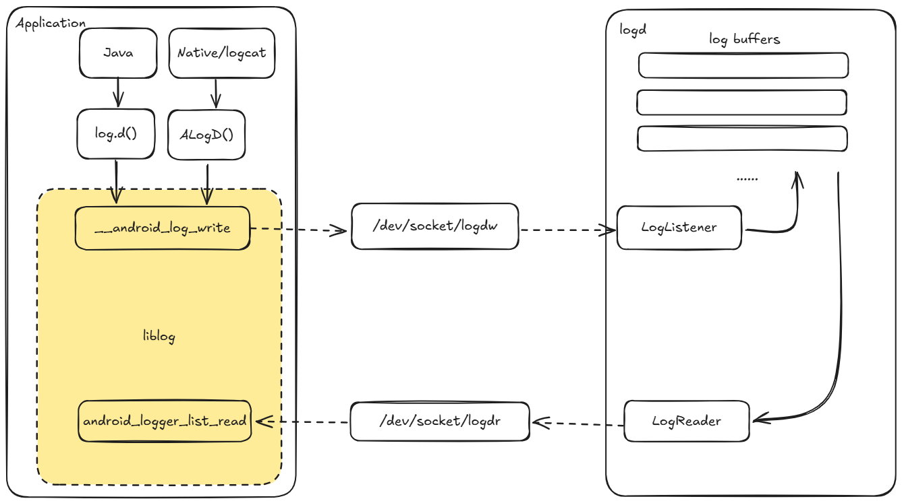

# logcat

## 核心CS架构

logcat是Android核心的日志系统，其底层是liblog和logd，其中liblog作为客户端，logd作为服务端。

上层的Java或native进程，包括logcat进程本身，都是通过liblog作为客户端，对logd进行读写。读写通过socket进行。



## buffer

logd通过环形buffer来存储log数据，不同类型的log存储在对应的buffer中，如下所示：

```C++
typedef enum log_id {
  /** For internal use only.  */
  LOG_ID_MIN = 0,

  /** The main log buffer. This is the only log buffer available to apps. */
  LOG_ID_MAIN = 0,
  /** The radio log buffer. */
  LOG_ID_RADIO = 1,
  /** The event log buffer. */
  LOG_ID_EVENTS = 2,
  /** The system log buffer. */
  LOG_ID_SYSTEM = 3,
  /** The crash log buffer. */
  LOG_ID_CRASH = 4,
  /** The statistics log buffer. */
  LOG_ID_STATS = 5,
  /** The security log buffer. */
  LOG_ID_SECURITY = 6,
  /** The kernel log buffer. */
  LOG_ID_KERNEL = 7,

  /** For internal use only.  */
  LOG_ID_MAX,

  /**
   * Let the logging library choose the best log target in cases where it's
   * unclear. This is useful if you're generic library code that can't know
   * which log your caller should use.
   */
  LOG_ID_DEFAULT = 0x7FFFFFFF
} log_id_t;
```

* main buffer：主要的日志缓冲区，应用程序打印日志
* radio buffer：通讯模块专用
* events buffer：系统日志，在`system_server`中常用
* crash buffer：记录进程crash信息
* stats buffer：记录系统统计信息，不常用
* security buffer：记录安全事件信息，不常用
* kernel buffer：记录内核日志，与`kmsg`打通

## C++使用liblog

```C++
#define LOG_TAG "MYLOG"

#include <android/log.h>

ALOGV("This is a verbose log");
ALOGD("This is a debug log");
ALOGI("This is a info log");
ALOGW("This is a warning log");
ALOGE("This is a error log");
```

## Java使用liblog

### 应用层

```java
import android.util.Log;

static final String TAG = "MYLOG";

Log.v(TAG, "This is a verbose log");
Log.d(TAG, "This is a debug log");
Log.i(TAG, "This is a info log");
Log.w(TAG, "This is a warning log");
Log.e(TAG, "This is a error log");
```

### framework层

```java
import android.util.Slog;

static final String TAG = "MYLOG";

SLog.v(TAG, "This is a verbose log");
SLog.d(TAG, "This is a debug log");
SLog.i(TAG, "This is a info log");
SLog.w(TAG, "This is a warning log");
SLog.e(TAG, "This is a error log");
```