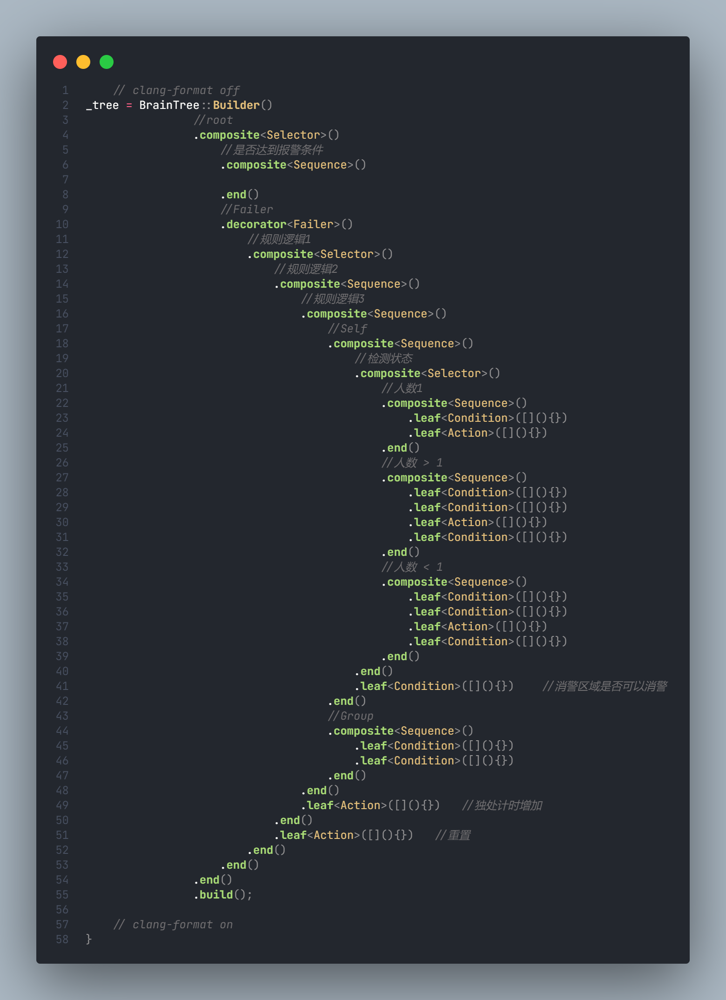

# 行为树(BrainTree)

## github链接

* [arvidsson/BrainTree: C++ behavior tree single header library](https://github.com/arvidsson/BrainTree)

## 补充说明-实践改进方向

实践发现，编写起来不方便自动格式化，且end语法在嵌套太多的情况下难以对上。如下图



完全可以通过其它方法进行省略，例如使用构造函数的方法进行改造，使用效果如下：

```C++
auto tree = BrainTree::Builder(
        composite<BrainTree::sequence>(
            leaf<Action>()
            leaf<Action>()
        )
    ).build();
```