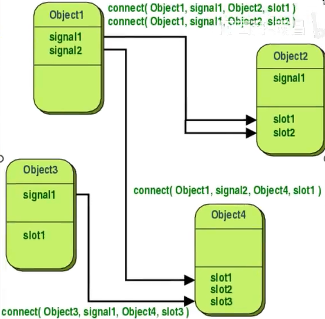
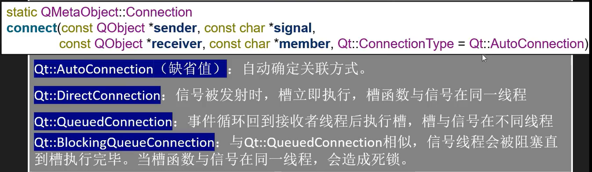

## 事件与信号

> 所有的GUI应用程序都是事件驱动的。事件主要由应用程序的用户生成，但也可以通过其它方式生成，例如Internet连接、窗口管理器或计时器。当调用exec方法时，应用程序进入主循环，主循环获取事件并将其发送给对象。

#### 信号与槽

* Qt具有独特的信号与插槽机制。这种信号和插槽机制是对C++的扩展
* 信号和槽用于对象之间的通信。
* slot是一种普通的C++函数；当与之相连的信号发出，该函数会被调用。
	* 使用connect将一个对象的信号与另一个对象的槽相连



##### 连接信号与槽的方法

> 使用connect函数连接，区别在于传递的参数

* 使用成员函数指针（推荐）

```c++
connect(sender,&QObject::destroyed,this,&MyObject::objectDestoryed);
```

优点：

1.允许编译器检查信号是否与槽的参数兼容

2.编译器可以隐式转换参数

---

* 使用仿函数或lambda表达式作为solt

```c++
connect(sender,&QObject::destoryed,this,[=](){this->m_objects.remove(sender);});
```

**注意：this指针用于在对象销毁时自动disconnect这个对象的槽，防止信号指向未知的情况**

---

* 使用SIGNAL和SLOT宏
	* 如果参数具有默认值，传递给SIGNAL()宏的签名的参数不得少于传递给SLOT()宏的签名的参数

```c++
connect(sender,SIGNAL(destroyed(QObject*)),this,SLOT(objectDestroyed(QObject*)));		//正确
connect(sender,SIGNAL(destroyed(QObject*)),this,SLOT(objectDestroyed()));				//正确
connect(sender,SIGNAL(destroyed()),this,SLOT(objectDestroyed()));						//正确

connect(sender,SIGNAL(destroyed()),this,SLOT(objectDestroyed(QObject*)));				//错误，不会报错，但在运行时崩溃
```

---

* 其余注意事项
	* connect可以添加Qt::ConnectionType类型的参数，表示信号与槽之间的关联关系(主要在多线程中使用)

