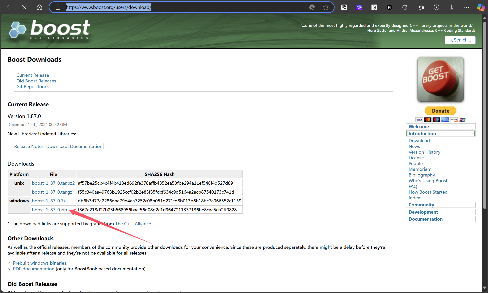

# beast head only使用方法

* 下载boost库：[Boost Downloads](https://www.boost.org/users/download/)



## cmake

* 设置宏`_WIN32_WINNT=0x0601`
* 添加编译指令`/EHsc`（可能导致与异常有关的链接错误）
* 添加头文件库（boost的根目录即可）

```cmake
cmake_minimum_required(VERSION 3.15)

add_compile_definitions(_WIN32_WINNT=0x0601)

project(test_beast)

set(CMAKE_CXX_STANDARD 17)

include_directories("E:/3rdparty/boost_1_84_0")

add_executable(test_beast main.cpp)

set_target_properties(test_beast PROPERTIES COMPILE_FLAGS "/EHsc")
```

## cpp

```c++
#include <boost/beast/core.hpp>
#include <boost/beast/http.hpp>
#include <boost/asio/connect.hpp>
#include <boost/asio/ip/tcp.hpp>
#include <iostream>

namespace beast = boost::beast;
namespace http = beast::http;
namespace net = boost::asio;
using tcp = net::ip::tcp;

int main() {
    net::io_context ioc;

    // 设置一个SSL上下文（如果需要）

    // 设置解析器
    tcp::resolver resolver(ioc);

    // 通过查找的IP地址建立连接
    auto const results = resolver.resolve("www.example.com", "http");

    // 设置HTTP请求
    beast::tcp_stream stream(ioc);
    stream.connect(results);

    http::request<http::string_body> req{http::verb::get, "/", 11};
    req.set(http::field::host, "www.example.com");
    req.set(http::field::user_agent, "Beast");

    // 将HTTP请求发送到远程主机
    http::write(stream, req);

    // 接收HTTP响应
    beast::flat_buffer buffer;
    http::response<http::dynamic_body> res;
    http::read(stream, buffer, res);

    // 打印接收到的HTTP响应
    std::cout << res << std::endl;

    // 优雅地关闭套接字
    beast::error_code ec;
    stream.socket().shutdown(tcp::socket::shutdown_both, ec);

    if (ec && ec != beast::errc::not_connected) {
        std::cerr << "错误：" << ec.message() << std::endl;
        return EXIT_FAILURE;
    }

    return EXIT_SUCCESS;
}

```