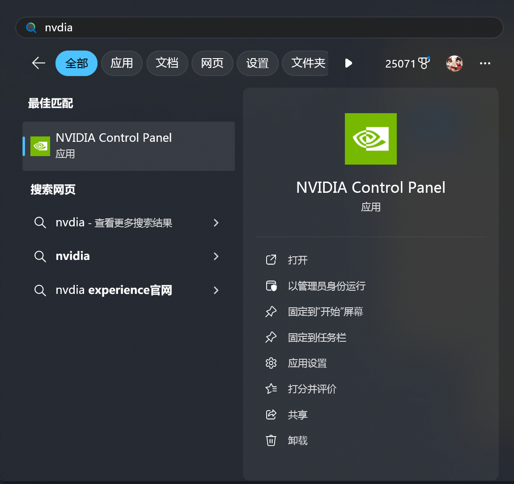
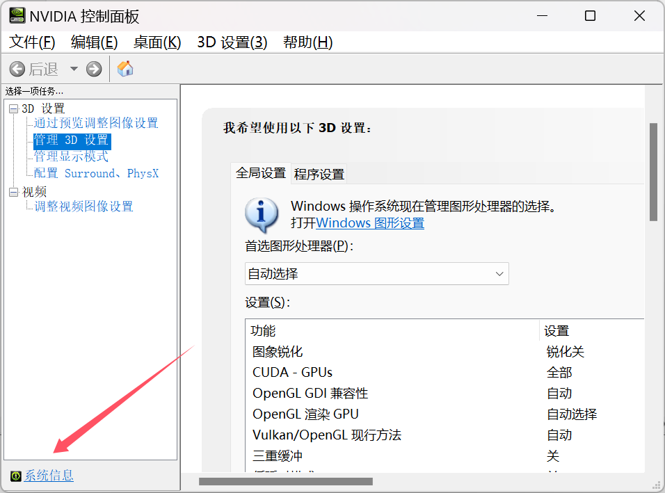
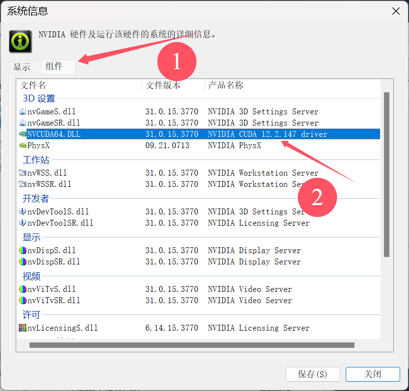
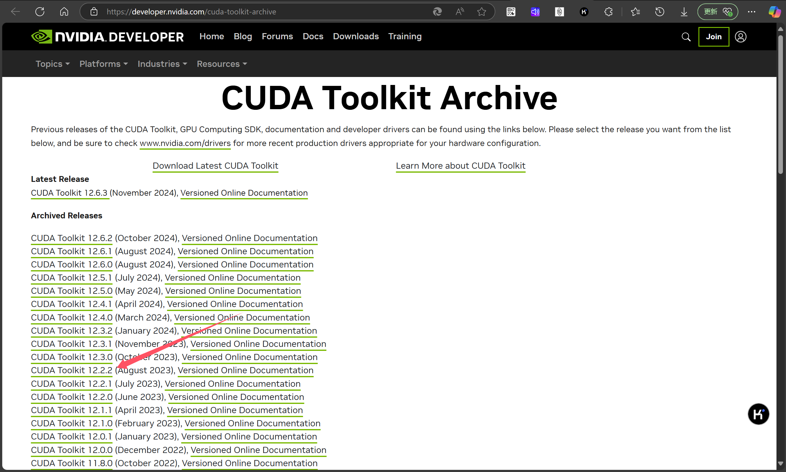
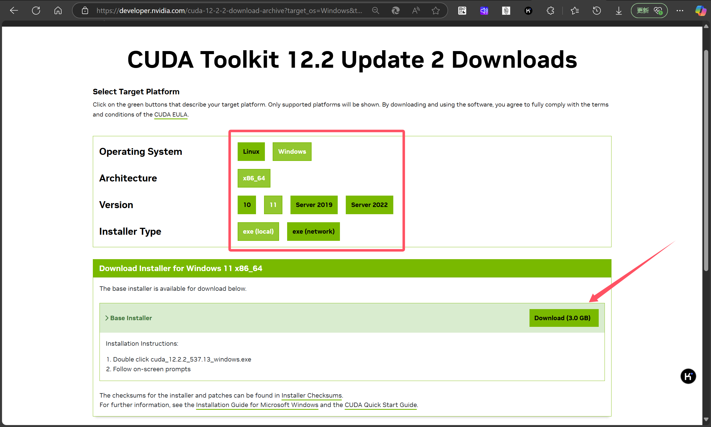

# cuda安装

### 打开nvdia控制面板，查看cuda版本：

### 打开下载官网，找到自己的版本：

* [CUDA Toolkit Archive | NVIDIA Developer](https://developer.nvidia.com/cuda-toolkit-archive)

### 选好系统，下载本地exe:

## 参考资料

* [超详细图文带你手把手安装CUDA和CUDNN，感受GPU的速度 - 知乎](https://zhuanlan.zhihu.com/p/651151335)