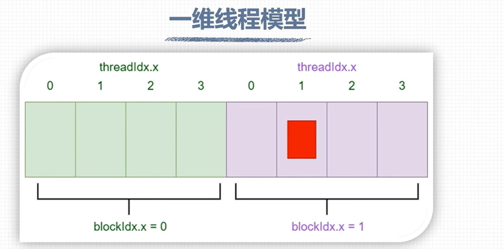

# 一维线程模型

一维线程模型是基础的GPU线程模型，每个线程在核函数中都有一个唯一标识。它由`<<<grid_size, block_size>>>`唯一确定。

## build-in variable

每个线程的`grid_size`和`block_size`保存在`build-in variable`中（无需定义就存在的变量，能直接使用）。

* `gridDim.x`：该变量的数值等于执行配置中变量grid_size的值
* `blockDim.x`：该变量的数值等于执行配置中变量block_size的值

线程的索引也会保存成build-in variable

* `blockIdx.x`：指定一个线程在一个网格中的线程块的索引，范围是0~gridDim.x-1
* `threadIdx.x`：指定一个线程在一个线程块中的线程索引值，范围是0~blockDim.x-1

```C++
kernel_fun<<<2, 4>>>();

gridDim.x = 2;
blockDim.x = 4;
blockIdx.x = 0~1;
threadIdx.x = 0~3;

// 线程唯一标识
Idx= threadIdx.x + blockIdx.x * blockDim.x;
```



## 测试代码

```C++
#include <cstdio>

__global__ void kernel() {
  const int bid = blockIdx.x;
  const int tid = threadIdx.x;

  const int id = threadIdx.x + blockIdx.x * blockDim.x;

  printf("blockIdx.x: %d, threadIdx.x: %d, global id: %d\n", bid, tid, id);
}

int main() {
  kernel<<<2, 4>>>();
  cudaDeviceSynchronize();
  return 0;
}

/*
PS D:\codeSpace\bad_code\test_cuda\build\Debug> ."D:/codeSpace/bad_code/test_cuda/build/Debug/main.exe"
blockIdx.x: 1, threadIdx.x: 0, global id: 4
blockIdx.x: 1, threadIdx.x: 1, global id: 5
blockIdx.x: 1, threadIdx.x: 2, global id: 6
blockIdx.x: 1, threadIdx.x: 3, global id: 7
blockIdx.x: 0, threadIdx.x: 0, global id: 0
blockIdx.x: 0, threadIdx.x: 1, global id: 1
blockIdx.x: 0, threadIdx.x: 2, global id: 2
blockIdx.x: 0, threadIdx.x: 3, global id: 3
*/
```