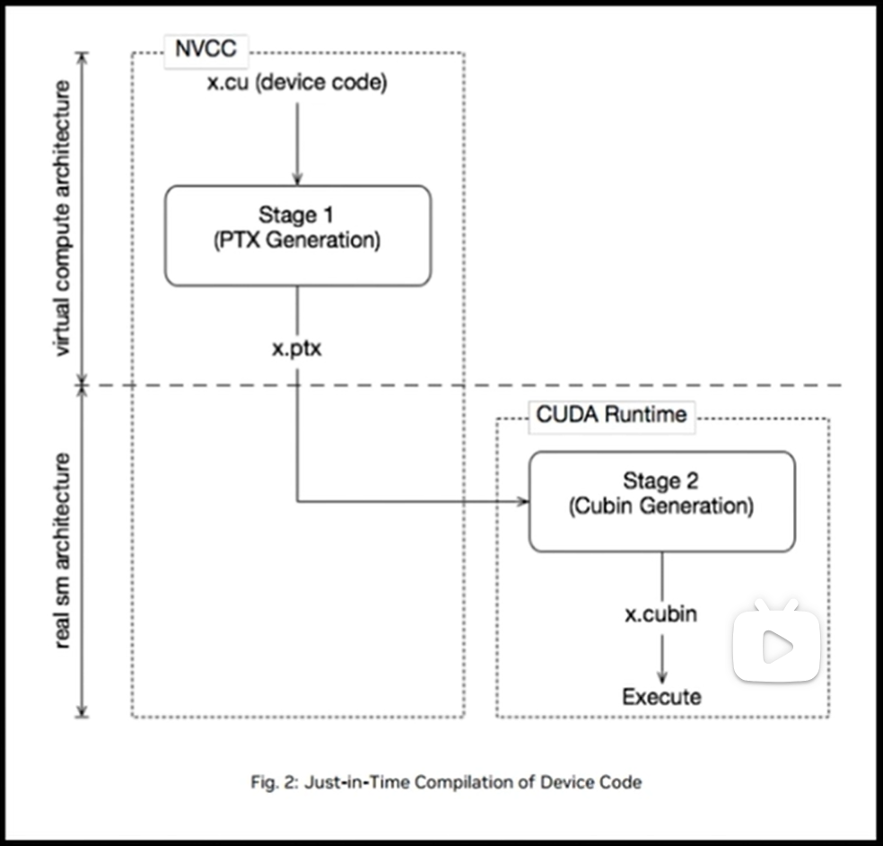

# nvcc计算能力指令（虚拟架构与真实架构）

## 默认计算能力

如果不指定虚拟架构和真实架构的指令，则会默认指定一个：

| 版本                 | 计算能力        |
| -------------------- | --------------- |
| `cuda6.0及其以前`    | 默认计算能力1.0 |
| `cuda6.5~~~cuda8.0`  | 默认计算能力2.0 |
| `cuda9.0~~~cuda10.2` | 默认计算能力3.0 |
| `cuda11.6`           | 默认计算能力5.2 |

通过生成ptx并查看也能观察到本地cuda的默认计算能力：

```shell
nvcc hello_world.cu -ptx
cat hello_world.ptx		# 查看.target行的默认计算能力：.target sm_52
```

## 1. 虚拟架构

虚拟架构与GPU硬件无关，只是将C/C++源码转为PTX。

使用`-arch=compute_XY`编译指令指定虚拟架构。如果只指定了虚拟架构，则可以在任意计算能力>=XY的GPU上运行。（XY代表版本号，例如61代表6.1）

```shell
nvcc hello_world.cu -o hello_world -arch=compute_61
```

## 2. 真实架构

真实架构必须在对应的GPU上才能指定，因为PTX指定转为cubin二进制代码与具体的GPU架构有关。

使用`-code=sm_XY`编译指令指定真实架构。

注意：如果指定了`-code=sm_ZW`，就要指定`-arch=compute_XY`。且`ZW>=XY`，`Z=X`。（即大版本互相不兼容，小版本高版本兼容）

```shell
nvcc hello_world.cu -o hello_world -arch=compute_61 -code=sm_62
```

## 多版本兼容指令

可以将代码编译成允许多个GPU兼容的二进制cubin代码，体积也会随之增加。

首先需要了解本机cuda支持的计算能力上下限，例如：cuda11.6支持3.5、5.0、6.0、7.0。

然后使用编译选项`-gencode arch=compute_XY,code=sm_XY`：

```shell
nvcc hello_world.cu -o hello_world_fat -gencode arch=compute_35,code=sm_35 -gencode arch=compute_50,code=sm_50 -gencode arch=compute_60,code=sm_60 -gencode arch=compute_70,code=sm_70
```

生成出来的二进制cubin代码可以在支持以上这些计算能力的GPU上运行。

## nvcc即时编译

可以在运行可执行文件时，通过保留的PTX代码临时编译出cubin文件。

* 优点：即时编译允许程序在编译时尚未问世的GPU上运行，只要运行时的GPU驱动程序支持，程序就可以通过即时编译生成适合该GPU的二进制代码
* 缺点：即时编译会在程序运行时进行，增加了程序的启动时间。不过，可以通过编译缓存来缓解这一问题。



通过编译指令保留PTX代码虚拟架构：

```shell
-gencode arch=compute_XY,code=compute_XY
```

* 两个计算能力都是虚拟架构计算能力
* 两个虚拟架构计算能力必须一致