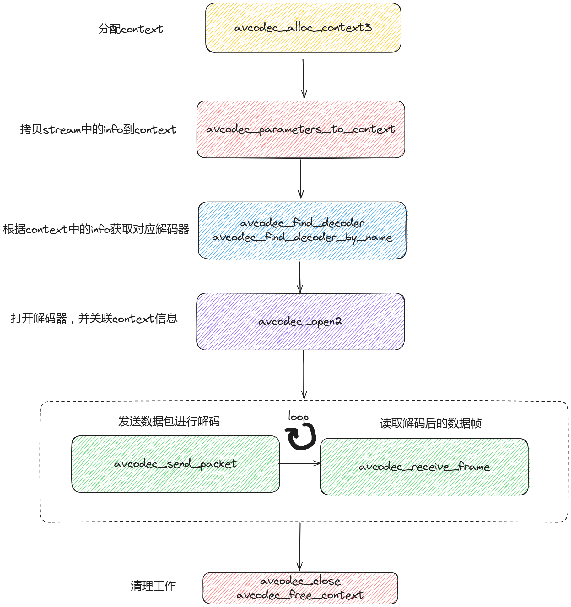

# 解码函数



## **avcodec_alloc_context3()**

- 函数原型:
  ```c
  AVCodecContext *avcodec_alloc_context3(const AVCodec *codec);
  ```
- 参数说明:
  - `codec`: 指向 `AVCodec` 结构的指针，表示要使用的解码器或编码器。
- 使用示例:
  ```c
  AVCodecContext *codec_ctx;
  AVCodec *codec = avcodec_find_decoder(AV_CODEC_ID_H264);
  codec_ctx = avcodec_alloc_context3(codec);
  ```

## **avcodec_find_decoder()**

- 函数原型:
  ```c
  const AVCodec *avcodec_find_decoder(enum AVCodecID id);
  ```
- 参数说明:
  - `id`: 要查找的解码器的 ID。
- 使用示例:
  ```c
  const AVCodec *codec = avcodec_find_decoder(AV_CODEC_ID_AAC);
  ```

## **avcodec_find_decoder_by_name()**

- 函数原型:
  ```c
  const AVCodec *avcodec_find_decoder_by_name(const char *name);
  ```
- 参数说明:
  - `name`: 要查找的解码器的名称。
- 使用示例:
  ```c
  const AVCodec *codec = avcodec_find_decoder_by_name("h264");
  ```

## **avcodec_open2()**

- 函数原型:
  ```c
  int avcodec_open2(AVCodecContext *avctx, const AVCodec *codec, AVDictionary **options);
  ```
- 参数说明:
  - `avctx`: 指向 `AVCodecContext` 结构的指针，表示解码器上下文。
  - `codec`: 指向 `AVCodec` 结构的指针，表示要打开的解码器。
  - `options`: 用于传递额外选项的字典。
- 使用示例:
  ```c
  if (avcodec_open2(codec_ctx, codec, NULL) < 0) {
      fprintf(stderr, "Could not open codec\n");
      exit(1);
  }
  ```

## ~~**avcodec_decode_video2()**~~ -- deprecated

- 函数原型:
  ```c
  int avcodec_decode_video2(AVCodecContext *avctx, AVFrame *picture,
                            int *got_picture_ptr, AVPacket *avpkt);
  ```
- 参数说明:
  - `avctx`: 指向 `AVCodecContext` 结构的指针。
  - `picture`: 用于存储解码后视频帧的 `AVFrame` 结构。
  - `got_picture_ptr`: 非零表示 `picture` 包含一个有效的帧。
  - `avpkt`: 包含要解码数据的 `AVPacket`。
- 使用示例:
  ```c
  AVFrame *frame = av_frame_alloc();
  int got_picture = 0;
  while (avcodec_decode_video2(codec_ctx, frame, &got_picture, &pkt) >= 0) {
      if (got_picture) {
          // 处理解码后的帧
      }
  }
  av_frame_free(&frame);
  ```

## ~~**avcodec_decode_audio4()**~~ -- deprecated

- 函数原型:
  ```c
  int avcodec_decode_audio4(AVCodecContext *avctx, AVFrame *frame,
                            int *got_frame_ptr, const AVPacket *avpkt);
  ```
- 参数说明与 `avcodec_decode_video2` 类似，但用于音频解码。

## **avcodec_send_packet()**

- 函数原型:
  ```c
  int avcodec_send_packet(AVCodecContext *avctx, const AVPacket *avpkt);
  ```
- 参数说明:
  - `avctx`: 指向 `AVCodecContext` 结构的指针。
  - `avpkt`: 包含要发送给解码器的数据包。
- 使用示例:
  ```c
  if (avcodec_send_packet(codec_ctx, &pkt) != 0) {
      fprintf(stderr, "Error sending a packet for decoding\n");
  }
  ```

## **avcodec_receive_frame()**

- 函数原型:
  ```c
  int avcodec_receive_frame(AVCodecContext *avctx, AVFrame *frame);
  ```
- 参数说明:
  - `avctx`: 指向 `AVCodecContext` 结构的指针。
  - `frame`: 用于接收解码后数据的 `AVFrame` 结构。
- 使用示例:
  ```c
  AVFrame *frame = av_frame_alloc();
  while (avcodec_receive_frame(codec_ctx, frame) >= 0) {
      // 处理解码后的帧
  }
  av_frame_free(&frame);
  ```

## **avcodec_free_context()**

- 函数原型:
  ```c
   void avcodec_free_context(AVCodecContext **avctx);
- 参数说明:
  - `avctx`: 指向 `AVCodecContext` 结构指针的指针。
- 使用示例:
  ```c
  avcodec_free_context(&codec_ctx);

## **avcodec_close()**

- 函数原型:
  ```c
  void avcodec_close(AVCodecContext *avctx);
  ```
- 参数说明:
  - `avctx`: 指向 `AVCodecContext` 结构的指针。
- 使用示例:
  ```c
  avcodec_close(codec_ctx);
  ```