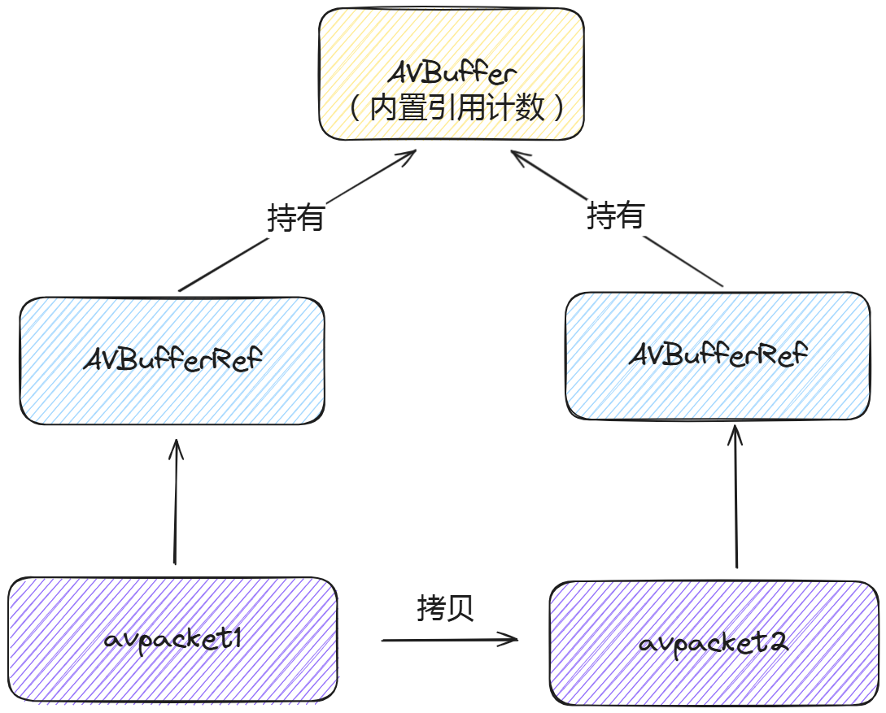

# AVPacket数据模型与API

## 内存模型



​	每一个AVPacket内含一个AVBufferRef的引用，指向真正的数据存储区域AVBuffer:

```C
struct AVBufferRef {	// AVPacket
    AVBuffer* buf;
}

struct AVBuffer {
    uint8_t *data;
    int size;
    atomic_uint refcount;	//引用计数
}
```

## 常用API

| 函数原型                                                 | 说明                                                         |
| -------------------------------------------------------- | ------------------------------------------------------------ |
| `AVPacket *av_packet_alloc(void);`                       | 分配 `AVPacket` 结构体。此时与数据缓冲区无关。               |
| `void av_packet_free(AVPacket **pkt);`                   | 释放 `AVPacket`。与 `av_packet_alloc` 对应。                 |
| `void av_init_packet(AVPacket *pkt);`                    | 初始化 `AVPacket`。只是单纯初始化 `pkt` 字段。               |
| `int av_new_packet(AVPacket *pkt, int size);`            | 给 `AVPacket` 的 `buf` 分配内存，引用计数初始化为 1。`av_init + set buf` |
| `int av_packet_ref(AVPacket *dst, const AVPacket *src);` | 增加引用计数。                                               |
| `void av_packet_unref(AVPacket *pkt);`                   | 减少引用计数。                                               |
| `void av_packet_move_ref(AVPacket *dst, AVPacket *src);` | 转移引用计数。`dst`指向了`src`数据，`src`重置。              |
| `AVPacket *av_packet_clone(const AVPacket *src);`        | 等同于 `av_packet_alloc() + av_packet_ref()` 的操作。        |

## example

### av_packet_alloc和av_packet_free

```C++
AVPacket *pkt = NULL;
pkt = av_packet_alloc();
int ret = av_new_packet(pkg, 1024);	// av_init + set buf

av_packet_free(&pkt);		// 无需调用av_packet_unref，因为free内部调用了unref
```

### av_init_packet

​	用于初始化pkt，但是可以被av_new_packet省略。

```C++
AVPacket *pkt = NULL;
pkt = av_packet_alloc();

av_init_packet(pkt);	// 可省略，因为没init也会在av_new_packet中init
int ret = av_new_packet(pkg, 1024);
av_packet_free(&pkt);
```

​	另一种用法是直接用`=`复制pkt结构体时，由于没有增加引用，因此多了一个pkt，需要用init来干掉。实现类似move_ref的效果。

```C++
AVPacket *pkt1 = NULL;
AVPacket *pkt2 = NULL;
pkt1 = av_packet_alloc();
pkt2 = av_packet_alloc();

int ret = av_new_packet(pkt1, 1024);

*pkt2 = *pkt1;	// ref:1 && but copy, should be 2
av_init_packet(pkt1);	// ref:1 && ok

av_packet_free(&pkt1);
av_packet_free(&pkt2);
```

**warning**

​	不要在已经有buf的AVPacket调用av_init_packet！其会置空内部buf，但不会释放buf。

```C++
AVPacket *pkt = NULL;
pkt = av_packet_alloc();
int ret = av_new_packet(pkg, 1024);

av_init_packet(pkt);	// warning!!!
av_packet_free(&pkt);
```

### av_packet_move_ref

```C++
AVPacket *pkt1 = NULL;
AVPacket *pkt2 = NULL;
pkt1 = av_packet_alloc();
pkt2 = av_packet_alloc();	// must alloc

int ret = av_new_packet(pkt1, 1024);
av_packet_move_ref(pkt2, pkt1);		// pkt1 -> pkt2	&& clear pkt1->buf 

av_packet_free(&pkt1);
av_packet_free(&pkt2);
```

### av_packet_clone

```C++
AVPacket *pkt1 = NULL;
AVPacket *pkt2 = NULL;
pkt1 = av_packet_alloc();

int ret = av_new_packet(pkt1, 1024);
pkt2 = av_packet_clone(pkt1);	// alloc + ref

av_packet_free(&pkt1);
av_packet_free(&pkt2);
```

### av_packet_ref和av_packet_unref

```C++
AVPacket *pkt1 = NULL;
AVPacket *pkt2 = NULL;
pkt1 = av_packet_alloc();

int ret = av_new_packet(pkt1, 1024);	// ref:1
av_packet_ref(pkt2, pkt1);	// ref:2

av_packet_unref(pkt1);	// ref:1 && clear pkt->buf
av_packet_unref(pkt1);	// ref:1 -> unable to unref, buf not found 

av_packet_unref(pkt2);	// ref:0

av_packet_free(&pkt1);
av_packet_free(&pkt2);
```