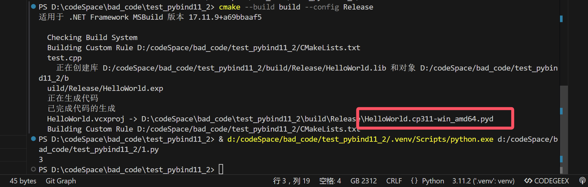
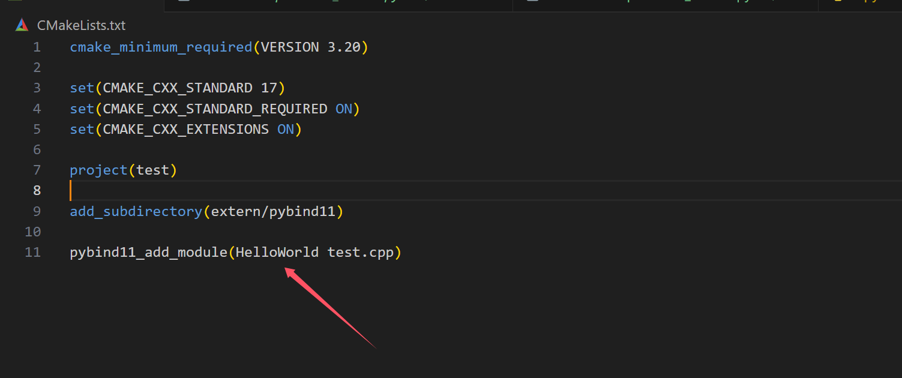
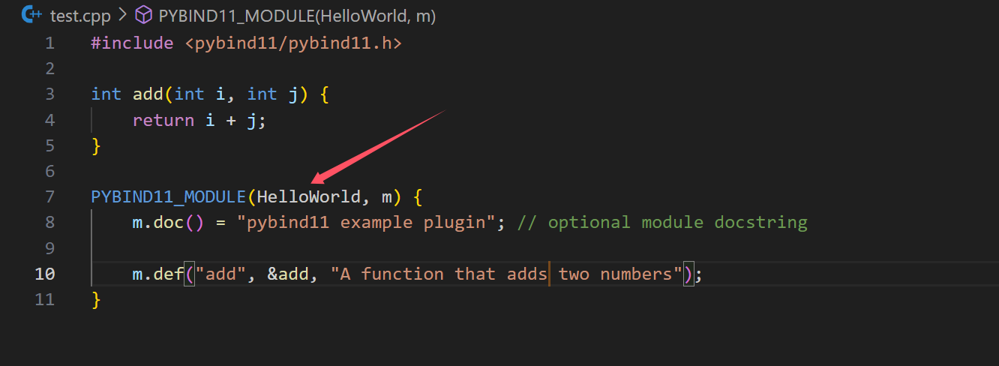

# pybind11 | install & usage

## 测试用的python代码

```python
import HelloWorld as hw

print(hw.add(1,2))
```

---

下面是正文：

## 注意事项（特别注意）

* 必须使用Release编译！（Debug会报错：python311.lib not found）
* 建立venv（用于指定你想用的那个python），并且使用命令行的cmake进行手动编译（否则可能会找到电脑上某个奇奇怪怪的python版本上去）



* CMakeLists.txt中的`module_name`与cpp中`module_name`的保持一致



## submodule方法（推荐）

## 1. 下载pybind11

```shell
git init .
git submodule add -b stable git@github.com:pybind/pybind11.git extern/pybind11
git submodule update --init

# 或者
mkdir extern && cd extern
git clone git@github.com:pybind/pybind11.git
```

## 2. 导入pybind

```cmake
cmake_minimum_required(VERSION 3.20)

# 警告：一定是Release
set(CMAKE_BUILD_TYPE "Release")

set(CMAKE_CXX_STANDARD 17)
set(CMAKE_CXX_STANDARD_REQUIRED ON)
set(CMAKE_CXX_EXTENSIONS ON)

project(test)

add_subdirectory(extern/pybind11)

pybind11_add_module(example test.cpp)
```

## vcpkg方法（需要额外编译，太慢了）

## 1. vcpkg.json

```
{
    "dependencies": [
      "pybind11"
    ]
  }
```

## 2. cmake

```cmake
cmake_minimum_required(VERSION 3.20)

# 警告：一定是Release
set(CMAKE_BUILD_TYPE "Release")

set(CMAKE_CXX_STANDARD 17)
set(CMAKE_CXX_STANDARD_REQUIRED ON)

project(test)

set(PYBIND11_FINDPYTHON ON)
find_package(pybind11 CONFIG REQUIRED)

pybind11_add_module(HelloWorld test.cpp)
```