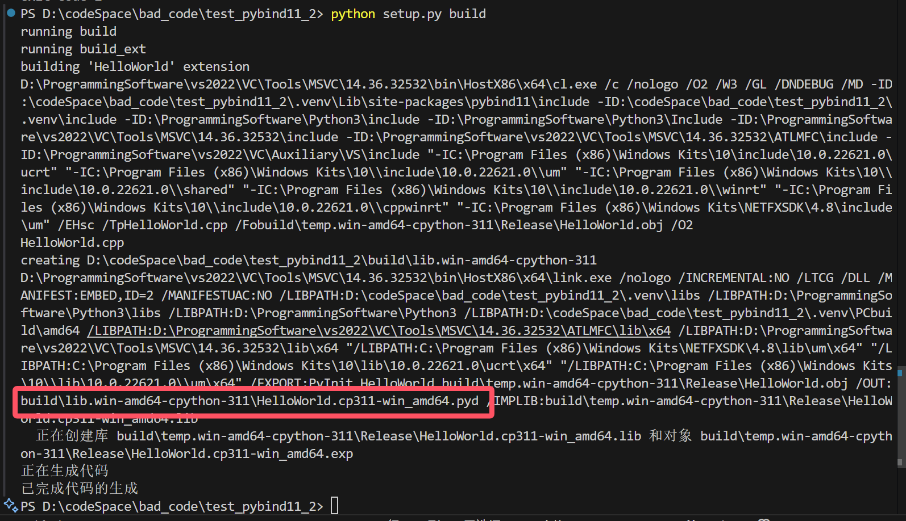

# pybind11 | install & usage

## 测试用的python代码

```python
import HelloWorld as hw

print(hw.add(1,2))
```

---

## 安装pybind11

```shell
pip install pybind11
```

## HelloWorld.cpp

```cpp
#include <pybind11/pybind11.h>

namespace py = pybind11;

int add(int i, int j) {
    return i + j;
}

PYBIND11_MODULE(HelloWorld, m) {
    m.doc() = "pybind11 example plugin"; // optional module docstring

    m.def("add", &add, "A function which adds two numbers");
}
```

## setup.py

#### Windows(MSVC)

```python
from setuptools import setup, Extension
import os

functions_module = Extension(
    name='HelloWorld',
    sources=['HelloWorld.cpp'],
    extra_compile_args=["/O2"],	# MSVC 最大优化O2, 默认PIC
    include_dirs=[
        # 拼接成绝对路径
        os.path.join(os.getcwd(), '.venv\\Lib\\site-packages\\pybind11\\include'), 
    ],
)

setup(ext_modules=[functions_module])
```

#### Linux(g++)

```python
from setuptools import setup, Extension
import os

functions_module = Extension(
    name='HelloWorld',
    sources=['HelloWorld.cpp'],
    extra_compile_args=["-O3","-fPIC"],
    include_dirs=[
        # 拼接成绝对路径
        os.path.join(os.getcwd(), '.venv/Lib/site-packages/pybind11/include'
    ],
)

setup(ext_modules=[functions_module])
```

## 执行命令

```text
python setup.py build
```

可以看到产生了build文件夹，并且里面有so动态库：

