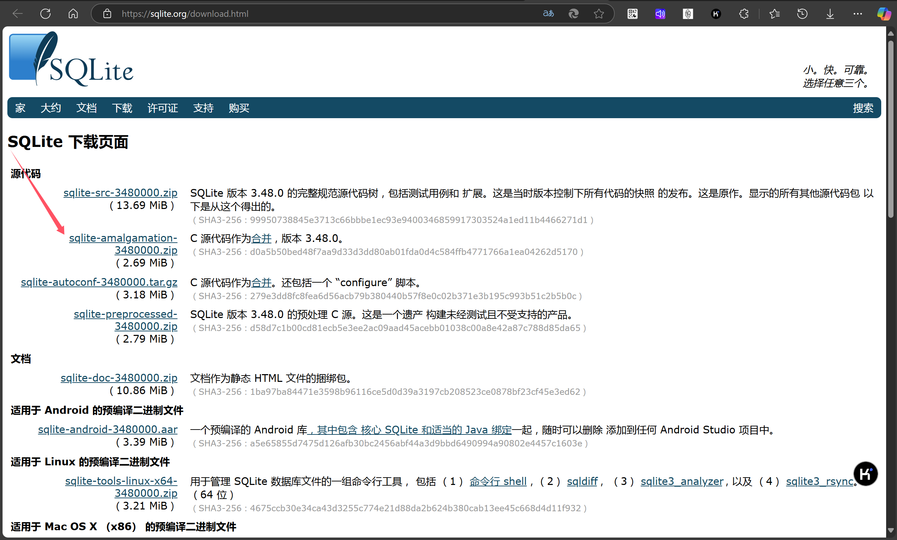

# sqlite获取

* [SQLite 下载页面](https://sqlite.org/download.html)

## dll文件


## lib文件

在DLL文件的解压目录下使用：

```bat
lib /def:sqlite3.def /machine:x64	# /machine:x86
```

生成对应的sqlite.lib文件


## sqlite.h

下载`sqlite-amalgamation-3480000.zip`压缩包，并复制里面的sqlite.h文件即可使用。



## quick start to check

```
yunyin@Yunyin:/mnt/d/codeSpace/bad_code/test_sqlite$ tree .
.
├── CMakeLists.txt
├── main.cpp
├── sqlite3.def
├── sqlite3.dll
├── sqlite3.exp
├── sqlite3.h
└── sqlite3.lib

1 directory, 7 files
```

### cmake(use lib)

```cmake
cmake_minimum_required(VERSION 3.10)
project(SQLiteCppDemo)

# Set C++ standard
set(CMAKE_CXX_STANDARD 11)

# Add executable
add_executable(sqlite_demo main.cpp)

# Include the path to the SQLite3 headers and link to the SQLite3 static library
target_include_directories(sqlite_demo PRIVATE ${CMAKE_SOURCE_DIR})
target_link_libraries(sqlite_demo PRIVATE ${CMAKE_SOURCE_DIR}/sqlite3.lib)	# 使用lib


# Set the output directory for the built executable
set_target_properties(sqlite_demo PROPERTIES RUNTIME_OUTPUT_DIRECTORY ${CMAKE_SOURCE_DIR}/bin)
```

### main.cpp

```c++
#include <iostream>
#include <sqlite3.h>
#include <string>

void executeSQL(sqlite3* db, const char* sql) {
    char* errMsg = nullptr;
    int rc = sqlite3_exec(db, sql, nullptr, nullptr, &errMsg);
    if (rc != SQLITE_OK) {
        std::cerr << "SQL error: " << errMsg << std::endl;
        sqlite3_free(errMsg);
    }
}

int main() {
    sqlite3* db;
    const char* dbName = "henry.db";
    
    // Open the database (creates if not exists)
    int rc = sqlite3_open(dbName, &db);
    if (rc) {
        std::cerr << "Can't open database: " << sqlite3_errmsg(db) << std::endl;
        return rc;
    }
    std::cout << "Opened database successfully" << std::endl;
    
    // SQL statement to create Userinfo table
    const char* createTableSQL = R"(
        CREATE TABLE IF NOT EXISTS Userinfo (
            uid INTEGER PRIMARY KEY,
            uname VARCHAR(64),
            age INTEGER
        );
    )";
    
    executeSQL(db, createTableSQL);
    std::cout << "Table created successfully" << std::endl;

    // Insert 10 rows of sample data
    for (int i = 1; i <= 10; ++i) {
        std::string insertSQL = "INSERT INTO Userinfo (uname, age) VALUES ('User" + std::to_string(i) + "', " + std::to_string(20 + i) + ");";
        executeSQL(db, insertSQL.c_str());
    }
    std::cout << "Inserted 10 rows successfully" << std::endl;

    // Query and print all records
    const char* selectSQL = "SELECT * FROM Userinfo;";
    sqlite3_stmt* stmt;
    rc = sqlite3_prepare_v2(db, selectSQL, -1, &stmt, nullptr);
    if (rc != SQLITE_OK) {
        std::cerr << "Failed to fetch data: " << sqlite3_errmsg(db) << std::endl;
        return rc;
    }

    std::cout << "Querying data..." << std::endl;
    while ((rc = sqlite3_step(stmt)) == SQLITE_ROW) {
        int uid = sqlite3_column_int(stmt, 0);
        const unsigned char* uname = sqlite3_column_text(stmt, 1);
        int age = sqlite3_column_int(stmt, 2);
        std::cout << "UID: " << uid << ", Name: " << uname << ", Age: " << age << std::endl;
    }

    sqlite3_finalize(stmt);
    sqlite3_close(db);
    
    return 0;
}
```

##