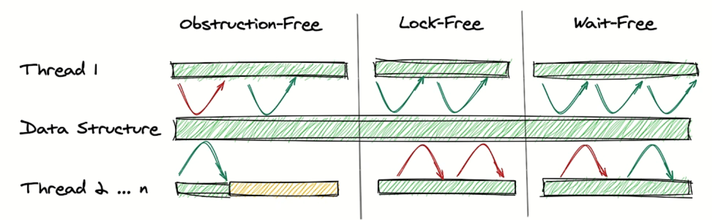
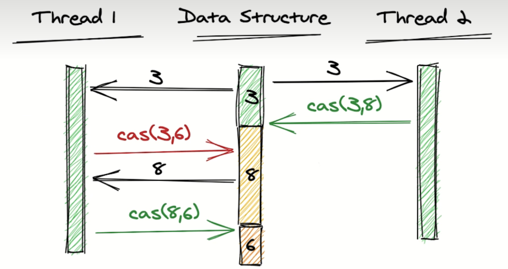

# **lock-free基本概念**

## **1. 非阻塞数据结构介绍**

​	**`lock-free`代表的非阻塞数据结构的三个层级中的第二个。这种数据结构是用来代替锁并发数据结构的，即不用类似与mutex之类的锁来完成的并发实践。它包含三个层级：**

* **无阻塞（obstruction-free）：无阻塞是最基本的非阻塞数据结构级别。在这个级别，我们只要求一个线程在其他所有线程都被挂起时能够继续执行。换句话说，只要其他线程都被暂停，一个线程就不会永远无法继续执行。这与使用锁的情况不同，如果一个线程在等待锁时，持有锁的线程被挂起，等待线程将永远等待下去。**
* **无锁（lock-free）：如果在任何时候至少有一个线程可以继续执行，这个数据结构被称为无锁的。其他线程可能会处于饥饿状态，无法执行。与无阻塞不同的地方在于，即使没有线程被挂起，至少有一个线程可以继续执行。**
* **无等待（wait-free）：如果一个数据结构是无锁的，并且保证每个线程在有限数量的步骤后都可以继续执行，它就被称为无等待的。也就是说，线程不会因为需要等待太长时间而无法继续执行。**

****

​	**图片的第一部分展示了无阻塞，因为一旦我们挂起其他线程（在底部以黄色表示)，线程1(顶部线程）可以立即继续执行（绿色箭头）。**
​	**中间部分展示了无锁。至少线程1可以继续执行，而其他线程可能会陷入饥饿状态（红色箭头）。**
​	**最后部分展示了无等待。在这里，我们保证线程2可以在一定的饥饿期后继续执行（绿色箭头），在此期间可能会有一段时间的饥饿状态（红色箭头）。**

## **2. 非阻塞原语**

### **2.1 Compare and Swap(CAS)**

>**对应C++中atomic的compare_exchange_strong 和 compare_exchange_weak。这两个版本的区别是：Weak版本如果数据符合条件被修改，其也可能返回false，就好像不符合修改状态一致；而Strong版本不会有这个问题，但在某些平台上Strong版本比Weak版本慢；绝大多数情况下，我们应该优先选择使用Strong版本；**

​	**比较并交换的思想是，只有当变量的值仍等于我们最初从主内存读取的值时，才会更新这个变量。CAS是一个原子操作，获取和更新一起作为一个不可分割的单个操作执行。**

****

#### **案例**

##### **无锁多线程栈**

​	**下面是一个使用CAS的无锁多线程栈的案例**

```C++
template<typename _Ty>
struct LockFreeStackT
{
	struct Node
	{
		_Ty val;
		Node* next;
	};
	LockFreeStackT() : head_(nullptr) {}

	void push(const _Ty& val)
	{
		Node* node = new Node{ val, head_.load() };
		while (!head_.compare_exchange_strong(node->next, node)) {
		}
	}

	void pop()
	{
		Node* node = head_.load();
		while (node && !head_.compare_exchange_strong(node, node->next) {
		}
		if (node) delete node;
	}

	std::atomic<Node*> head_;
};
```

#### ABA问题

