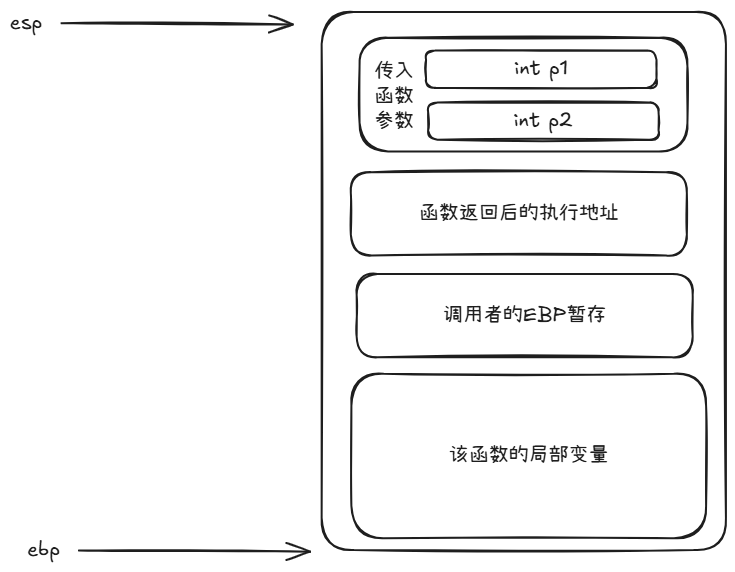
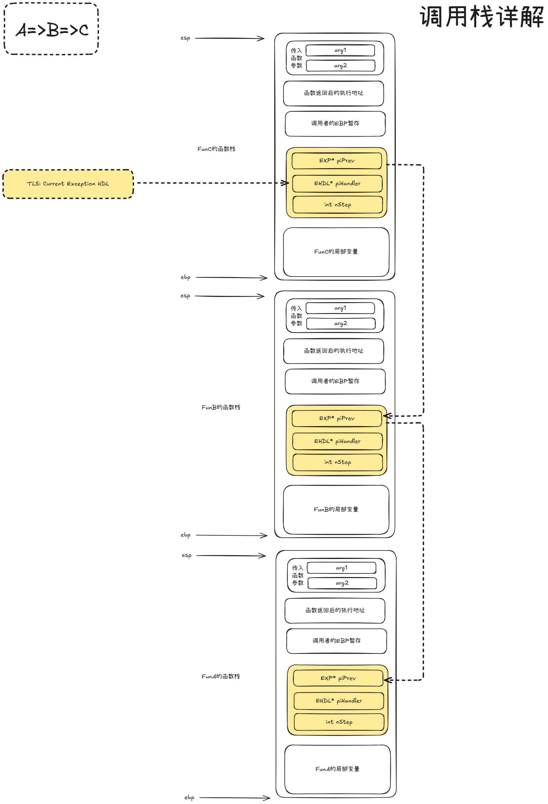

# C语言调用与C++调用的汇编实现

对于`__stdcall`的`test(int p1,int p2)`的汇编代码：执行函数前堆栈指针 ESP 为 N。

## C语言调用

```assembly
push p2 									;参数2入栈, ESP -= 4h , ESP = N - 4h
push p1 									;参数1入栈, ESP -= 4h , ESP = N - 8h
call test 									;压入返回地址 ESP -= 4h, ESP = N - 0Ch
{
push ebp									;保护先前EBP指针， EBP入栈， ESP-=4h, ESP = N - 10h
mov ebp, esp 								;设置EBP指针指向栈顶 N-10h
mov eax, dword ptr [ebp+0ch] 				;ebp+0ch为N-4h,即参数2的位置
mov ebx, dword ptr [ebp+08h] 				;ebp+08h为N-8h,即参数1的位置
sub esp, 8									;局部变量所占空间ESP-=8, ESP = N-18h
...
add esp, 8 									;释放局部变量, ESP+=8, ESP = N-10h
pop ebp 									;出栈,恢复EBP, ESP+=4, ESP = N-0Ch
ret 8 										;ret返回,弹出返回地址,ESP+=4, ESP=N-08h
											;后面加操作数8为平衡堆栈,ESP+=8,ESP=N, 恢复进入函数前的堆栈
}
```

内存栈：（内部的元素顺序反了，但是懒得改了，后面的图也是）



## CPP调用（带有异常处理）

带有异常处理是指下面满足其一：

* 该函数可能会直接或间接地抛出一个异常，即该函数的定义存放在一个 C++ 编译（而不是传统 C）单元内，并且该函数没有使用`throw()`和`noexcept`异常过滤器
* 该函数的定义内使用了 try 块

为了能够成功地捕获异常和正确地完成栈回退（stack unwind），编译器必须要引入一些额外的数据结构和相应的处理机制。引入了异常处理机制的栈框架大概是什么样子：



**需要说明的是**：编译器会为每一个 “C++ 函数”定义一个 EHDL 结构，不过只会为包含了 “try” 块的函数定义 `tblTryBlocks` 成员。此外，异常处理器还会为每个线程维护一个指向当前异常处理框架的指针。该指针指向当前的异常处理器链表，通常存放在某个 TLS 槽或能起到类似作用的地方（见上图）。

```C++
struct UNWINDTBL {
    int nNextIdx;						// 当前回退条目的下一个条目
    void (* pfnDestory)(void* this);	// 析构函数指针
    void* pObj;							// 对应析构的this指针
};

struct CATCHBLOCK {
	// ...
    type_info* piType;		// 该catch块捕获的异常类型
    void* pCatchBlockEntry;	// 该catch块的处理代码起始地址
};

struct TRYBLOCK {
	// ...
    int nBeginStep;		// 属于该try块的nStep的起始范围
    int nEndStep;		// 属于该try块的nStep的终止范围
    CATCHBLOCK tblCatchBlocks[];	// 该try块拥有的catch块表
};

struct EHDL {
    // ...
    UNWINDTBL tblUnwind[];		// 栈回退表
    TRYBLOCK tblTryBlocks[];	// try块表
    // ...
};

struct EXP {
    EXP* piPrev;		// 指向上一个函数栈上的EXP结构体地址
    EHDL* piHandler;	// 异常处理器需要的信息
    int nStep;
};
```