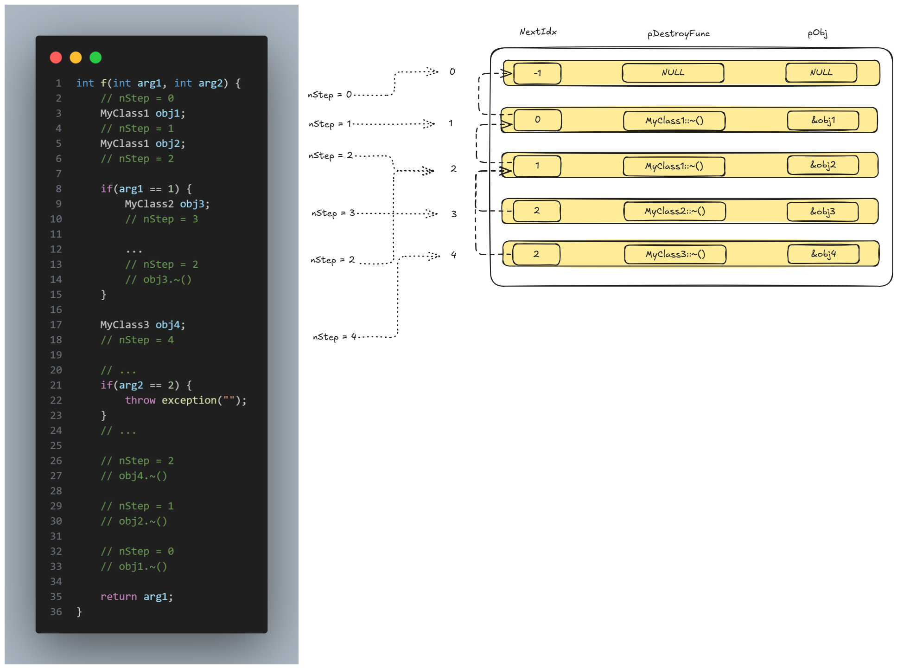

# 栈回退的实现机制（栈回退表）

“栈回退”是伴随异常处理机制引入 C++ 中的一个新概念，主要用来确保在异常被抛出、捕获并处理后，所有生命期已结束的对象都会被正确地析构，它们所占用的空间会被正确地回收。

## 栈回退表和 nStep

* **`nStep` 变量用于跟踪函数内局部对象的构造、析构阶段。再配合编译器为每个函数生成的 `tblUnwind` 表，就可以完成退栈机制。** 
* 表中的 `pfnDestroyer` 字段记录了对应阶段应当执行的析构操作（析构函数指针）
* `pObj` 字段则记录了与之相对应的对象 `this` 指针偏移。将 `pObj` 所指的偏移值加上当前栈框架基址（EBP），就是要代入 `pfnDestroyer` 所指析构函数的 `this` 指针，这样即可完成对该对象的析构工作。
* 而 `nNextIdx` 字段则指向下一个需要析构对象所在的行



**在发生异常时**：

* 异常处理器首先检查当前函数栈框架内的 `nStep` 值，并通过 `piHandler` 取得 `tblUnwind[]` 表。然后将 `nStep` 作为下标带入表中，执行该行定义的析构操作，然后转向由 `nNextIdx` 指向的下一行，直到 `nNextIdx` 为 -1 为止。
* 在当前函数的栈回退工作结束后，异常处理器可沿当前函数栈框架内 `piPrev` 的值回溯到异常处理链中的上一节点重复上述操作，直到所有回退工作完成为止。

```C++
struct UNWINDTBL {
    int nNextIdx;						// 当前回退条目的下一个条目
    void (* pfnDestory)(void* this);	// 析构函数指针
    void* pObj;							// 对应析构的this指针
};

struct EHDL {
    // ...
    UNWINDTBL tblUnwind[];		// 栈回退表
    TRYBLOCK tblTryBlocks[];	// try块表
    // ...
};

struct EXP {
    EXP* piPrev;		// 指向上一个函数栈上的EXP结构体地址
    EHDL* piHandler;	// 异常处理器需要的信息
    int nStep;
};
```

**nStep 的值完全在编译时决定**，运行时仅需执行若干次简单的整形立即数赋值（通常是直接赋值给CPU里的某个寄存器）。