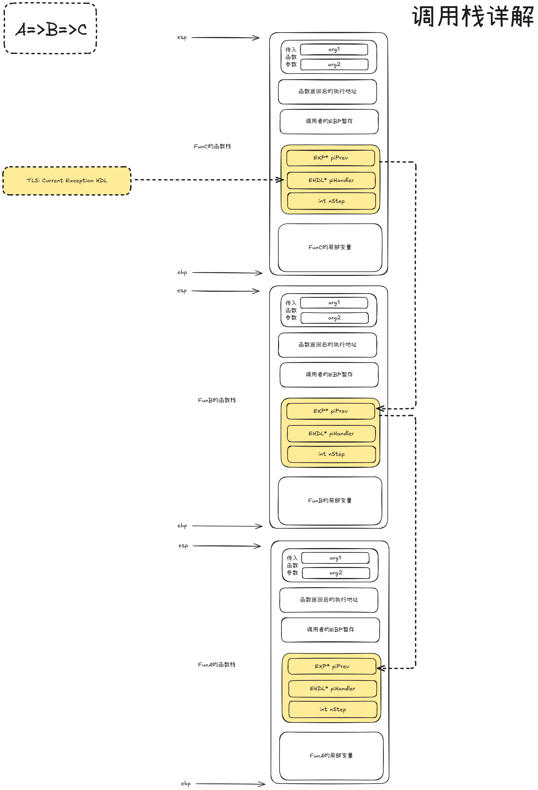

# 异常捕获的实现

> 在上一小节中，我们已经看到了 nStep 变量在跟踪对象构造、析构方面的作用。

实际上 `nStep` 除了能够跟踪对象创建、销毁阶段以外，还能够标识当前执行点是否在 `try` 块中，以及（如果当前函数有多个 try 块的话）究竟在哪个 `try` 块中。

这是通过在每一个 try 块的入口和出口各为 `nStep` 赋予一个唯一 ID 值，并确保 `nStep` 在对应 `try` 块内的变化恰在此范围之内来实现的。

## nStep与try块表（tblTryBlocks[]）

### 正常捕获到异常

在具体实现异常捕获时，首先，C++ 异常处理器检查发生异常的位置是否在当前函数的某个 `try` 块之内。

这项工作可以通过将当前函数的 `nStep` 值依次在 `piHandler` 指向 `tblTryBlocks[]` 表的条目中进行范围为 `[nBeginStep, nEndStep)` 的比对来完成。

在找到对应的try块之后，再在对应的`try`块中查询哪个`catch`的异常类型匹配上了，再从`CATCHBLOCK`中执行对应的异常类型的处理代码：

```C++
struct CATCHBLOCK {
	// ...
    type_info* piType;		// 该catch块捕获的异常类型
    void* pCatchBlockEntry;	// 该catch块的处理代码起始地址
};

struct TRYBLOCK {
	// ...
    int nBeginStep;		// 属于该try块的nStep的起始范围
    int nEndStep;		// 属于该try块的nStep的终止范围
    CATCHBLOCK tblCatchBlocks[];	// 该try块拥有的catch块表
};

struct EHDL {
    // ...
    UNWINDTBL tblUnwind[];		// 栈回退表
    TRYBLOCK tblTryBlocks[];	// try块表
    // ...
};

struct EXP {
    EXP* piPrev;		// 指向上一个函数栈上的EXP结构体地址
    EHDL* piHandler;	// 异常处理器需要的信息
    int nStep;
};
```

### 未能正常捕获异常

否则，则说明异常发生位置不在当前函数的 `try` 块内，或者这个 `try` 块中没有与当前异常相匹配的 `catch` 块。

此时则沿着函数栈框架中 `piPrev` 所指地址（即：异常处理链中的上一个节点）逐级重复以上过程，直至找到一个匹配的 `catch` 块或到达异常处理链的最开始：

