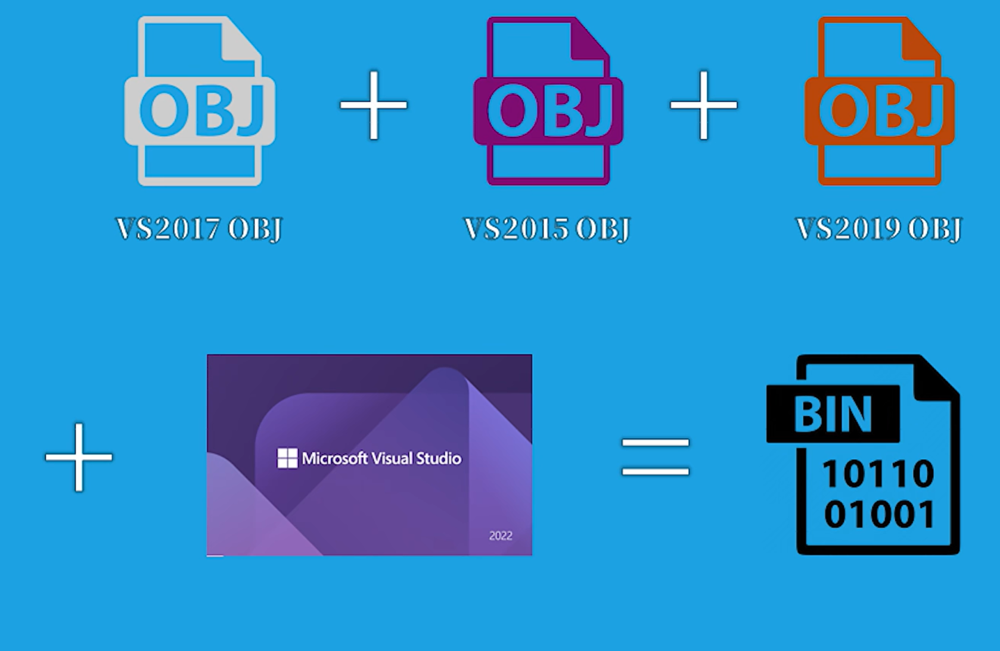

# VS版本

VS的版本分为几个部分：

* VS的IDE年份：往往是显示在软件名字和启动logo上的版本，这代表的是年份，但不代表实际的IDE版本号

* VS的IDE版本号：实际的VS的IDE版本号

* 工具集版本号：链接器版本和工具集版本是一致的

    * 兼容性：从VS2015开始，MSVC对工具集版本进行了兼容性升级，新版本能兼容老版本

        * ABI
        * OBJ 文件格式
        * runtime库

        这意味着：

        1. 可以使用VS2022也能正常使用VS2017编译出来的二进制静态库

        2. 甚至更进一步，可以将一堆VS2015的obj文件、VS2017的obj文件和VS2019的obj文件，使用VS2022一起链接成一个二进制文件。

            

        3. 补充：如果链接选项使用了GL或者LTCG，兼容性就会降低（必须保证工具集的主版本号和此版本号一致）

* 编译器版本号：同样从2015开始保持兼容，在代码中经常使用宏来判断编译器是否支持。

    * `_MSC_VER`：主版本号和次版本号组成，例如：19.39.33519对应的是1939
    * `_MSC_FULL_VER`：完整的版本号，例如：19.39.33519对应的是193933519

| 年份   | IDE版本 | 工具集版本（链接器） | 编译器版本 |
| ------ | ------- | -------------------- | ---------- |
| VS2015 | 14.0    | 14.0                 | 19.0       |
| VS2017 | 15.0    | 14.1                 | 19.10      |
| VS2019 | 16.0    | 14.20                | 19.20      |
| VS2022 | 17.0    | 14.30                | 19.30      |