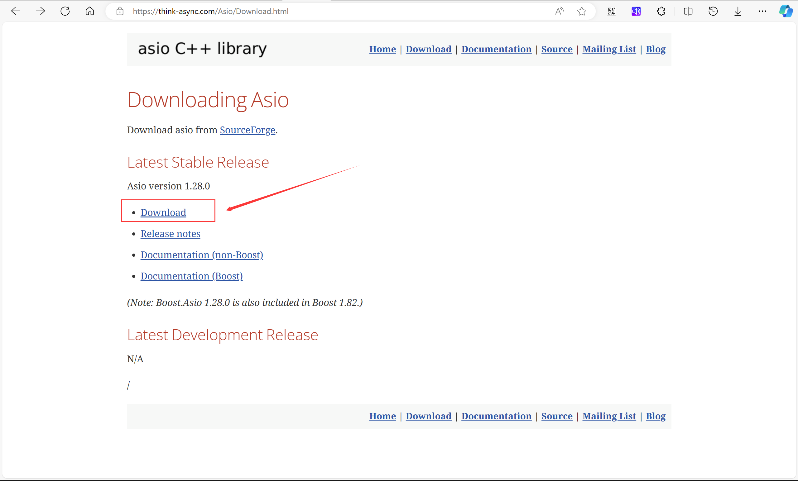

# asio standalone download

## Download

[Downloading Asio (think-async.com)](https://think-async.com/Asio/Download.html)



## Usage

​	附加包含目录：`E:\3rdparty\asio-1.28.0\include`

​	测试代码：

```C++
#include <iostream>
#include "asio.hpp"
int main()
{
    asio::io_context io;
    asio::steady_timer t(io, asio::chrono::seconds(5));
    t.wait();
    std::cout << "Hello World!\n";
}
```

