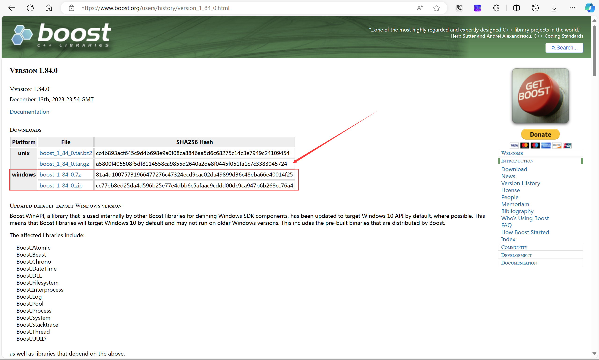
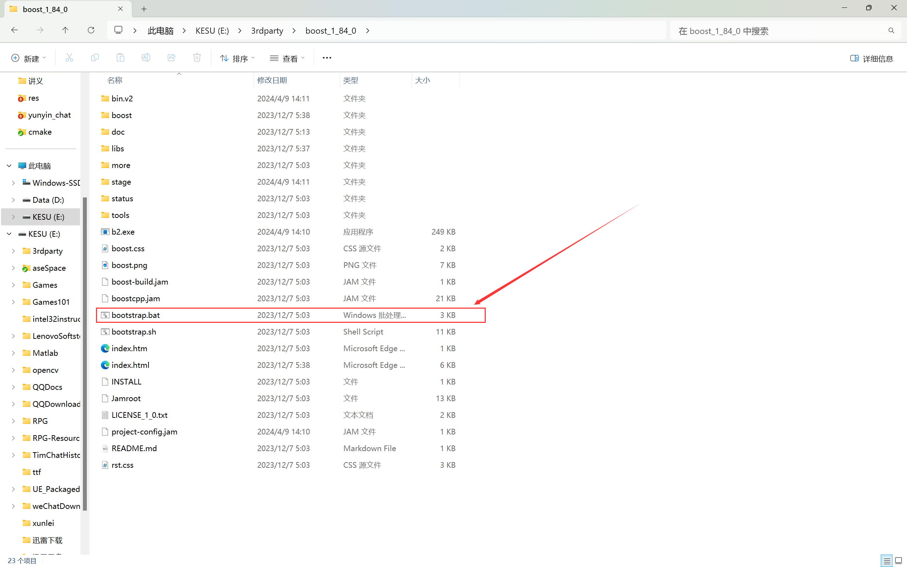
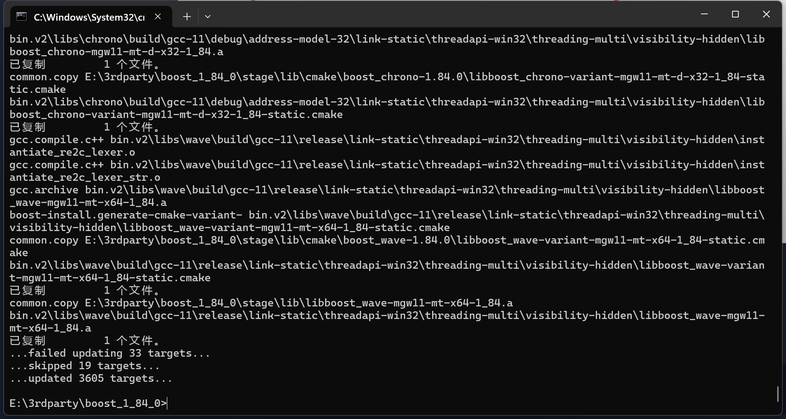
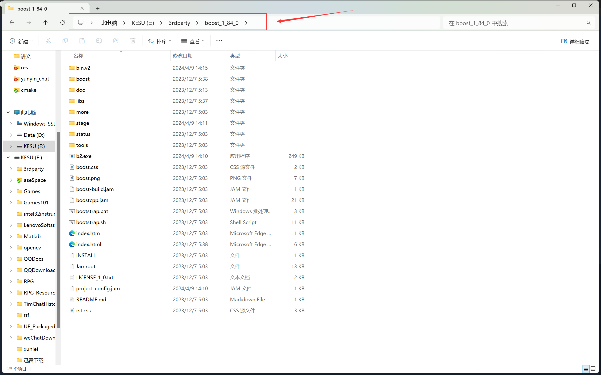
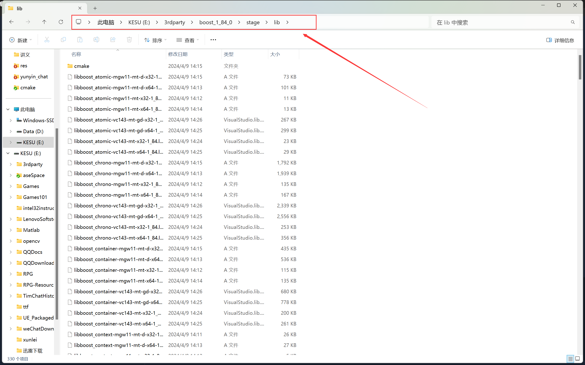

# download and install

## download

​	在boost官网下载Windows版本的zip文件。



## install

### bat

​	双击bat文件，生成编译可执行文件`b2.exe`



### b2

​	使用生成的b2.exe执行lib的编译。

```shell
.\b2.exe toolset=msvc		# linux: ./b2.exe toolset=gcc
```



## header

​	包含目录为boost的根目录：`E:\3rdparty\boost_1_84_0`



## lib

​	lib目录为根目录下的stage/lib:`E:\3rdparty\boost_1_84_0\stage\lib`



## test

```C++
#include <iostream>
#include <string>
#include "boost/lexical_cast.hpp"
int main()
{
    using namespace std;
    cout << "Enter your weight: ";
    float weight;
    cin >> weight;
    string gain = "A 10% increase raises ";
    string wt = boost::lexical_cast<string> (weight);
    gain = gain + wt + " to ";      // string operator()
    weight = 1.1 * weight;
    gain = gain + boost::lexical_cast<string>(weight) + ".";
    cout << gain << endl;
    system("pause");
    return 0;
}
```

