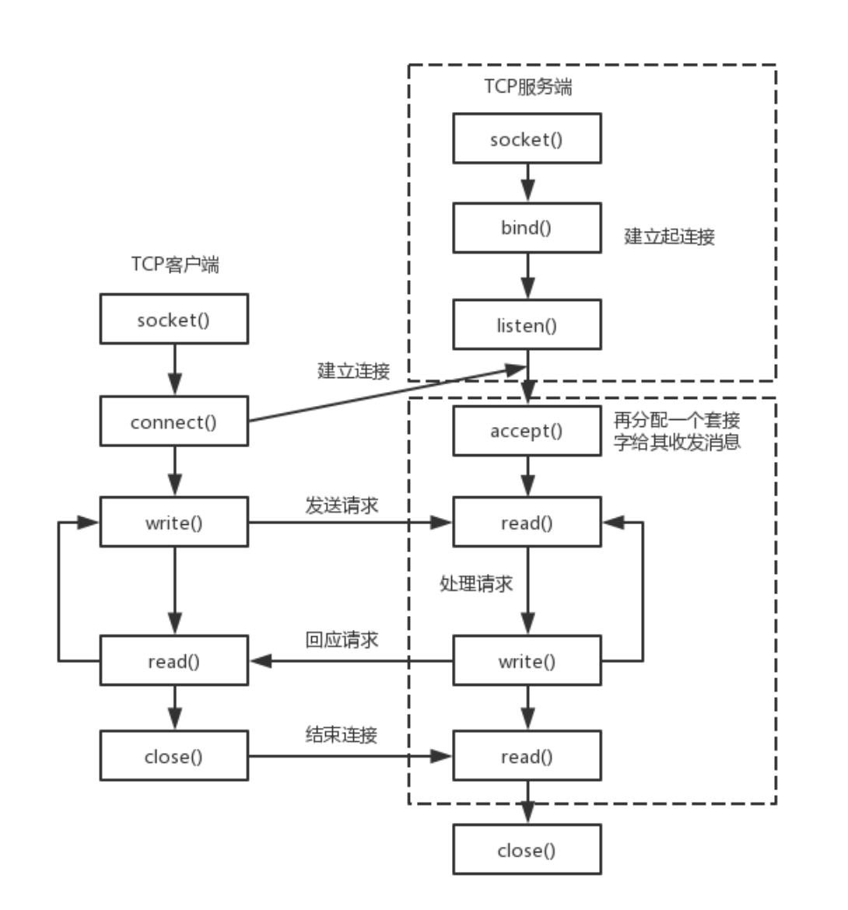

# asio socket的创建与连接

## 1. 网络编程的基本流程

​	asio是基于该基本流程进行封装的lib。

* 服务端：

  1）socket——创建socket对象。

  2）bind——绑定本机ip+port。

  3）listen——监听来电，若在监听到来电，则建立起连接。

  4）accept——再创建一个socket对象给其收发消息。原因是现实中服务端都是面对多个客户端，那么为了区分各个客户端，则每个客户端都需再分配一个socket对象进行收发消息。

  5）read、write——就是收发消息了。

* 客户端：

  1）socket——创建socket对象。

  2）connect——根据服务端ip+port，发起连接请求。

  3）write、read——建立连接后，就可发收消息了。



## 2. 基础：endpoint创建

​	创建的endpoint仅仅是存储了IP+port的数据对象，抽象意义上代表了一个通信端点。

### high-level

​	后续是创建endpoint的理论详细步骤，但是实践中常常将其写作一个临时对象传递使用：

```C++
sock.connect(ip::tcp::endpoint(ip::address::from_string("127.0.0.1"),6688));	// client

tcp::acceptor acptr(io, tcp::endpoint(tcp::v4(), 6688));	//server
```

### 客户端

​	通过指定对方（即服务器）的IP+Port构建一个用于通信的endpoint.

```C++
int client_end_point() {
    // Step 1. Assume that the client application has already 
    // obtained the IP-address and the protocol port number.
    std::string raw_ip_address = "127.0.0.1";
    unsigned short port_num = 3333;
    // Used to store information about error that happens
    // while parsing the raw IP-address.
    boost::system::error_code ec;
    // Step 2. Using IP protocol version independent address
    // representation.
    asio::ip::address ip_address =
        asio::ip::address::from_string(raw_ip_address, ec);
    if (ec.value() != 0) {
        // Provided IP address is invalid. Breaking execution.
        std::cout
            << "Failed to parse the IP address. Error code = "
            << ec.value() << ". Message: " << ec.message();
        return ec.value();
    }
    // Step 3.
    asio::ip::tcp::endpoint ep(ip_address, port_num);
    // Step 4. The endpoint is ready and can be used to specify a 
    // particular server in the network the client wants to 
    // communicate with.
    return 0;
}
```

### 服务端

​	创建一个用于接受任意IP的endpoint，需要指定监听的端口。

```C++
int server_end_point(){
    // Step 1. Here we assume that the server application has
    //already obtained the protocol port number.
    unsigned short port_num = 3333;
    // Step 2. Create special object of asio::ip::address class
    // that specifies all IP-addresses available on the host. Note
    // that here we assume that server works over IPv4 protocol.
    asio::ip::address ip_address = asio::ip::address_v4::any(); 	//asio::ip::address_v6::any()也可
    // Step 3.
    asio::ip::tcp::endpoint ep(ip_address, port_num);
    // Step 4. The endpoint is created and can be used to 
    // specify the IP addresses and a port number on which 
    // the server application wants to listen for incoming 
    // connections.
    return 0;
}
```

## 3. 基础：socket创建 & 使用

​	socket是用于网络通信的基本对象，用于connect/read/write。

### 客户端

​	对于客户端而言，创建好socket后，打开socket然后连接对应的服务器endpoint即可。

```C++
int  connect_to_end() {
    // Step 1. Assume that the client application has already
            // obtained the IP address and protocol port number of the
            // target server.
    std::string raw_ip_address = "127.0.0.1";
    unsigned short port_num = 3333;
    try {
        // Step 2. Creating an endpoint designating 
        // a target server application.
        asio::ip::tcp::endpoint
            ep(asio::ip::address::from_string(raw_ip_address),
                port_num);
        asio::io_context ios;
        
        // Step 3. Creating and opening a socket.
        asio::ip::tcp::socket sock(ios, ep.protocol());
        
        // Step 4. Connecting a socket.
        sock.connect(ep);
    }
    // Overloads of asio::ip::address::from_string() and 
    // asio::ip::tcp::socket::connect() used here throw
    // exceptions in case of error condition.
    catch (system::system_error& e) {
        std::cout << "Error occured! Error code = " << e.code()
            << ". Message: " << e.what();
        return e.code().value();
    }
}
```

### 服务器

​	对于服务器而言，socket的作用是监听对应的port，接受客户端的连接，然后创建一个新的socket负责这个连接。

​	监听的socket在asio中有一个特定的对象：`asio::ip::tcp::acceptor`，其内部封装了一个socket。

```C++
int accept_new_connection(){
    // The size of the queue containing the pending connection
            // requests.
    const int BACKLOG_SIZE = 30;		// tcp缓存的连接数
    // Step 1. Here we assume that the server application has
    // already obtained the protocol port number.
    unsigned short port_num = 3333;
    // Step 2. Creating a server endpoint.
    asio::ip::tcp::endpoint ep(asio::ip::address_v4::any(),
        port_num);
    asio::io_context  ios;
    try {
        // Step 3. Instantiating and opening an acceptor socket.
        asio::ip::tcp::acceptor acceptor(ios, ep.protocol());	// 创建的同时open了，相当于
        														// asio::ip::tcp::acceptor acceptor(ios);
        														// acceptor.open(ep.protocol(), ec);
        
        // Step 4. Binding the acceptor socket to the 
        // server endpint.
        acceptor.bind(ep);
        
        // Step 5. Starting to listen for incoming connection
        // requests.
        acceptor.listen(BACKLOG_SIZE);
        
        // Step 6. Creating an active socket.
        asio::ip::tcp::socket sock(ios);
        
        // Step 7. Processing the next connection request and 
        // connecting the active socket to the client.
        acceptor.accept(sock);
    }
    catch (system::system_error& e) {
        std::cout << "Error occured! Error code = " << e.code()
            << ". Message: " << e.what();
        return e.code().value();
    }
}
```

### 补充：通过域名解析的方式连接

```C++
int dns_connect_to_end()
{
    std::string host = "example.com";
    std::string port_num = 3333;
    asio::io_context ioc;
    asio::ip::tcp::resolver::query rq(host, port_num, asio::ip::tcp::resolver::query::numeric_service);
    asio::ip::tcp::resolver r(ioc);
    
    try
    {
        asio::ip::tcp::resolver::iterator it = r.resolve(rq);
        asio::ip::tcp::socket s(ioc);
        asio::connect(s, it);
    }
    catch(system::system_error& e)
    {
        std::cout << "Error occured!Error Code=" << e.code() << ".Message:" << e.what();
        return e.code().value();
    }
}
```

## 4. 基础：buffer

### 概念说明

​	任何网络库都有提供buffer的数据结构，所谓buffer就是接收和发送数据时缓存数据的结构。

​	`boost::asio`提供了`asio::mutable_buffer` 和 `asio::const_buffer`这两个结构，他们是一段连续的空间，首字节存储了后续数据的长度。

​	asio::mutable_buffer用于写服务，asio::const_buffer用于读服务。但是这两个结构都没有被asio的api直接使用。

​	对于提供给api的buffer参数，asio提出了`MutableBufferSequence`和`ConstBufferSequence`概念，他们是由多个`asio::mutable_buffer`和`asio::const_buffer`组成的。

​	上述的两个Sequence的结构类似于`std::vector<asio::mutable_buffer>`：


​	也就是说boost::asio为了节省空间，将一部分连续的空间组合起来，作为参数交给api使用。

### 实际使用

​	boost::asio为了简化用户的操作，允许用户使用buffer()函数来得到一个`MutableBufferSequence`/`ConstBufferSequence`概念的对象，根据传入参数是只读还是可写决定返回的类型。

​	只读：`asio::const_buffer_1`

​	可写：`asio::mutable_buffer_1`

### 演示code

​	假设需要使用send函数发送数据：

```C++
template<typename ConstBufferSequence>
std::size_t send(const ConstBufferSequence & buffers);
```

#### 不用提供的buffer

​	自己构造一个`asio::const_buffer`以及传递给send()的`vector<asio::const_buffer>`对象。

```C++
void use_const_buffer() {
    std::string buf = "hello world!";
    asio::const_buffer  asio_buf(buf.c_str(), buf.length());
    std::vector<asio::const_buffer> buffers_sequence;
    buffers_sequence.push_back(asio_buf);
}
```

#### 使用buffer函数

```C++
void use_buffer_str() {
    asio::const_buffers_1 output_buf = asio::buffer("hello world");
}
```

#### C-style string

```C++
void use_buffer_array(){
    const size_t  BUF_SIZE_BYTES = 20;
    std::unique_ptr<char[] > buf(new char[BUF_SIZE_BYTES]);
    auto input_buf = asio::buffer(static_cast<void*>(buf.get()), BUF_SIZE_BYTES);
}
```

流式io

​	对于流式操作，我们可以用`streambuf`，将输入输出流和streambuf绑定，可以实现流式输入和输出。

```C++
void use_stream_buffer() {
    asio::streambuf buf;
    std::ostream output(&buf);
    // Writing the message to the stream-based buffer.
    output << "Message1\nMessage2";
    
    // Now we want to read all data from a streambuf
    // until '\n' delimiter.
    // Instantiate an input stream which uses our 
    // stream buffer.
    std::istream input(&buf);
    
    // We'll read data into this string.
    std::string message1;
    std::getline(input, message1);
    // Now message1 string contains 'Message1'.
}
```

