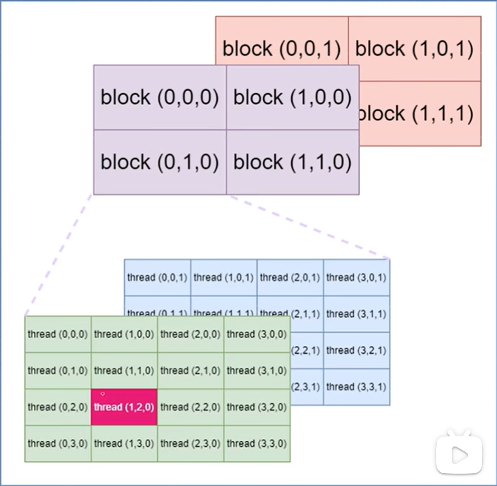

# 线程全局索引的计算方式

## 组合方式

网格分为1维、2维、3维。

线程块也分为1维、2维、3维。

因此自由组合之后，就会有9种。

## 线程全局索引

线程的全局索引，与grid和block的组合有关，下面给出通用公式。当维数为1时，对应取值为1，则可以简化公式。

```C++
int blockId = blockIdx.x + blockIdx.y* gridDim.x + gridDim.x* gridDim.y* gridDim.z;
int id = blockId* (blockDim.x* blockDim.y* blockDim.z)
    			+ (threadIdx.z* (blockDim.x* blockDim.y))
    			+ (threadIdx.y* blockDim.x) + threadIdx.x;
```

