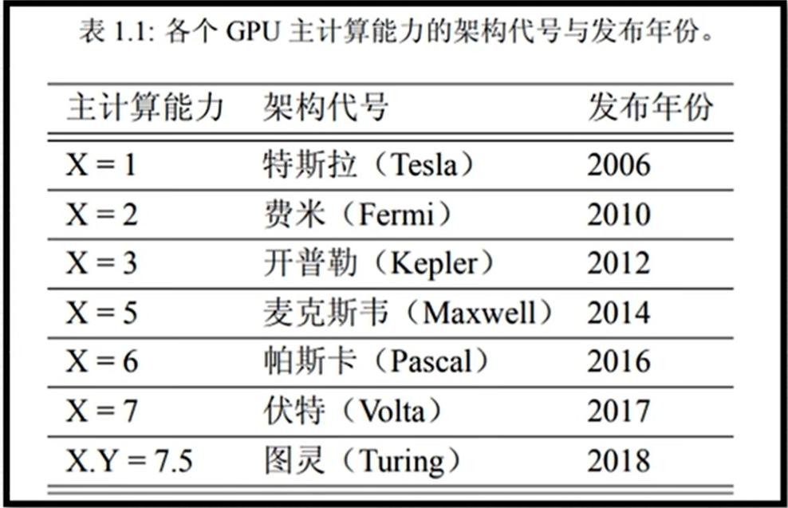
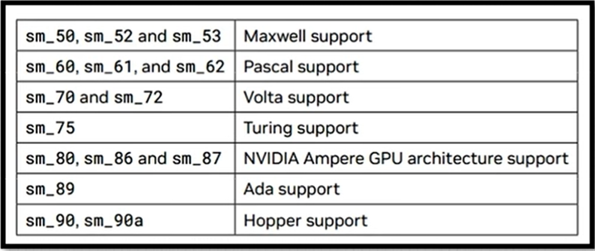
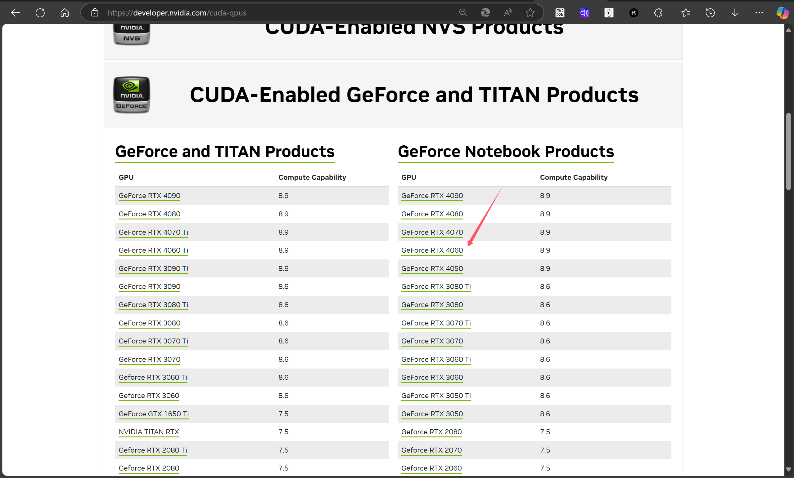

# nvcc编译流程与GPU计算能力

## nvcc编译流程

1. nvcc分离全部源代码为：
   - (1) 主机代码
   - (2) 设备代码

2. 主机（Host）代码是C/C++语法，设备（device）代码是C/C++扩展语言编写

3. nvcc先将设备代码编译为PTX（Parallel Thread Execution）伪汇编代码，再将PTX代码编译为二进制的cubin目标代码

4. 在将源代码编译为 PTX 代码时，需要用选项`-arch=compute_XY`指定一个虚拟架构的计算能力，用以确定代码中能够使用的CUDA功能。

5. 在将PTX代码编译为cubin代码时，需要用选项`-code=sm_ZW`指定一个真实架构的计算能力，用以确定可执行文件能够使用的GPU。

参考资料：[1. Introduction — NVIDIA CUDA Compiler Driver 12.8 documentation](https://docs.nvidia.com/cuda/cuda-compiler-driver-nvcc/index.html)

## GPU架构与计算能力

每款GPU都有标识“计算能力”的版本号，用X.Y表示（X是主版本号，Y是次版本号）。



每个版本的cuda能支持的GPU架构有详细说明，例如，对于12.2版本的cuda，有如下的架构支持5.0~9.0：



## 查看本GPU的计算能力支持

查看GPU的型号：

```shell
C:\Users\10654> nvidia-smi --list-gpus
GPU 0: NVIDIA GeForce RTX 4060 Laptop GPU (UUID: GPU-76e68793-9a36-770e-c2d2-0f8032c32ae3)
```

在官网找到对应GPU型号的最高计算能力表格：[CUDA GPUs - Compute Capability | NVIDIA Developer](https://developer.nvidia.com/cuda-gpus)

例如：对应`GeForce RTX 4060`的最高支持的计算能力为8.9。

