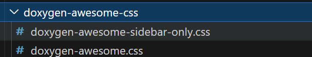

# doxygen创建指南

## 创建docs目录并初始化doxygen

```shell
mkdir docs
cd docs && doxygen -g
```

## 使用Doxywizard配置Doxyfile

```shell
doxywizard
```

## 使用doxygen-awesome美化

```shell
mkdir doxygen-awesome-css
```

​	将文件拷贝进该目录



​	在Doxyfile中配置`HTML_EXTRA_STYLESHEET`为

```shell
HTML_EXTRA_STYLESHEET  = ./doxygen-awesome-css/doxygen-awesome.css \
                         ./doxygen-awesome-css/doxygen-awesome-sidebar-only.css
```

​	(可以在Doxywizard设置)

## 参考资料

* [Doxygen Awesome： Doxygen Awesome (jothepro.github.io)](https://jothepro.github.io/doxygen-awesome-css/)
* [Doxygen：入门](https://www.doxygen.nl/manual/starting.html)