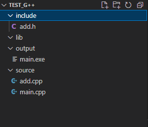
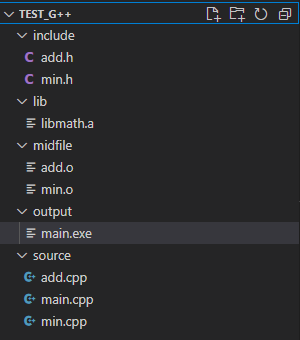
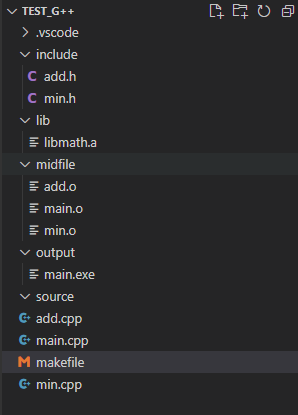
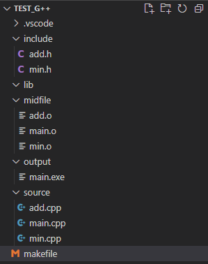
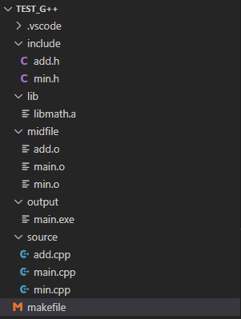
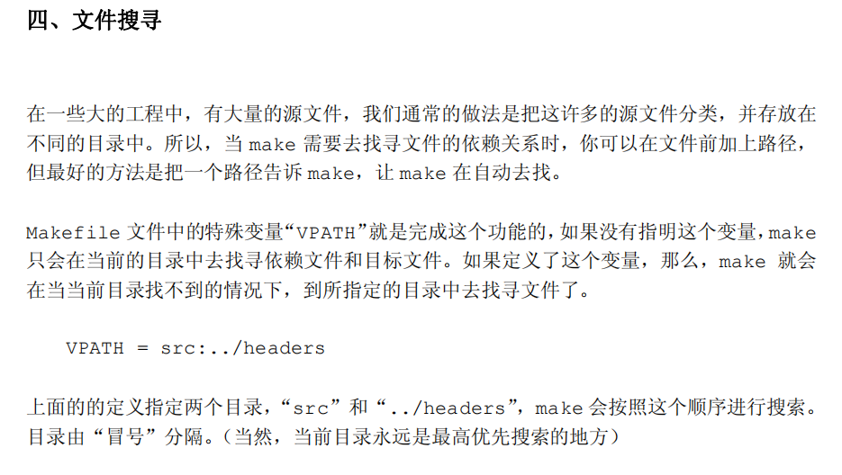

## g++案例

#### 目录结构



#### 文件内容

```C++
//main.cpp
#include"add.h"
#include<iostream>
using namespace std;
int main(int argc,char* argv[])
{
    int a{};
    a = 1;
    a++;
    a++;
    a = add(1,3);
    cout<<a<<endl;
}


//add.h
#pragma once
int add(int x,int y);


//add.cpp
#include"add.h"
int add(int x,int y)
{
    return x+y;
}
```

#### 编译指令

> 指定头文件目录-I(大写i)
>
> 指定输出目录-o

```shell
g++ .\source\main.cpp .\source\add.cpp -I .\include\ -o ./output/main.exe
```

---


#### 更全面的指令

* -I(大写的i)：指定头文件目录，一般为incl或include
* -l(小写的l)：指定链接的库名，后面直接跟库名，例如libmath.a，为-lmath。
	* （因此库名是去掉lib和后缀的部分）
* -L(大写的L)：指定寻找上述库的目录。当前目录为.

**案例**

```shell
g++ .\source\add.cpp -I .\include -c -o .\midfile\add.o	 
g++ .\source\min.cpp -I .\include -c -o .\midfile\min.o  
ar -r .\lib\libmath.a .\midfile\min.o .\midfile\add.o
g++ .\source\main.cpp -lmath -Llib -I .\include\ -o .\output\main.exe
```

**最终结果**



**使用makefile改进编写**

> 由于某种问题（后面已经解决，详见二和四），make找不到source下的文件，只能将源文件移动到根目录下

```makefile
main.exe:libmath.a main.o
	g++ .\midfile\main.o -lmath -Llib -I .\include\ -o .\output\main.exe
libmath.a:add.o min.o
	ar -r .\lib\libmath.a .\midfile\min.o .\midfile\add.o
add.o:add.cpp
	g++ add.cpp -I .\include -c -o .\midfile\add.o
min.o:min.cpp
	g++ min.cpp -I .\include -c -o .\midfile\min.o
main.o:main.cpp
	g++ main.cpp -I .\include -c -o .\midfile\main.o

clean:			#注意：make.exe调用的不是powershell,而是cmd,因此要用del代替rm命令
	del .\midfile\*.o
	del .\output\main.exe
	del .\lib\*.a
```

**最终结果**



**将makefile优化（一）**

> 与上图一致，只是将部分路径使用变量表示，并且加入了O2优化指令
>
> 关于头文件：依赖里可加可不加，但是命令里要加，并且要写路径

```makefile
INC = -I .\include
SOURCE = .\source\*.cpp
CFLAGS := -O2 -g
EXE = main.exe

$(EXE):libmath.a main.o
	g++ .\midfile\main.o -lmath -Llib $(INC) $(CFLAGS) -o .\output\main.exe
libmath.a:add.o min.o
	ar -r .\lib\libmath.a .\midfile\min.o .\midfile\add.o
add.o:add.cpp
	g++ add.cpp $(INC) -c $(CFLAGS) -o .\midfile\add.o
min.o:min.cpp
	g++ min.cpp $(INC) -c $(CFLAGS) -o .\midfile\min.o
main.o:main.cpp
	g++ main.cpp $(INC) -c $(CFLAGS) -o .\midfile\main.o

clean:			#注意：make.exe调用的不是powershell,而是cmd,因此要用del代替rm命令
	del .\midfile\*.o
	del .\output\main.exe
	del .\lib\*.a
```

##### 将makefile优化（二）

> 解决了寻找source目录的问题，但是没有静态库。得出的结论是
>
> 1. 生成.o文件需要在依赖和命令中都指定路径
> 2. 生成可执行文件，只需要在命令中指定路径，不能指定依赖的路径
>
> 即：除了依赖源文件要加路径指明，其它都不用

```makefile
SRCPATH = .\source
INCPATH = .\include
MIDPATH = .\midfile
OUTPUTPATN = .\output
INC = -I $(INCPATH)
EXE = main.exe
CFLAGS := -O2 -g

$(EXE):main.o add.o min.o
	g++ $(MIDPATH)\main.o $(MIDPATH)\add.o $(MIDPATH)\min.o $(CFLAGS) -o $(OUTPUTPATN)\$(EXE)
main.o:$(SRCPATH)\main.cpp
	g++ $(SRCPATH)\main.cpp -c $(INC) $(CFLAGS) -o $(MIDPATH)\main.o
add.o:$(SRCPATH)\add.cpp
	g++ $(SRCPATH)\add.cpp -c $(INC) $(CFLAGS) -o $(MIDPATH)\add.o
min.o:$(SRCPATH)\min.cpp
	g++ $(SRCPATH)\min.cpp -c $(INC) $(CFLAGS) -o $(MIDPATH)\min.o

clean:
	del .\midfile\*.o
	del .\output\main.exe
	del .\lib\*.a
```



**将makefile优化（三）**

> 使用静态库lib来封装.o文件

```makefile
SRCPATH = .\source
INCPATH = .\include
MIDPATH = .\midfile
OUTPUTPATN = .\output
LIBPATH = .\lib
LIBNAME = math
LIB = -L$(LIBPATH) -l$(LIBNAME)
INC = -I $(INCPATH)
EXE = main.exe
CFLAGS := -O2 -g

$(EXE):main.o libmath.a
	g++ $(MIDPATH)\main.o $(LIB) $(CFLAGS) -o $(OUTPUTPATN)\$(EXE)
main.o:$(SRCPATH)\main.cpp
	g++ $(SRCPATH)\main.cpp -c $(INC) $(CFLAGS) -o $(MIDPATH)\main.o
libmath.a:add.o min.o
	ar -r $(LIBPATH)\libmath.a $(MIDPATH)\min.o $(MIDPATH)\add.o
add.o:$(SRCPATH)\add.cpp
	g++ $(SRCPATH)\add.cpp -c $(INC) $(CFLAGS) -o $(MIDPATH)\add.o
min.o:$(SRCPATH)\min.cpp
	g++ $(SRCPATH)\min.cpp -c $(INC) $(CFLAGS) -o $(MIDPATH)\min.o

clean:
	del .\midfile\*.o
	del .\output\main.exe
	del .\lib\*.a
```



**将makefile优化（四）**



> 由此，可以设置VPATH变量，来省略cpp依赖中的路径（命令中的路径依旧要写）

```makefile
VPATH = .\source	#此处加了VPATH的路径
SRCPATH = .\source
INCPATH = .\include
MIDPATH = .\midfile
OUTPUTPATN = .\output
LIBPATH = .\lib
LIBNAME = math
LIB = -L$(LIBPATH) -l$(LIBNAME)
INC = -I $(INCPATH)
OBJECTS = main.o libmath.a
EXE = main.exe
CFLAGS := -O2 -g

$(EXE):$(OBJECTS)
	g++ $(MIDPATH)\main.o $(LIB) $(CFLAGS) -o $(OUTPUTPATN)\$(EXE)
main.o:main.cpp		#此处的路径省略了
	g++ $(SRCPATH)\main.cpp -c $(INC) $(CFLAGS) -o $(MIDPATH)\main.o
libmath.a:add.o min.o
	ar -r $(LIBPATH)\libmath.a $(MIDPATH)\min.o $(MIDPATH)\add.o
add.o:add.cpp		#此处的路径省略了
	g++ $(SRCPATH)\add.cpp -c $(INC) $(CFLAGS) -o $(MIDPATH)\add.o
min.o:min.cpp		#此处的路径省略了
	g++ $(SRCPATH)\min.cpp -c $(INC) $(CFLAGS) -o $(MIDPATH)\min.o

clean:
	del .\midfile\*.o
	del .\output\main.exe
	del .\lib\*.a
```

**将makefile优化（五）**

> 使用静态模式直接生成所有.o文件
>
> 使用`$<`作为依赖集合（依赖集合不需要加路径，因为在VPATH里设置了路径）
>
> 使用`$@`作为输出集合（输出集合需要加路径，因为没有一个输出的路径变量）

```makefile
VPATH = .\source		#依赖目录
SRCPATH = .\source
INCPATH = .\include
MIDPATH = .\midfile
OUTPUTPATN = .\output
LIBPATH = .\lib
LIBNAME = math
LIB = -L$(LIBPATH) -l$(LIBNAME)
INC = -I $(INCPATH)
OBJECTS = main.o add.o min.o
EXE = main.exe
CFLAGS := -O2 -g

$(EXE):main.o libmath.a
	g++ $(MIDPATH)\main.o $(LIB) $(CFLAGS) -o $(OUTPUTPATN)\$(EXE)
libmath.a:add.o min.o
	ar -r $(LIBPATH)\libmath.a $(MIDPATH)\min.o $(MIDPATH)\add.o
$(OBJECTS):%.o:%.cpp		#静态模式 格式：文件集合：筛选条件：依赖集合
	g++ -c $(CFLAGS) $(INC) $< -o $(MIDPATH)\$@	#使用$<作为依赖，$@作为输出（且有路径）

clean:
	del .\midfile\*.o
	del .\output\main.exe
	del .\lib\*.a
```

**将makefile优化（六）**

> 主要优化了clean的各种模式，便于选择性清理。

```makefile
VPATH = .\source
SRCPATH = .\source
INCPATH = .\include
MIDPATH = .\midfile
OUTPUTPATN = .\output
LIBPATH = .\lib
LIBNAME = math
LIB = -L$(LIBPATH) -l$(LIBNAME)
INC = -I $(INCPATH)
OBJECTS = main.o add.o min.o
EXE = main.exe
CFLAGS := -O2 -g

$(EXE):main.o libmath.a
	g++ $(MIDPATH)\main.o $(LIB) $(CFLAGS) -o $(OUTPUTPATN)\$(EXE)
	echo exe build success!
libmath.a:add.o min.o
	ar -r $(LIBPATH)\libmath.a $(MIDPATH)\min.o $(MIDPATH)\add.o
$(OBJECTS):%.o:%.cpp
	g++ -c $(CFLAGS) $(INC) $< -o $(MIDPATH)\$@

.PHONY:cleanall
cleanall:cleanobj cleanlib cleanapp
cleanobj:
	del .\midfile\*.o 
cleanlib:
	del .\lib\*.a
cleanapp:
	del $(OUTPUTPATN)\$(EXE)
```

**将makefile优化（七）**

> 根据不同的操作系统启动不同的代码

