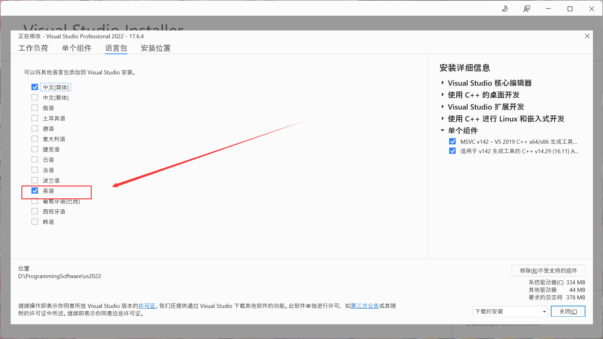
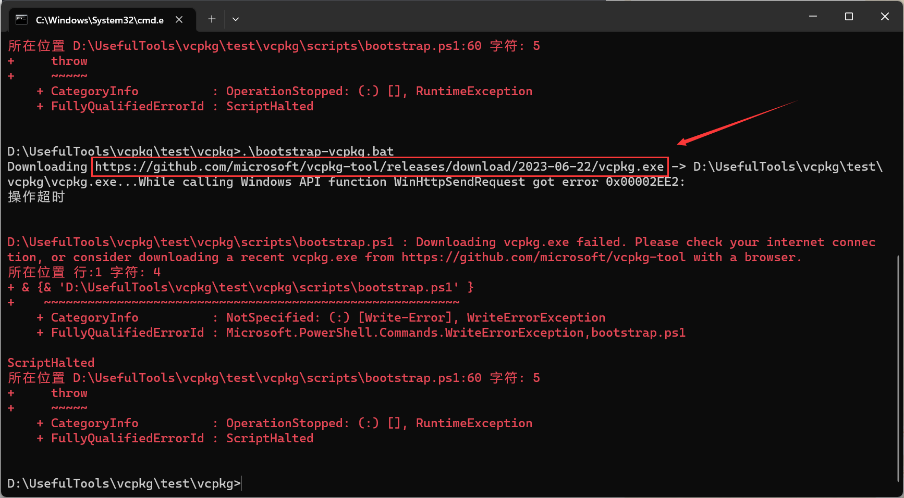
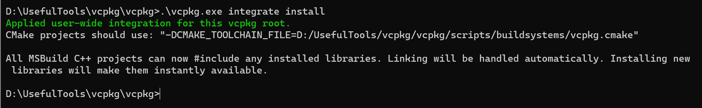

## vcpkg的vs使用方法

### 1. 前置工具

* Vs
* Git
* Cmake

### 2. 安装vs的英文语言包



### 3. git clone vcpkg

​	选择一个路径，在该路径下：

```shell
git clone git@github.com:microsoft/vcpkg.git
```

### 4. 执行bat脚本

```shell
.\bootstrap-vcpkg.bat
```

​	注意：如果下载失败，可以直接点击链接，在浏览器里下载，再放到该目录下：



### 5. vcpkg命令

#### 5.1 搜索

```shell
.\vcpkg.exe search fmt
```

#### 5.2 安装

```shell
.\vcpkg.exe install fmt:x64-windows
.\vcpkg.exe install fmt:x86-windows
```

#### 5.3 vs插件

```shell
.\vcpkg.exe integrate install
```



#### 5.4 查看第三方库

```shell
.\vcpkg.exe list
```

