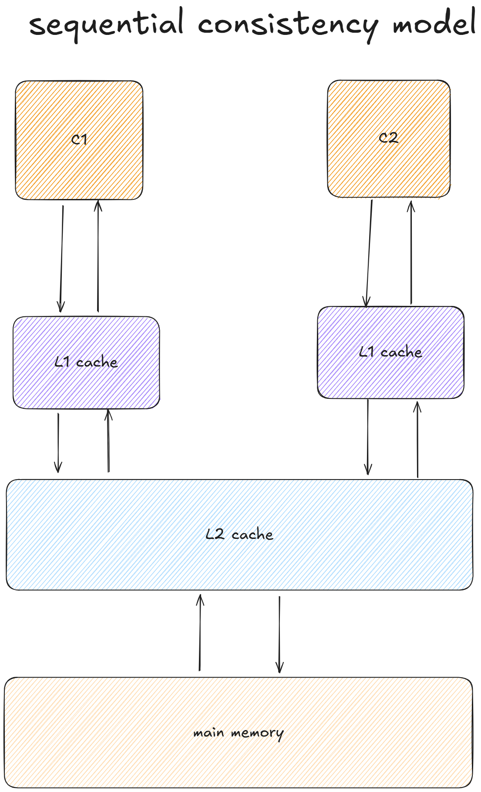

# 顺序存储模型

顺序模型（sequential consistency model）又被简称为SC，常对应的硬件结构图如下。

在顺序模型的硬件架构中，只存在cache结构：各个CPU有自己的cache，同时它们也会共用一个cache，最后cache与主存交互。

在该模型下，对于下面的指令：

| Core C1                       | Core C2                                                    |
| ----------------------------- | ---------------------------------------------------------- |
| S1: data=1 S2: flag=true | L1: r1=flag B1: if(r1!=true) goto L1 L2: r2=data |

执行情况是：S1->S2->L1->L2，最终r2=1。

**这便是SC(顺序模型)的特点，指令的执行行为与UP（单核）上是一致的。**

