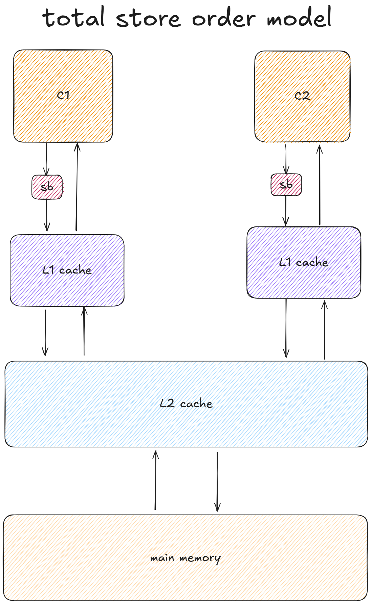

# 完全存储定序模型

## 1. 模型（store buffer）

为了提供CPU的性能，设计者在CPU中添加了一个存储缓冲区（store buffer）。它的作用是为store指令提供缓冲，使得CPU不用等待存储器的响应。



因此，对于写操作（store），只要store buffer中还有空间，都只要1时钟周期。但是也引入了访问乱序的问题。

---

## 2. 说明

相比于以前的内存模型（SC）而言，store的时候数据会先被放到store buffer里面，然后再被写到L1 cache里。

```shell
S1: store flag=1
S2: load r1=2
S3: store b=3
```

如果在顺序存储模型(SC)中，S1肯定会比S2先执行。

但是如果在加入了store buffer之后，S1将指令放到了store buffer后会立刻返回，这个时候会立刻执行S2。S2是read指令，CPU必须等到数据读取到r1后才会继续执行。这样很可能S1的store flag=set指令还在store buffer上，而S2的load指令可能已经执行完。

> （特别是r1在cache上存在，而flag没在cache中的时候。这个时候CPU往往会先执行S2，这样可以减少等待时间）

这里就可以看出在加入了store buffer之后，内存一致性模型就发生了改变：

**由于store buffer必须严格按照FIFO的次序将数据发送到主存，cpu必须要严格保证store buffer的顺序执行，所以S3必须要在S1之后执行，这种内存模型就叫做完全存储定序（TSO）。**我们常用的物理机上的x86 CPU 就是这种内存模型。

## 3. 问题

这种架构在单核情况下没问题，但在多核运行多线程的时候会出现问题，对于如下分别运行在`core1`和`core2`的指令：

| Core C1                                | Core C2                                |
| -------------------------------------- | -------------------------------------- |
| S1: store data=1<br />S2: load r1=flag | L1: store flag=1<br />L2: load r2=data |

由于store buffer的存在，L1和S1的store指令会被先放到store buffer里面，然后CPU会继续执行后面的load指令。

store buffer中的数据可能还没有来得及往存储器中写，这个时候我们可能看到C1和C2的r1、r2都为0的情况。这种乱序称之为store-load乱序，对于可能出现store-load乱序的场景，cpu提供了一些指令去控制怎么把这些数据同步到其它核。

## 4. 模型（invalidate queue）


在store buffer的基础上，如果store buffer满了会刷新进L1 cache，就要发送invalidate message给其它的CPU core，等待返回ack保证数据更新。

为了提速，增加了一个invalidate queue的部件，CPU只需将invalidate message发送到其它CPU的queue就能直接返回继续执行，中间不需要等待ack。

但是也引入了问题，如果invalidate message存储在queue中没有被CPU处理掉，就会导致数据没有更新。

```C++
int a = 0, c = 0;

thread 1:
{
      a = 1;
      smp_mb(); // memory barrier
      c = 3
}

thread 2:
{
      while(c != 3);
      //smp_mb()  此处也需要添加内存屏障
      assert(a == 1); 
}
```

上面提到的smp_mb()是一种full memory barrier，他会将store buffer和invalidate queue都flush一遍。

但是就像上面例子中体现的那样有时候我们不用两个都flush，于是硬件设计者引入了read memory barrier和write memory barrier：

* read memory barrier其实就是将invalidate queue flush。也称lfence(load fence)
* write memory barrier是将storebuffer flush。也称sfence(sotre fence)

