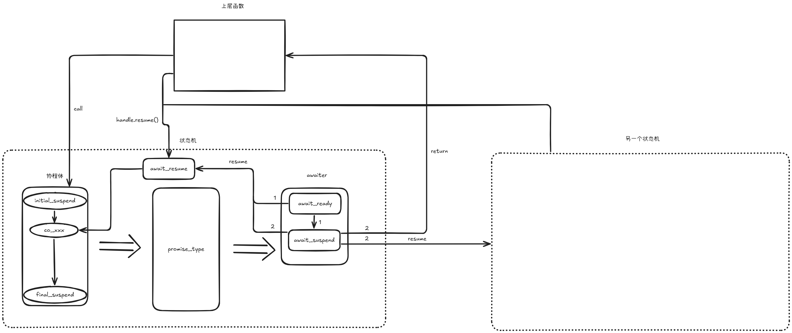

# co_await

co_await 是协程用于等待的运算符，后面跟一个**等待体**。

## quick view



```C++
struct Awaiter {
    int value;

    bool await_ready() {
        // 协程一定会挂起
        return false;
    }

    void await_suspend(std::coroutine_handle<> coroutine_handle) {
        // 切换线程
        std::async([=](){
            using namespace std::chrono_literals;
            // sleep 1s
            std::this_thread::sleep_for(1s); 
            // 恢复协程
            coroutine_handle.resume();
        });
    }

    int await_resume() {
        // value 将作为 co_await 表达式的值
        return value;
    }
};
```

## 等待体

等待体是co_await后允许跟随的类型：`co_await xxx;`

等待体一般需要三个函数：await_ready、await_suspend、await_resume。

### await_ready

```cpp
bool await_ready();
```

await_ready 返回 bool 类型，如果返回 true，则表示已经就绪，无需挂起；否则表示需要挂起。

标准库当中提供了两个非常简单直接的等待体，`struct suspend_always` 表示总是挂起，`struct suspend_never` 表示总是不挂起。不难想到，这二者的功能主要就是依赖 await_ready 函数的返回值：

```cpp
struct suspend_never {
    constexpr bool await_ready() const noexcept {
        return true;  // 返回 true，总是不挂起
    }
    ...
};

struct suspend_always {
    constexpr bool await_ready() const noexcept {
        return false; // 返回 false，总是挂起
    }
    ...
};
```

### await_suspend

await_ready 返回 false 时，协程就挂起了。这时候协程的局部变量和挂起点都会被存入协程的状态当中，await_suspend 被调用到。

```cpp
??? await_suspend(std::coroutine_handle<> coroutine_handle);
```

参数 `coroutine_handle` 用来表示当前协程，我们可以在稍后合适的时机通过调用 resume 来恢复执行当前协程：

```cpp
coroutine_handle.resume();
```

注意到 await_suspend 函数的返回值类型我们没有明确给出，因为它有以下几种选项：

- 返回 void 类型或者返回 true，表示当前协程挂起之后将执行权还给当初调用或者恢复当前协程的函数。
- 返回 false，则恢复执行当前协程。注意此时不同于 await_ready 返回 true 的情形，此时协程已经挂起，await_suspend 返回 false 相当于挂起又立即恢复。
- 返回其他协程的 coroutine_handle 对象，这时候返回的 coroutine_handle 对应的协程被恢复执行。
- 抛出异常，此时当前协程恢复执行，并在当前协程当中抛出异常。

可见，await_suspend 支持的情况非常多，也相对复杂。实际上这也是 C++ 协程当中最为核心的函数之一了。

### await_resume

协程恢复执行之后，等待体的 await_resume 函数被调用。

```cpp
??? await_resume();
```

同样地，await_resume 的返回值类型也是不限定的，返回值将作为 `co_await` 表达式的返回值。

## co_await + 等待体

`co_await`后面跟等待体是最常见的情况。

```C++
Result f() {
    std::cout << "start" << std::endl;
    co_await Awaiter{};
    std::cout << "go on" << std::endl;
    co_await Awaiter{};
    std::cout << "end" << std::endl;
}
```

## co_await + 函数体

co_await后面也可以跟一个函数体，通过函数体的返回值去作为一个等待体，间接实现`co_await`等待体的情况。

```C++
Awaiter get_awaiter() {
    return Awaiter{};
}

Result f() {
    std::cout << "start" << std::endl;
    co_await get_awaiter();
    std::cout << "go on" << std::endl;
    co_await get_awaiter();
    std::cout << "end" << std::endl;
}
```

## co_await + await_transform

co_await后面还可以跟一个任意类型的值，作为传递给`await_transform`的参数，同时返回一个等待体，间接实现`co_await`等待体的情况。

`await_transform`的函数原型为：`Awaiter await_transform(T t);`。例如下面使用`int`作为参数类型：

```C++
struct promise_type {
    int value;
    
    std::suspend_always await_transform(int value) {
      this->value = value;
      return {};
    }
}

Result f() {
    int i = 0;
    std::cout << "start" << std::endl;
    co_await i++;
    std::cout << "go on" << std::endl;
    co_await i++;
    std::cout << "end" << std::endl;
}
```

## co_await + 函数体 + await_transform 混合

co_await后面还可以跟一个返回任意值的函数体，函数的返回值会作为`await_transform`函数的参数被传入，最终返回一个等待体，间接实现`co_await`等待体的情况。

```C++
int get_value_double(int i) {
    return i* 2;
}

struct promise_type {
    int value;
    
    std::suspend_always await_transform(int value) {
      this->value = value;
      return {};
    }
}

Result f() {
    int i = 0;
    std::cout << "start" << std::endl;
    co_await get_value_double(i++);
    std::cout << "go on" << std::endl;
    co_await get_value_double(i++);
    std::cout << "end" << std::endl;
}
```