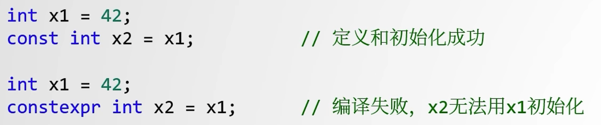

# constexpr详解

​	**C++11**引入了`constexpr`修饰符。在**C++14**、**C++17**和**C++20**中都进行了拓展。

## 引入

​	`const`修饰的变量可以在运行时才初始化，而`constexpr`则**一定**会在编译期初始化。

​	`constexpr`才是名符其实的常量，所有的`constexpr`都是`const`。而`const`表示的是**`read only`的语义**，保证修饰的变量运行时不可以更改，如果直接改动它，编译器在编译时会报错。

​	引入的原因在于：**保证在编译期就能计算出值，提高运行时的效率**。



## constexpr函数

​	`constexpr`函数是指可以在编译期间求值的函数。**注意：如果传入的实参不可以在编译期间求值，那么就退化为普通函数了。**

### 不同标准的constexpr

**C++11标准**

* 函数必须返回一个值（所以不能是void）
* 如果有传入的参数，则必须是常量
* 函数体必须仅有一句return语句，且必须是常量表达式
* 函数必须用constexpr声明

**C++14标准**

* 可以使用带常量表达式的if和`switch`语句，但不能使用`go`语句
* 可以在函数中声明变量来帮助计算，除了没有初始化，`static`和`thread_local`变量
* 可以使用所有的`loop`，包括`for`、`while`、`do-while`
* 函数可以修改生命周期与常量表达式相同的对象
* 函数的返回值可以声明为`void`
* `constexpr`修饰的成员函数不再具有`const`属性

**C++17**

* `lambda`表达式会被隐式声明为`constexpr`

**C++20**

* 允许在常量表达式中使用**虚函数**
* 允许在常量表达式中进行平凡的默认初始化
* 允许在`constexpr`函数中出现try-catch
* 允许在`constexpr`中更改联合类型的有效成员
* 允许dynamic_cast和typeid出现在常量表达式中

### 案例1：constexpr函数基础

​	下面是一个经典用法：在编译期间，函数返回一个常量值。

```C++
/* wrong const function, 
const int sq(int n)
{
	return n*n;
}
*/

constexpr int sq(int n)
{
	return n * n;
}

int main()
{
    constexpr int N = 123;
	constexpr int N_SQ = sq(N);  printf("%d %d\n", N, N_SQ);
}
```

​	如果使用`const`，上面的代码就不会在编译期进行计算，即使计算结果应该是**显然的常量**。但是`const`的语义就是`read only`，因此不会参与常量的计算。

### 案例2：带if的constexpr函数

​	下面演示了**C++14**开始的标准下，允许声明辅助的变量并使用带常量表达式的if语句。编译器只编译符合条件的if代码块。

```C++
constexpr int calc(int n)
{
	if (n % 2 == 0) { 	// C++11 compile error
		return n * n;
	} 
    else {				//只会编译部分
        cout << "1";
    }
    int a = 10; 		// C++11 compile error  
    return n * n + a; 	// C++11 compile error
}

int main()
{
	constexpr int N = 123;
	constexpr int N_SQ = sq(N);
	constexpr int N_CALC = calc(N);  
    printf("%d %d %d\n", N, N_SQ, N_CALC); // 123 15129 15139
    printf("%d\n", sq(4)); 	// 编译期不会计算 sq(4)
}
```

### 案例3：enum获取预期的序列值

​	在过往的`enum`中，如果想要获取到斐波那契数列的枚举，则需要自己手动计算出。但是在引入了`constexpr`后，可以通过`constexpr`函数来赋值给枚举变量，从而获取到想要的序列值（不止斐波那契数列）。

```C++
constexpr int fib(int n)		//编译期计算斐波那契数列的值
{
	if (n <= 0) {
		return 1;
	}
    return fib(n - 1) + fib(n - 2);
}

enum FIB_ENUM {		//通过在编译期计算出想要的数列值，以此创建对应的枚举类型
	a = fib(5),
	b = fib(10),
	c = fib(20),
	dummy = fib(0)
};

int main()
{
	FIB_ENUM my_fib = a;
	printf("%d %d %d\n", 
           my_fib, 
           FIB_ENUM::b, 
           FIB_ENUM::c);		// 8 89 10946
  	return 0;
}
```

### 案例4：隐式lambda的constexpr

​	`lambda`函数作为函数时，会隐式添加`constexpr`的声明标识。

```C++
constexpr int foo()
{
	return []() { return 58; }();
}

auto get_size = [](int i) { return i* 2; }		
char buffer1[foo()] = {0};						//OK
char buffer2[get_size(5)] = {0};				//lambda as constexpr
```

## constexpr类成员函数

​	使用`const`修饰类成员函数用于表示该函数不会修改类成员变量的值。但是如果使用`constexpr`修饰类成员函数，则表示不同的含义。

### 案例1：常量表达式构造函数

​	给函数的构造函数添加`constexpr`声明，才能允许成员函数使用`constexpr`修饰。

规则：

* 构造函数必须用`constexpr`修饰
* 构造函数的初始化列表必须是常量表达式
* 构造函数的函数体必须为空

```C++
class X
{
public:
	constexpr X() : x1(5) {}
    constexpr X(i) : x1(i) {}
    constexpr int get() const
    {
        return x1;
    }
private:
    int x1;
};

constexpr X x;
char buffer[x.get()] = {0};
```

### 案例2：operator重载

### 案例3：constexpr虚函数

```C++
struct X
{
    constexpr virtual int f() const { return 1; }
}

int main() {
    constexpr X x;
    int i = x.f();		//virtual function
}
```

## constexpr的内联属性（C++17）

​	在**C++17**中，用`constexpr`声明静态变量时，也赋予了变量`inline`的属性。

```C++
class X {
public:
    static constexpr int num{5};	//C++17 equal to: inline static constexpr int num{5};
}
```

​	上面的代码既是声明也是定义，如果在C++17前的版本，虽然能正常输出这个变量，但是实际上只是**编译器将其替换成对应的值**，而并不存在这个变量。

## consteval声明立即函数

​	与`constexpr`有所不同，`consteval`**必须确保**函数在编译期间就执行计算。

```C++
constexpr int sqr(int n)
{
    return n*n;
}

constexpr int r = sqr(100);		//OK

int x = 100;
int r2 = sqr(100);				//Error!
```

## constinit检查常量初始化

​	在C++中有一种典型的错误叫做**Static Initialization Order Fiasco**，指的是因为静态初始化顺序错误导致的问题。

​	这种错误一般发生在`main`之前。由于不同编译单元之间的初始化顺序是一个`ub`，因此如果*一个编译单元的静态变量依赖另一个编译单元的静态变量*，那么这种行为有**50%的概率**出错。

```C++
//a.h
class A
{
    	...
};

//a.cpp
A a;

//b.h
class B
{
    	...
};

//b.cpp
B b;
```

​	因此，**C++20**引入了`constinit`在编译期来完成这种检查工作。

​	**它不要求修饰的对象具有常量属性，但是要求用于该对象初始化的表达式具有常量属性。**

---

​	首先，`constinit`修饰的变量必须是**静态存储持续时间**的。

```C++
constinit int x = 11;		//OK
int main()
{
	constinit static int y = 42;	//OK
    constinit int z = 7;	//Error!	局部变量是动态分配的
}
```

​	其次，`constinit`要求变量具有**常量初始化程序**。即在编译期间这段代码就能计算出来，例如：`constexpr`修饰的函数。

```C++
const char* f() { return "hello"; }
constexpr const char* g() { return "cpp"; }

constinit const char* str1 = f();		//Error! f()不是一个常量初始化程序
constinit const char* str2 = g();		//OK
```

​	`constinit`还能用于非初始化声明，以告知编译器`thread_local`变量已被初始化。

```C++
extern thread_local constinit int x;
int f() { return x; }
```

