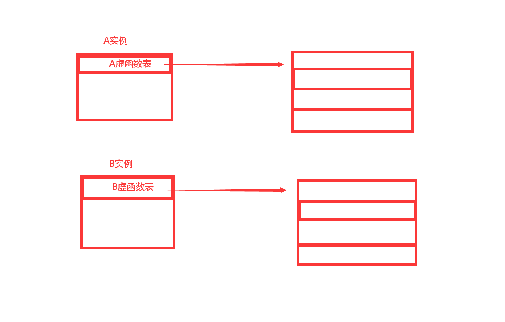
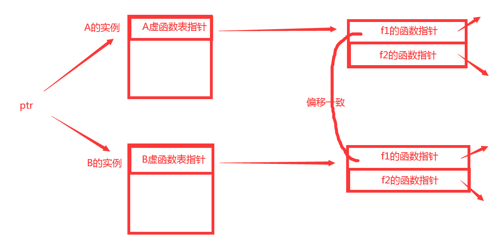
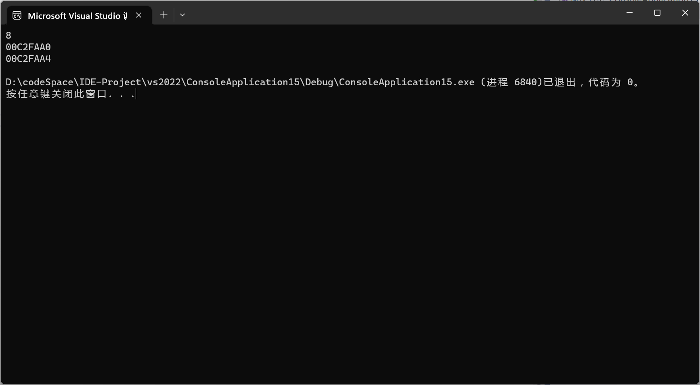
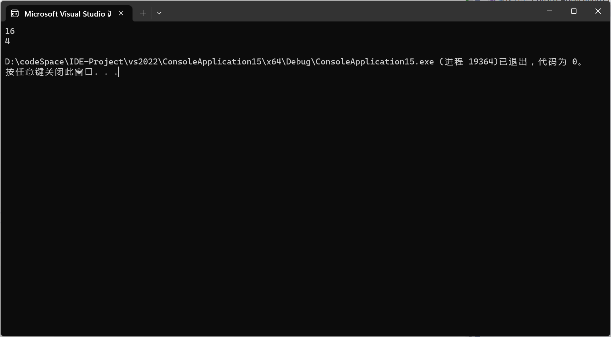

# 虚函数表

​	虚函数表是存放虚函数的指针的一张表。

## 1.虚函数表位置

​	在类实例的**首部**，有一个指针，指向该实例所对应的类型的虚函数表。父类对应父类的表，子类对应子类的表。

```C++
class A
{
public:
    virtual void f1(){ cout << "A:f1" << endl;}
    virtual void f2(){ cout << "A:f2" << endl;}
}

class B : public A
{
public:
    virtual void f1(){ cout << "B:f1" << endl;}
    virtual void f2(){ cout << "B:f2" << endl;}
}

A* a = new A;	//A的实例
B* b = new B;	//B的实例
```



## 2.虚函数表规则

* 一个类对应一个虚函数表
* 同一类的多个实例对应同一个虚函数表
* 虚函数表只能通过指针去调用（即`->`方式）
* 父类与子类的同名函数位置偏移一致

## 3.修改虚函数表

​	通过WindowApi可以修改虚函数表，来验证上述规则。

```C++
A* a1 = new A;
A* a2 = new A;

unsigned* vtable = (unsigned*)a1;		//获取虚函数表地址
unsigned* func = (unsigned*)vtable[0];	//获取第i个函数的地址
VirturalProtect(func1, 8, PAGE_EXCUTE_READWRITE, NULL);		//修改虚函数内存对应的属性

void Hack(){ cout << "in Hack" << endl; }
func[0] = (unsigned)Hack;		//修改虚函数表

a1->f1();	//in Hack
a2->f1();	//in Hack

A tempA;
tempA.f1();	//A:f1
```

​	可以看出，只修改了a1的虚函数表，但是a2也受到了影响，说明**同一个类的实例对应的都是一个虚函数表**。

​	另外，如果用局部变量的方式去调用，则会发现不受影响，说明**局部变量调用虚函数的方式不是通过虚函数表**。

## 4.验证虚函数的偏移一致

​	如果从反汇编的角度，可以直接看到父类和子类的同名函数，它们在自己的虚函数表中的偏移是一致的（`ebx+x`对应了指向的虚函数指针，x是偏移量）。

​	原理是可以理解的：通过指针调用，由于多态的原因，它并不知道实际指向的对象类型，但是如果是同名虚函数，只需保证偏移一致，总能在虚函数表中调用正确的函数。

​	下面给出了一个图例：`ptr`指针分别指向A和B的两个实例，如果想要调用`f1`函数，只需保证调用的函数在虚函数表中的偏移是0，不管指向的类型是哪个，都能正确调用正确的`f1`函数



## 4.虚函数表相关的内存问题

### 4.1 证明虚函数表的存在

​	如何证明指向虚函数表的指针存在，并且就在类实例的首部呢？如果使用虚函数表，对该对象进行`sizeof`时就会发现，你的对象竟然凭空多出了4字节的大小（`x86`架构下）。并且对象的地址和对象第一个数据成员的地址竟相差了4字节，也就是一个指针的大小（`x86`架构下）。

```C++
#include <iostream>
class A
{
public:
    int HP;
public:
    virtual void Eat() {}
    virtual void Die() {}
};

class B : public A
{
public:
    virtual void Eat() {}
    virtual void Die() {}
};

int main()
{
    A a;
    std::cout << sizeof(a) << std::endl;
    std::cout << &a << std::endl << &a.HP << std::endl;
}
```



### 4.2 虚函数表引发的内存对齐问题

​	在`x64`架构下，下面的代码会输出多少呢？

```C++
A a;
std::cout << sizeof(a) << std::endl;
std::cout << sizeof(int) << std::endl;
```



​	答案非常奇怪，为什么会多出12个字节的大小？即使加上虚函数表，在x64架构下，应该也就是多出8字节才对。没错，是内存对齐引发了多出的4个字节。

​	如果你不知道内存对齐的规则了，可以这样理解：数据成员的偏移量以min(pack(n)，最大成员占用字节)的整数倍进行对齐。这时候，我们就可以使用`#pragma pack(n)`指令来强制指定内存对齐规则了。

```C++
#pragma pack(1)
```

​	这时候，输出就符合常理了：


