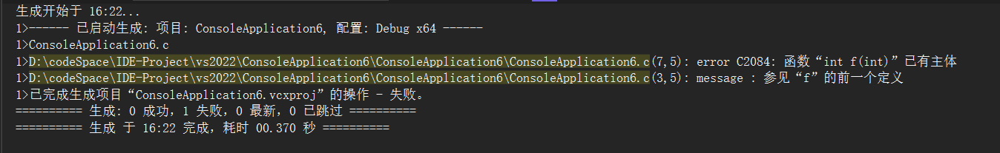
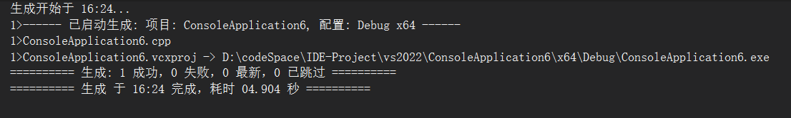

# 00 前置基础

本次课程主要内容是，对C++中的基础语法知识进行回顾，为后续更多的特性做铺垫。

本课程在前期会在Windows平台上进行，使用VS2022，在后续会教授Linux相关开发，使用gcc和cmake进行跨平台开发。请预先准备好VS环境。

## 0. if、while和for

C++和C语言中的这些都是一样的，此处仅给出代码，用于熟悉和回顾。

```C++
#include <iostream>
using namespace std;

int main() {
    // if 语句
    int num = 10;
    if (num > 5) {
        cout << "Number is greater than 5." << endl;
    } else {
        cout << "Number is not greater than 5." << endl;
    }

    // while 循环
    int count = 1;
    cout << "While loop:" << endl;
    while (count <= 5) {
        cout << "Count: " << count << endl;
        count++;
    }

    // for 循环
    cout << "For loop:" << endl;
    for (int i = 1; i <= 5; i++) {
        cout << "Iteration: " << i << endl;
    }

    return 0;
}
```

## 1. 指针与引用

### 指针回顾

指针以一种比较接近底层的方式，在C语言和C++中有广泛的应用：

```C++
int i = 100;
const int* const a = &i;		// 常见问题：左边的2个const分别修饰的是什么？

char* str = nullptr;			// 为什么在C++中的nullptr代替了NULL？它们的本质是什么？
```

### 引用与指针

在C++中，很多情况下会用引用来代替指针，有更好的可读性，同时减少编写时出错的可能：

```C++
int f(int* a) {
    *a = 100;	// 可能出现的问题？
}

int f(int& a) {
    a = 100;
}
```

对于引用，经常会被问到的核心要点在于：

* 必须在创建时初始化
* 不可修改指向的对象
* 引用本质上只是一个别名

因此，从实践上来说，引用是C++在语法层面为我们做的一个工具，能减少指针解引用带来的思维负担。但同时，也由于引用不能赋值为空，导致使用上灵活性的降低，例如：

```C++
// 在这种场景下的需要将全局变量给其它地方使用，但是如果是引用，则一开始就没法初始化
char* arg1 = nullptr;

int main(int argc, char** argv) {
    if (argc != 1) {
        arg1 = argv[1];
    }
    ...
}

// 其它文件里的函数
#include <iostream>
void print() {
    if (arg1 == nullptr) return;
    std::cout << arg1 << std::endl;
}
```

### new和malloc

在C语言中，malloc是标准库提供了在堆上分配内存的函数。它需要一个size作为参数，返回一个地址。

```C
int* a = (int*)malloc(sizeof(int));
```

在C++中，new则成为了替代malloc的存在，不再依赖标准库提供的函数，而是依赖于语言内置的关键字：

```C++
int* a = new int(1);
```

在编写C++代码时，应该要优先使用new而不是malloc，面试也经常会问类似的问题（new和malloc的区别）：

* new是C++内置的关键字，而malloc则是标准库提供的函数
* new不需要传入字节大小，返回的类型也不需要强转。malloc返回的是void*，需要手动强转成对应的类型。
* new会调用类的构造函数，而malloc仅仅分配内存。

## 2. 函数与函数重载

在C语言中，函数往往是确定唯一的，当定义了一个函数时，如果再次定义，编译器就会报错：

```C
#include <stdio.h>

void f(int a) {}

void f(double b) {}

int main() {
    f(1);
}
```



然而在C++中却能完成这个，这都归功于C++的函数重载机制。下面同样的代码，在C++中就可以正常通过编译：



回顾一下函数重载的规则：

* 函数重载要求重载函数的参数列表必须不同
* 函数的返回类型不能用于区分重载函数

### 函数重载的原理

面试经常会被问到，为什么可以进行函数重载，原因就在于C语言和C++的编译器对函数的处理方式不同。C++编译器采用了一种名为“name mangling”（名称改编）的技术：对于同一个函数名，在编译后需要有不同的符号名，否则链接器无法区分它们。

名称修饰的主要作用是将函数的名称、参数类型等信息编码到一个唯一的符号名中，以便链接器可以正确区分这些函数。

假设我们有以下C++代码：

```C++
void foo(int);
void foo(double);
```

在某些编译器中，这些函数可能会被修饰为：

- `foo__Fii`（表示`foo`函数，参数为`int`）
- `foo__Fdd`（表示`foo`函数，参数为`double`）

而在C语言中，这些函数都会被编译成一个名字：`foo`。

> 补充：编译过程
>
> 在C/C++中，一般编译会分为四个流程进行，分别是预处理、编译、汇编和链接。
>
> 预处理是编译过程的第一步，主要处理源代码文件中的预处理指令，如`#include`、`#define`、`#ifdef`等。
>
> 预处理后的代码会被编译器转换为汇编语言代码。此时编译器会进行**语法分析**、**语义分析**、**代码生成**。
>
> 汇编器将汇编语言代码转换为机器代码，生成目标文件（通常是`.o`或`.obj`文件）。
>
> 链接器将多个目标文件和库文件组合成一个可执行文件。

## 3. 练习

实现一个简单的log函数，用于将各种类型打印到指定的输出：

```C++
#include <stdio.h>
#include <chrono>
#include <sstream>
#include <iostream>
#include <string>

void log_time(std::ostream& os) {
	auto now = std::chrono::system_clock::now();
	std::time_t time_t_now = std::chrono::system_clock::to_time_t(now);
	std::tm* ltm = std::localtime(&time_t_now);

	os << std::put_time(ltm, "%Y-%m-%d %H:%M:%S");
}

void log(std::ostream& os, int a) {
	log_time(os);

	os << "\t" << std::to_string(a);
}

// 其它log函数...

int main() {
	log(std::cout, 111);
    // 2025-05-14 16:43:30     111
}
```

一些说明：

* 使用`std::chrono::system_clock::now()`获取当前时间，这是C++标准库中推荐的方式，比C语言的`time()`函数更现代和灵活。
* 将`std::ostream&`作为参数传递，使得函数可以灵活地输出到不同的流（如`std::cout`、`std::cerr`或文件流），增加了函数的通用性和灵活性。
* ...

## 4. 提问环节和后续安排

...