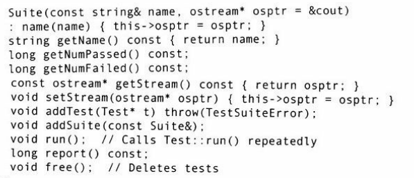

## 2.2.4 TestSuite框架介绍

##### 1.主要类

* Test类
* Suite类

##### 2.Test类

​	是一个抽象基类，内含成功和失败的次数和run方法。

​	使用：重写run方法即可。多用test_宏。

##### 3.初步使用

**案例**

* ```C++
	// DateTest.h
	#ifndef DATETEST_H
	#define DATETEST_H
	#include "Date.h"
	#include "../TestSuite/Test.h"
	
	class DateTest : public TestSuite::Test
	{
	    Date mybday;
	    Date today;
	    Date myevebday;
	
	public:
	    DateTest() : mybday(1951, 10, 1), myevebday("19510930") {}
	    void run()
	    {
	        testOps();
	        testFunctions();
	        testDuration();
	    }
	    void testOps()
	    {
	        test_(mybday < today);
	        test_(mybday <= today);
	        ...
	    }
	    void testFunction()
	    {
	        test_(mybday.getYear() == 1951);
	        ... test_(mybday.toString() == "19511001");
	        ...
	    }
	    void testDuration()
	    {
	        Date d2(2003, 7, 4);
	        Date::Duration dur = duration(mybday, d2);
	        test_(dur.years == 51);
	        test_(dur.months == 9);
	        test_(dur.days == 3);
	    }
	}
	
	#endif 
	
	```

* ```C++
	//DateTest.cpp
	#include <iostream>
	#include "DateTest.h"
	using namespace std;
	
	int main(){
	    DateTest test;
	    test.run();
	    return test.report();
	}
	/*	
		Test：report（）函数显示前面的输出，并且把测试失败的次数作为返回值。
		这个值也适合作为main（）函数的返回值。
	*/
	```

##### 4.异常检测

对于异常，不能直接用布尔表达式来判断，则这样使用来测试成功或失败：

```C++
void testException()
{
    try{
        Date d(0,0,0);		//Invaild
        fail_();			//not throw, fail
    }
    catch(Date::DateError&)
    {
        succeed_();			//throw, success
	}
}

void run()
{
    testException();		//add exception test to run function
    ...
}
```

#### 2.2.5 Suite类配合Test类

​	Suite类可以将测试案例集中到一个函数单元中。程序设计人员可以使用addtest_()成员函数添加一个Test对象到Suite中，也可以使用addSuite()将现有的一个测试套件添加到Suite中。

##### 1.案例

下面是一个案例，测试了和String有关的所有类的测试：

```C++
#include <iostream>
#include "../TestSuite/Suite.h"
#include "StringStorage.h"
#include "Sieve.h"
#include "Find.h"
#include "Rparse.h"
#include "TrimTest.h"
#include "CompStr.h"
using namespace std;
using namespace TestSuite;

int main()
{
	Suite suite("String Tests");		//创建Suite类，用于测试String相关的类
    
    //添加测试类
    suite.addTest(new StringStorageTest);
    suite.addTest(new SieveTest);
    suite.addTest(new FindTest);
    suite.addTest(new RparseTest);
    suite.addTest(new TrimTest);
    suite.addTest(new CompStrTest);
    
    //开始运行测试
    suite.run();
    
    //报告错误（print），并获取错误数量
    long nFail = suite.report();
    
    //释放所有的测试类
    suite.free();
    
    return nFail;
}
```

##### 2.Suite接口

