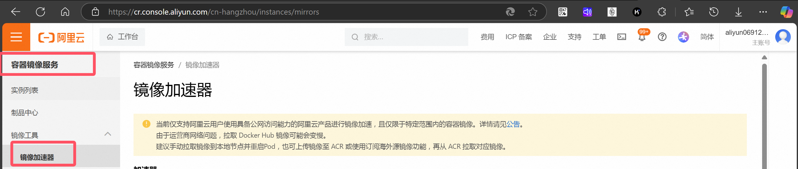

# docker加速（阿里云）

* 进入阿里云
* 搜索：容器镜像服务
* 点击镜像加速器



## 加速镜像网站配置

* 镜像网站需要持续更新，也就是下面list中的网址

```shell
sudo mkdir -p /etc/docker
sudo tee /etc/docker/daemon.json <<-'EOF'
{
  "registry-mirrors": [
    "https://hub.geekery.cn/",
    "https://dockerpull.com",
    "https://docker.hpcloud.cloud",
    "https://docker.m.daocloud.io",
    "https://docker.unsee.tech",
    "https://docker.1panel.live",
    "http://mirrors.ustc.edu.cn",
    "https://docker.chenby.cn",
    "http://mirror.azure.cn",
    "https://dockerpull.org",
    "https://dockerhub.icu",
    "https://hub.rat.dev"
  ]
}
EOF
sudo systemctl daemon-reload
sudo systemctl restart docker
```