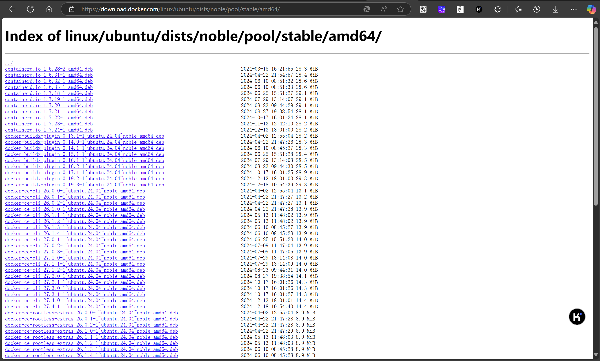

# docker安装（ubuntu）

* 官网教程：[Ubuntu | Docker Docs](https://docs.docker.com/engine/install/ubuntu/)

## 关于在线安装

* 参考链接：https://docs.docker.com/engine/install/ubuntu/#install-using-the-repository

## 关于离线安装

* 参考链接：https://docs.docker.com/engine/install/ubuntu/#install-from-a-package

### 通过命令获取对应ubuntu的版本

```shell
yunyin@Yunyin:~$ lsb_release -cs
No LSB modules are available.
noble
```

如上所示，是noble版本，所以在https://download.docker.com/linux/ubuntu/dists中选择noble

### 下一级目录

继续点击/pool/stable进入下一级目录，这里是稳定版本的docker

### 架构

一般是amd64的传统PC架构，所以选择amd64进入下一级目录

### 最终目录

最后会来到这个目录：[Index of linux/ubuntu/dists/noble/pool/stable/amd64/](https://download.docker.com/linux/ubuntu/dists/noble/pool/stable/amd64/)



需要选择下面的几个deb包各一份（版本选最新的就行）：

```
containerd.io_<version>_amd64.deb
docker-ce_<version>_amd64.deb
docker-ce-cli_<version>_amd64.deb
docker-buildx-plugin_<version>_amd64.deb
docker-compose-plugin_<version>_amd64.deb
```

### 下载安装

将上面的文件下载到本地目录下，然后安装：

```shell
sudo dpkg -i ./containerd.io_<version>_<arch>.deb \
  ./docker-ce_<version>_<arch>.deb \
  ./docker-ce-cli_<version>_<arch>.deb \
  ./docker-buildx-plugin_<version>_<arch>.deb \
  ./docker-compose-plugin_<version>_<arch>.deb
```

Docker 守护程序会自动启动。