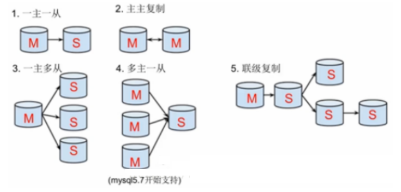

## mysql主从复制理论

#### 1.1 主从复制概念

​	存在一个mysql主数据库和一个mysql从数据库，从数据库负责准实时地同步主库。主库主要完成写操作，从库完成读操作。

**优点：**

* 主库挂掉，从库依旧能提供服务
* 减轻单节点io操作，减轻流量压力
* 读写分离

**方式：**

* 一主一从
* 一主多从
* 多主多从
* 多主一从
* 联级复制



#### 1.2 主从复制原理


```
1.数据库有个bin-log二进制文件，记录了所有sql语句。
2.我们的目标就是把主数据库的bin-log文件的sql语句复制过来。
3.让其在从数据的relay-log重做(中继)日志文件中再执行一次这些sql语句即可。
4.下面的主从配置就是围绕这个原理配置
5.具体需要三个线程来操作：
    5.1 bin-log输出线程:每当有从库连接到主库的时候，主库都会创建一个线程然后发送bin-log内容到从库。在从库里，当复制开始的时候，从库就会创建两个线程进行处理：
    5.2 从库I/O线程:当START SLAVE语句在从库开始执行之后，从库创建一个I/O线程，该线程连接到主库并请求主库发送bin-log里面的更新记录到从库上。从库I/O线程读取主库的binlog输出线程发送的更新并拷贝这些更新到本地文件，其中包括relay-log文件。
    5.3 从库的SQL线程:从库创建一个SQL线程，这个线程读取从库I/O线程写到relay-log的更新事件并执行。
```

**流程步骤：**

```
步骤一：主库db的更新事件(update、insert、delete)被写到binlog
步骤二：从库发起连接，连接到主库
步骤三：此时主库创建一个binlog dump thread线程，把binlog的内容发送到从库
步骤四：从库启动之后，创建一个I/O线程，读取主库传过来的binlog内容并写入到relay
log.
步骤五：还会创建一个SQL线程，从relay log里面读取内容，从
Exec_Master_Log_Pos位置开始执行读取到的更新事件，将更新内容写入到slave的db.
```

