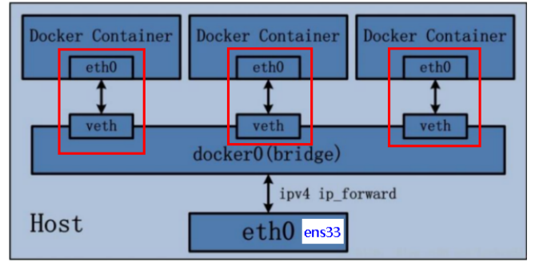
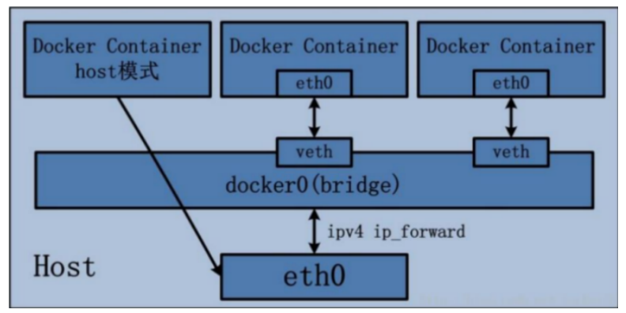
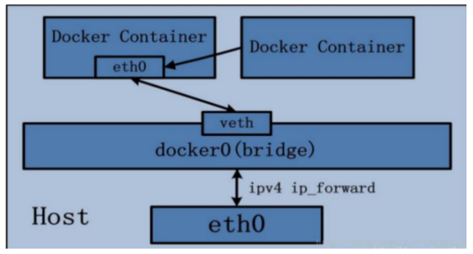

## Docker网络模式详解

#### bridge下基本规则

​	在docker虚拟地址的网段下，容器产生时，ip被分配；容器停止，ip被收回（会被分配给接下来开启的容器）。

### 四种网络模式

#### 1.bridge模式（默认模式）

​	Docker 服务默认会创建一个 docker0 网桥，它在内核层连通了其他的物理或虚拟网卡，这就将所有容器和本地主机都放到同一个物理网络。Docker 默认指定了 docker0 接口 的 IP 地址和子网掩码，让主机和容器之间可以通过网桥相互通信。



​	bridge模式也可以选择自己创建的网络作为网桥。只要在同一网络下，容器都能互相ping通。

**关于bridge连接不上外网的问题的解决方案（开启宿主机的ipv4转发功能）**

```shell
# 修改配置
echo "net.ipv4.ip_forward=1" >> /etc/sysctl.conf

# 重启network
systemctl restart network

# 查看 (0->标识未开启 1->标识开启)
sysctl net.ipv4.ip_forward
# net.ipv4.ip_forward = 1

# 重启docker
systemctl restart docker
```

#### 2.host模式（主机共享ip）

​	容器直接使用宿主机ip与外部进行通信。	

```shell
docker run -it --net=host tomcat /bin/bash
```



#### 3.none模式（少见）

​	在none模式下，并不为Docker容器进行任何网络配置。 也就是说，这个Docker容器没有网卡、IP、路由等信息，只有一个lo需要我们自己为Docker容器添加网卡、配置IP等。

#### 4.container模式（容器共享ip）

​	新建的容器和已经存在的一个容器共享一个网络ip配置而不是和宿主机共享。新创建的容器不会创建自己的网卡，配置自己的IP，而是和一个指定的容器共享IP、端口范围等。



**案例**

```shell
docker run -it --name alpine1 alpine /bin/sh	#第一个容器
docker run -it --network container:alpine1 --name alpine2 alpine /bin/sh	#第二个容器
```

#### 5.自定义网络模式

​	bridge基本规则中，如果一个容器停止，其ip会被分配给其它容器。不利于容器之间的通信时切换ip。因此采用自定义网络模式来通过容器名来访问同一网络下的容器。

##### 5.1 创建网络

```shell
docker network create yunyin_network
```

##### 5.2 使用新网络启动容器

```shell
docker run -d -p 8081:8080 --network yunyin_network --name tomcat81 billygoo/tomcat8-jdk8
#容器1
docker run -d -p 8082:8080 --network yunyin_network --name tomcat82 billygoo/tomcat8-jdk8
#容器2
```

##### 5.3 ping彼此的名字

```shell
ping tomcat82
ping tomcat81
```

**小结：自定义网络本身就维护好了主机名和ip的对应关系（ip和域名都能通）**