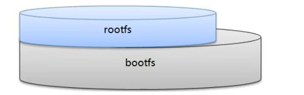
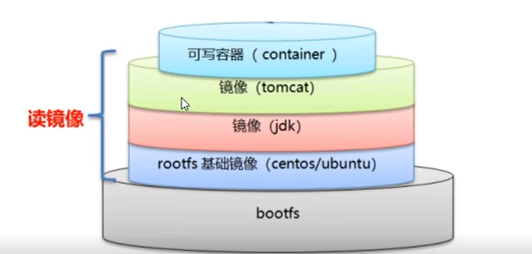

## Docker镜像的底层原理

#### 1. 镜像是分层的文件系统

​	一个镜像，对外表现为一个整体，内部实际是一层一层的小镜像叠加在一起组成的。因此，镜像是分层的文件系统，称为“联合文件系统”。它支持对文件系统（也就是镜像）的修改作为一次提交来层层叠加。

​	存在一个基础镜像，以继承的方式被制作成具体的应用镜像。（类似Java中的Object类）

#### 2. 基础镜像

* bootfs（boot file system）
	* bootloader（用于引导加载kernel启动）
	* kernel（linux内核）
* rootfs（root file system）
	* 表现为典型的Linux系统中的`/dev`、`/proc`、`/bin`、`/etc`等标准文件和目录。
	* 对应不同操作系统的发行版，如Ubuntu、CentOS

#### 3. 镜像结构

下面是镜像的大致结构：

​	只有最上层的容器是可写的文件，其余都是只读的镜像文件。

​	当需要以此作为基础来制作镜像时，在容器的基础上再添加新的文件，并整体再次打包成一个镜像即可。
