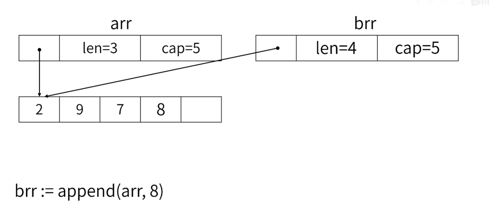
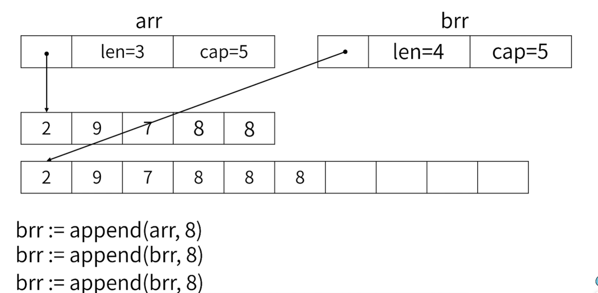
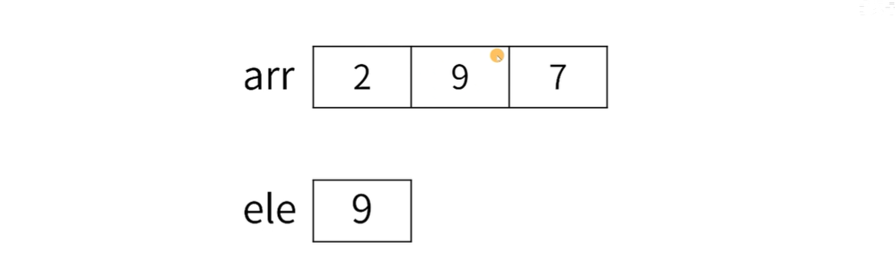

# 05 slice

[TOC]

​	关键字：slice;append;range;浅拷贝;

---

​	slice和数组不一样，数组是固定大小的一段内存，不能改变。

​	slice本质上是一个结构体：

```go
type slice struct {
	array unsafe.Pointer
    len int
    cap int
}
```

## 1. 使用slice：

​	注意：slice之间的赋值是浅拷贝，也就是说共享底层数组。

```go
// Package main -----------------------------
// @file      : slice.go
// @author    : Yunyin
// @contact   : yunyin_jayyi@qq.com
// @time      : 2023/7/27 19:31
// -------------------------------------------
package main

import (
	"fmt"
)

func main() {
	arr := make([]int, 3, 5) //使用make函数来创建，三个参数分别是数据类型，len，cap
	arr[0], arr[1], arr[2] = 2, 5, 7
	brr := arr		
	brr[0] = 4
	fmt.Println(arr)		//[4 5 7]
	fmt.Println(brr)		//[4 5 7]
}

```

## 2. append的两种情况

​	`append`会在给定`slice`的基础上创建一个`slice（len+1）`，并在底层数组增加一个元素，将新的`slice`返回。

```go
arr := make([]int, 3, 5)
arr[0],arr[1],arr[2] = 2, 9, 7
brr := append(arr, 8)
```

​	注意：

* 在**容量足够**的情况下，两个slice**共享**同一个底层数组，但是**len不同**。原slice的len不会增加。



```go
arr := make([]int, 3, 5)
arr[0],arr[1],arr[2] = 2, 9, 7
brr := append(arr, 8)
brr := append(brr, 8)
brr := append(brr, 8)		//此时len为6（下图brr的len标注错误）
```

* 当**容量不足**的情况下，新的slice会拥有一个**扩容**后的底层数组，而原slice依旧指向**老的底层数组**。



## 3. 遍历切片（数组）

​	切片和数组的遍历方式是一样的，都是通过`range`。

​	注意：此处的element是一块**独立的内存**，每次**循环开始**将元素拷贝过来。



```go
for index, element := range arr {
    fmt.Println("%p %p %d %d\n", &element, &arr[index], element, arr[index])
}
```

