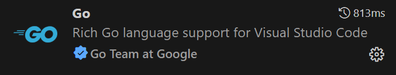
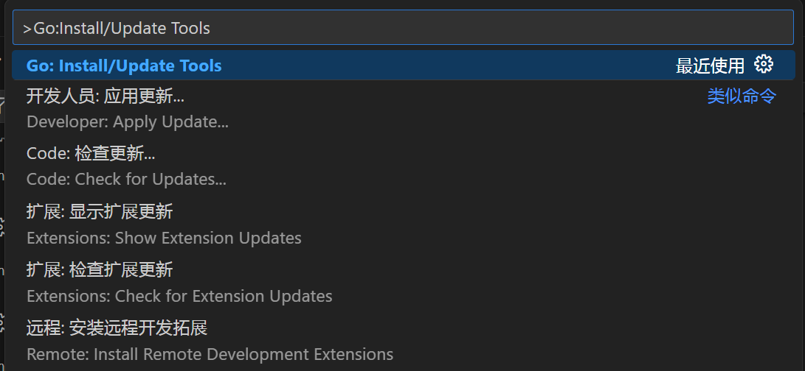
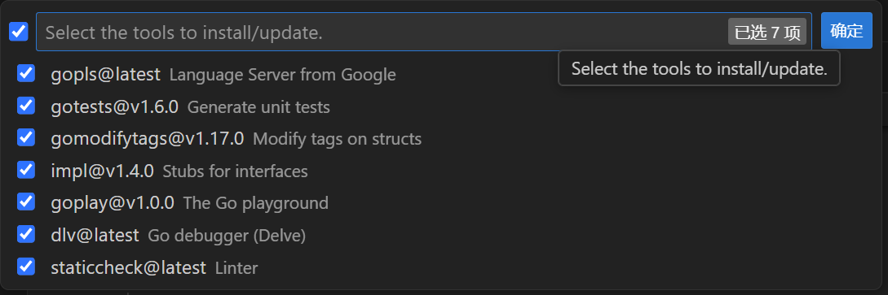
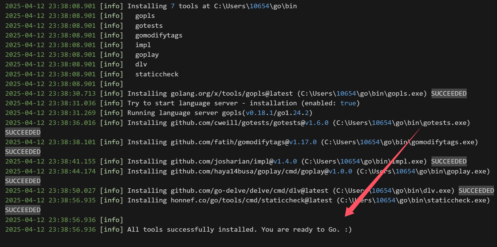
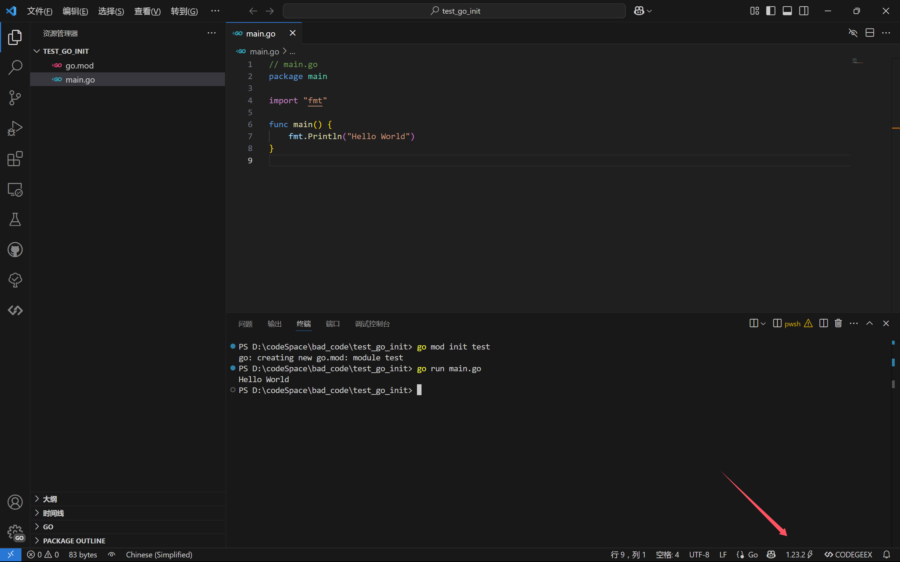
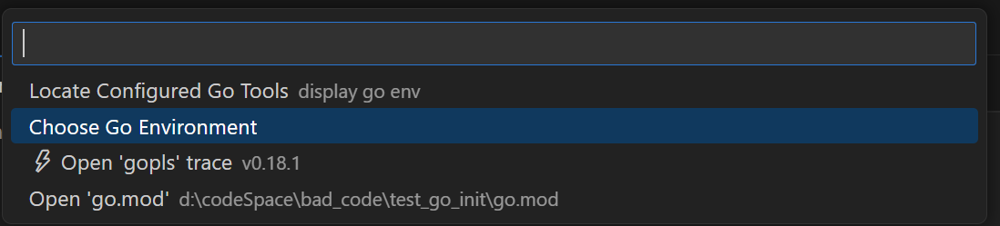
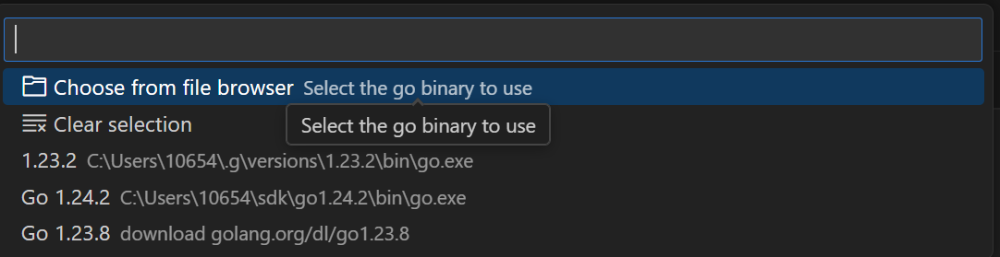

# vscode-golang环境配置

## 1. 安装g工具（推荐）

使用[g工具](../g管理golang版本/g管理go版本.md)去管理golang版本，可以在需要的时候随时切换对应的版本。

当然也可以直接安装golang SDK。

## 2. vscode安装Go插件



安装好后，使用ctrl+shift+P，打开命令面板，输入下面这个命令：



全选之后确定，就可以自动安装对应的golang工具了：



等待输出即可（挂梯子，否则就要配置goproxy环境变量去找国内代理）：



## 测试开发

### 创建初始工程

```powershell
go mod init test
```

### 创建main.go

```go
// main.go
package main

import "fmt"

func main() {
	fmt.Println("Hello World!")
}

```

#### run

```powershell
PS D:\codeSpace\bad_code\test_go_init> go run main.go  
Hello World!
```

## 补充：切换golang版本

在vscode右下角点击当前的golang版本：



点击Choose Go Environment（或者用ctrl+shift+P，输入`Go:Choose Go Environment`）：



由于vscode提供的自动下载的版本不全，因此推荐使用g工具管理golang版本，再从这里去选择对应的go.exe的二进制文件，即可换上对应的golang版本：

