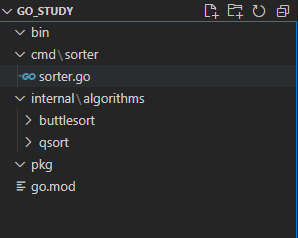
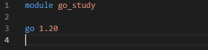
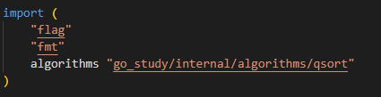

## Go项目结构

#### 总览

```go
/*
--Project path
  --bin     可执行文件
  --build   编译构建结果
  --cmd     代码，甚至可以只有一个main
    --具体包名
  --config  配置文件
  --docs    文档文件
  --example 样例应用程序
  --internal  不便在cmd做展示的、需要隐藏的、需要加密的代码
  --pkg     外部应用程序使用的代码库
  --script  脚本
  --test    测试代码
  --tools   编写的工具，可以从pkg、internal引入代码
  --vender  应用程序依赖项
  go.mod
*/
```

#### 案例



步骤：

* 在根目录下使用`go init mod <modname>`



* 将main包放到cmd目录下，将项目内部使用的包放到internal目录下
* main导入包时，以下图的方式

