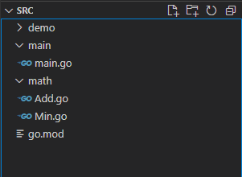

## 一个成功的导包案例

#### 文件目录

注意：一定是打开src目录，如果是上一级目录会报错



#### math包内容

**注意**：函数名首字母一定要**大写**，否则是私有函数

```go
//Add.go
package math

func Add(a int, b int) (res int) {
	return a + b
}


//Min.go
package math

func Min(a int, b int) (res int) {
	return a - b
}
```

#### go.mod内容

使用`go mod init mathtest`自动创建

```go
module mathtest

go 1.19
```

#### main包内容

```go
package main

import (
	"fmt"
	"mathtest/math"
)

func main() {
	fmt.Println(math.Add(1, 2))
	fmt.Println(math.Min(1, 2))
}
```

#### 执行

```go
go run .\main\
```

