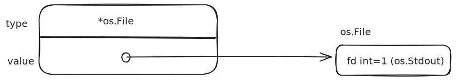
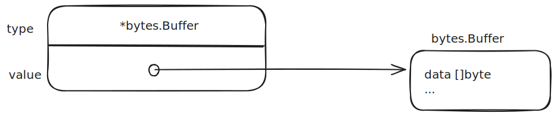

# 接口值

一个接口的值（即接口值），由两个部分组成，它们被称为接口的动态类型和动态值。：

* 类型（例如：int）
* 类型值（例如：2）

> 对于像Go语言这种静态类型的语言，类型是编译期的概念；因此一个类型不是一个值。接口值存储的并不是类型本身，而是类型信息（Type Information）。具体来说：
>
> * **类型信息**：是一个运行时的结构，包含了类型的方法集合、类型名称等元数据。

## 接口值的零值

在Go语言中，变量总是被一个定义明确的值初始化，即使接口类型也不例外。对于一个接口的零值就是它的类型和值的部分都是nil：

```Mermaid
classDiagram
    class 接口值 {
        type: nil
        value: nil
    }
```

（从C++的角度去解读，value等价于this指针，而type等价于虚函数表指针以及其它元信息，下面可以看到）

## 接口值的变化

下面4个语句中，变量w得到了3个不同的值。（开始和最后的值是相同的）

```go
var w io.Writer
w = os.Stdout
w = new(bytes.Buffer)
w = nil
```

### nil

```go
var w io.Writer
```

一个接口值基于它的动态类型被描述为空或非空，所以这是一个空的接口值。你可以通过使用w==nil或者w!=nil来判断接口值是否为空。调用一个空接口值上的任意方法都会产生panic

### *os.File

第二个语句将一个`*os.File`类型的值赋给变量w:

```go
w = os.Stdout
```

这个赋值，调用了一个具体类型的值到接口类型的隐式转换，这和显式的使用`w=io.Writer(os.Stdout)`是等价的。

这个接口值的动态类型被设为`*os.File`指针的类型描述符，它的动态值持有`os.Stdout`的拷贝（这是一个代表处理标准输出的os.File类型变量的指针）：



调用一个包含`*os.File`类型指针的接口值的`Write`方法，使得`(*os.File).Write`方法被调用。（从C++的角度去解读，value等价于this指针，而type等价于虚函数表指针）。

通常在编译期，我们不知道接口值的动态类型是什么，所以一个接口上的调用必须动态查找到方法地址再进行：

因为不是直接进行调用，所以编译器必须把代码生成在类型描述符的方法`Write`上，然后间接调用那个地址。这个调用的主导者（this指针）是一个接口动态值的拷贝：`os.Stdout`。效果和下面这个直接调用一样：

```go
os.Stdout.Write([]byte("hello")) // "hello"
```

### *bytes.Buffer

第三个语句给接口值赋了一个`*bytes.Buffer`类型的值：

```go
w = new(bytes.Buffer)
```

现在动态类型是`*bytes.Buffer`并且动态值是一个指向新分配的缓冲区的指针：



### nil

最后，第四个语句将`nil`赋给了接口值：

```go
w = nil
```

这个重置将它所有的部分都设为`nil`值，把变量w恢复到和它之前定义时相同的状态。

## 比较接口值（==和!=）

接口值可以使用`==`和`!＝`来进行比较。

两个接口值相等仅当：

* 它们都是nil值，
* 它们的动态类型相同，并且动态值也根据这个动态类型的==运算得到相等的结果。

因为接口值是可比较的，所以它们可以用在`map`的键或者作为`switch`语句的操作数。

### 不可比较的类型

如果两个接口值的动态类型相同，但是这个动态类型是不可比较的（比如切片），将它们进行比较就会失败并且`panic`:

```go
var x interface{} = []int{1, 2, 3}
fmt.Println(x == x) // panic: comparing uncomparable type []int
```

考虑到这点，接口类型是非常与众不同的。

其它类型要么是安全的可比较类型（如基本类型和指针）要么是完全不可比较的类型（如**切片，映射类型，和函数**）。但是在比较接口值或者包含了接口值的聚合类型时，我们必须要意识到潜在的panic。

同样的风险也存在于使用接口作为map的键或者switch的操作数。只能比较你非常确定它们的动态值是可比较类型的接口值。

### 获取接口值的动态类型

当我们处理错误或者调试的过程中，得知接口值的动态类型是非常有帮助的。所以我们使用fmt包的%T动作:

```go
var w io.Writer
fmt.Printf("%T\n", w) // "<nil>"
w = os.Stdout
fmt.Printf("%T\n", w) // "*os.File"
w = new(bytes.Buffer)
fmt.Printf("%T\n", w) // "*bytes.Buffer"
```

在fmt包内部，使用反射来获取接口动态类型的名称。

## 警告：一个包含nil值的接口不是nil接口

一个不包含任何值的nil接口值和一个刚好包含nil指针的接口值是不同的。

下面的代码演示了：当`main`函数调用函数`f`时，参数是一个`bytes.Buffer`的空指针。在`*bytes.Buffer`转为`io.Writer`接口时：

```go
out.type = bytes.Buffer
out.value = nil
```

意思就是`out`变量是一个包含空指针值的非空接口，所以防御性检查`out!=nil`的结果依然是true：

```go
const debug = true

func main() {
    var buf *bytes.Buffer
    if debug {
        buf = new(bytes.Buffer) // 创建buf
    }
    f(buf)
}

func f(out io.Writer) {
    // ...do something...
    if out != nil {
        out.Write([]byte("done!\n"))	// 打印log
    }
}
```

解决方案就是将main函数中的变量buf的类型改为io.Writer，因此可以避免一开始就将一个不完整的值赋值给这个接口：

```go
var buf io.Writer	// 声明接口类型，默认是nil接口
if debug {
    buf = new(bytes.Buffer)
}
f(buf) // OK
```