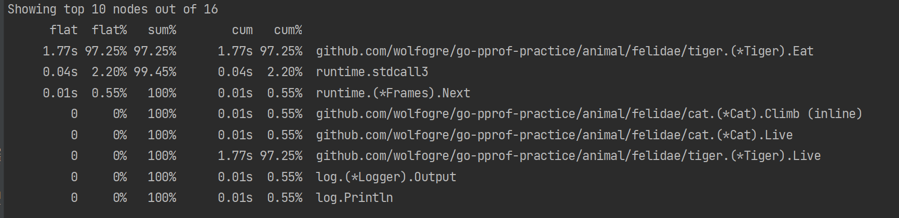
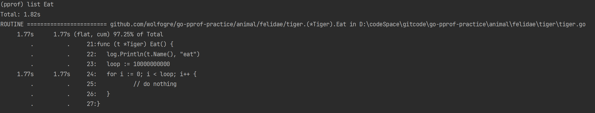

# pprof性能调优

## 代码中使用pprof

​	在main函数开始使用下面的代码开启pprof功能。

```go
package main

import (
	"log"
	"net/http"
	_ "net/http/pprof"
	"os"
	"runtime"
	"time"

	"github.com/wolfogre/go-pprof-practice/animal"
)

func main() {
	log.SetFlags(log.Lshortfile | log.LstdFlags)
	log.SetOutput(os.Stdout)

	runtime.GOMAXPROCS(1)
	runtime.SetMutexProfileFraction(1)
	runtime.SetBlockProfileRate(1)

	go func() {
		if err := http.ListenAndServe(":6060", nil); err != nil {
			log.Fatal(err)
		}
		os.Exit(0)
	}()

	//...
}

```

## 浏览器查看pprof

```http
http://localhost:6060/debug/pprof
```

## 终端查看pprof

### CPU性能分析

```shell
go tool pprof "http://localhost:6060/debug/pprof/profile?seconds=10"	#监测时间10s
```

#### 1. top

​	使用`topN`可以从高到底对CPU性能消耗的函数排序。



其中：

* flat：当前函数（不包括函数调用）消耗的CPU性能
* cum：当前函数（包括函数调用）消耗的CPU性能

#### 2. list

​	使用`list+函数名`列出函数对应的代码。可用此来列出CPU消耗最多的函数对应的代码。

```go
list Eat
```



#### 3. web

​	`web`命令用于使用浏览器查看函数性能的消耗情况。

### 堆内存分析

```shell
go tool pprof -http=:8080 "http://localhost:6060/debug/pprof/heap"
```

