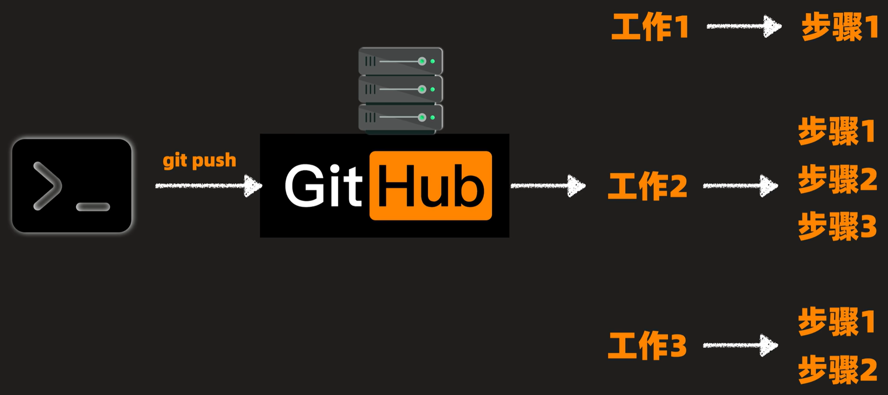

# 工作流

​	github-actions的工作流是，制定一系列工作顺序执行，每个工作的步骤之间顺序执行。

​	GitHub Actions 有一些自己的术语。

（1）**workflow** （工作流程）：持续集成一次运行的过程，就是一个 workflow。

（2）**job** （任务）：一个 workflow 由一个或多个 jobs 构成，含义是一次持续集成的运行，可以完成多个任务。

（3）**step**（步骤）：每个 job 由多个 step 构成，一步步完成。

（4）**action** （动作）：每个 step 可以依次执行一个或多个命令（action）。

## 可参考视频

* ### [为什么大佬都在用 Github Actions 做 CICD？](https://www.bilibili.com/video/BV1jNSEBiE6D)