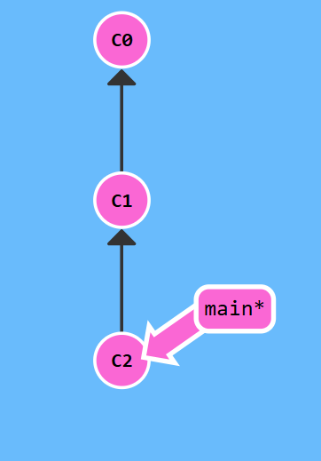
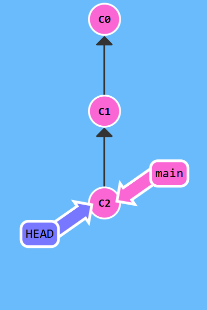

# HEAD与游离的HEAD

在git中，所有的内容都是commit。branch只是一个引用，指向一个commit。

而HEAD则是一个特殊的引用，代表当前所在的commit。它可以指向一个具体的commit，也可以指向一个branch，从而间接指向一个commit。

当HEAD指向一个branch时，它与branch是一体的，在git中不会显示出来。而将它手动指向一个commit时，即使这个commit和原本的branch指向的commit一致，也会因此而脱离，成为一个游离的HEAD。

下面的图片代表了HEAD指向了main branch，间接引用C2：



而如果手动将HEAD分离出来，则会变成这样，HEAD虽然依旧指向了C2，但变成了直接引用：

```shell
git checkout C2
```

