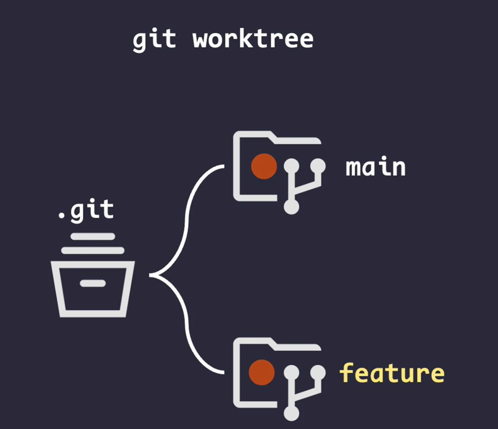

# git worktree代替git stash

当在某个branch上工作时，需要切换到另一个branch里查看某些内容，或者修改另一个branch里的任务。

如果使用git stash，就需要切分支，来回切换，并且stash和pop。

这个时候，可以选择使用git worktree来选择一个目录，存放某个分支的内容，正常使用。这个新建的目录分支的仓库，和当前的目录下的仓库，共享一个.git。



## 临时查看某个分支的内容

```shell
# 新建工作目录为../repo-main，分支为main
git worktree add ../repo-main main
```

## 临时查看某个远端分支的内容

```shell
# 新建工作目录为../repo-origin-main，分支为origin/main
git worktree add ../repo-origin-main origin/main
```

## 删除worktree的目录

```shell
git worktree remove ../repo-origin-main
```

## 新建一个分支放在另一个worktree目录里

```shell
# 新建fix分支，在../repo-fix下
git worktree add -b fix ../repo-fix
```