# git add & commit

## 1. git对象

​	git保存数据，以git对象的形式。

​	有三种git对象，分别对应了不同的struct。

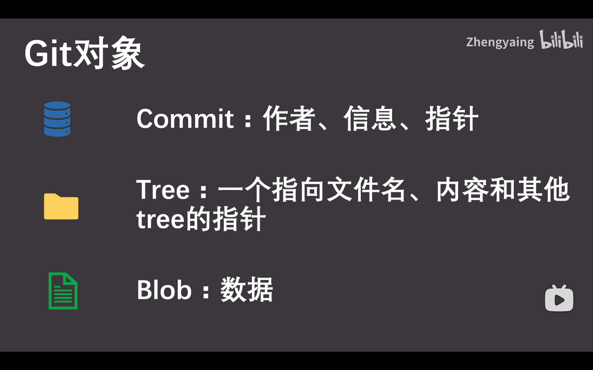

**案例**

​	在一次commit中，存在一个根目录文件夹，其递归包含了文件夹和文件。

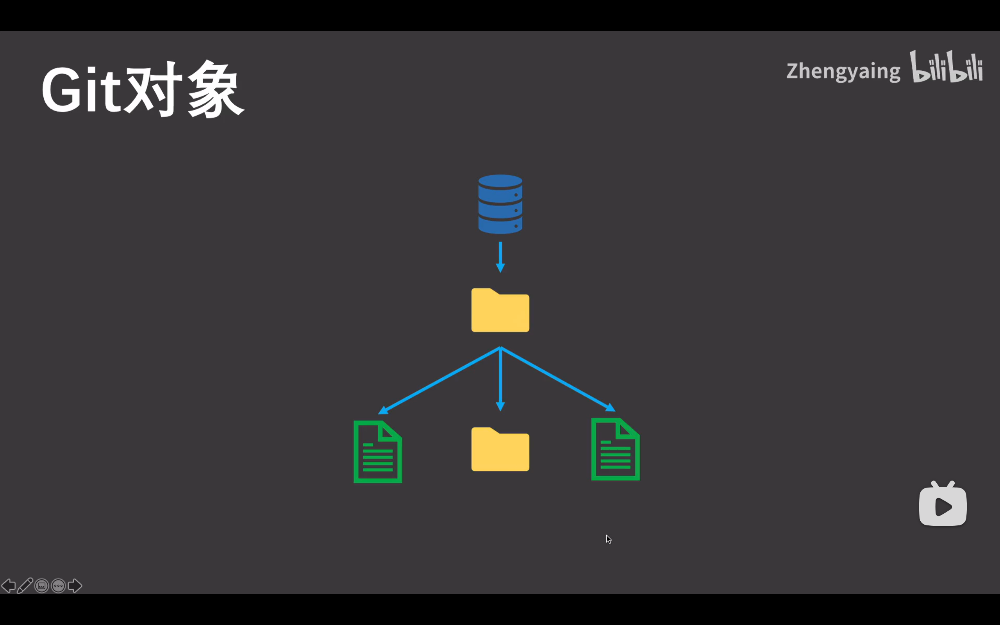

## 2. git对象如何保存

### 保存位置

​	其保存在`.git`下的`objects`中：

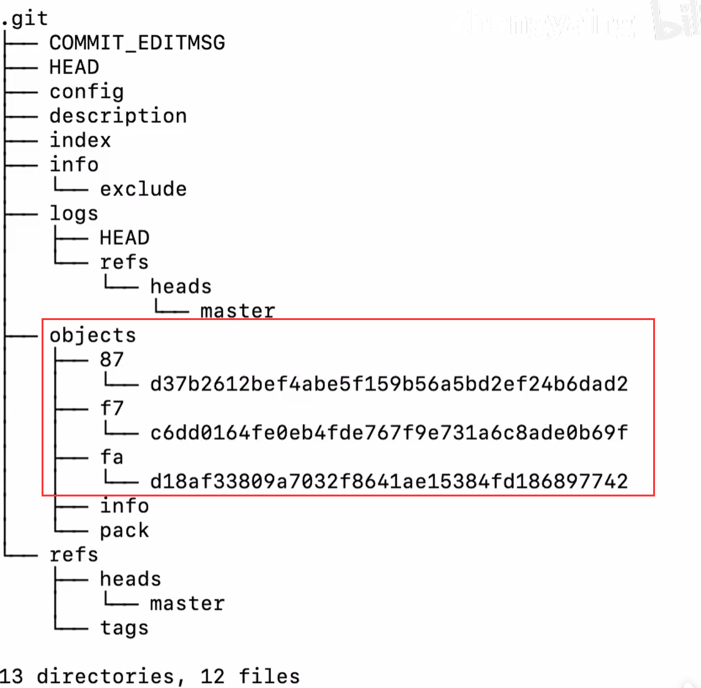

### 保存依据

​	git对象依据文件实际数据进行hash计算，将计算出的hash值与对应的data保存进对应的object中。

​	注意：如果多个文件存储的内容都一样，只会保存为一份object，因为计算出的hash值一致，从而节省空间。

### 查看objects对象的类型

```shell
git cat-file -t fad1	# 目录+hash前2位
```

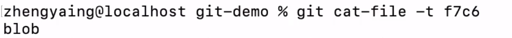

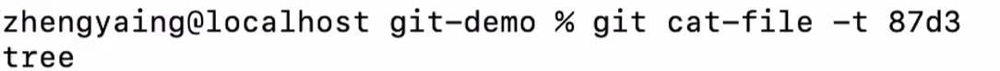

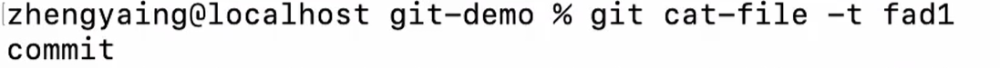

### 查看objects对象的内容

```shell
git cat-file -p fad1	# 目录+hash前2位
```

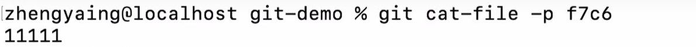

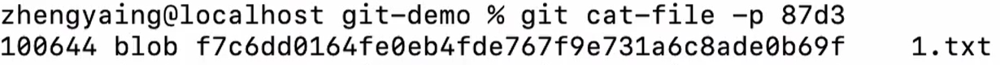

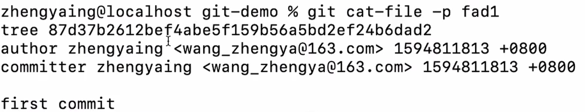

### 解释说明

​	可以看到：

* fad1中是git的commit对象，存储了本次提交的基本信息和根目录tree对象的指针（hash值）。

  （如果不是第一次commit，还会存有指向上一次commit的hash指针`parent`）。

* 87d3中是git的tree对象，即根目录对象，存储了包含的blob对象的指针（hash值）。

* f7c6中是git的blob对象，存储了具体的数据信息。

## 3. git add & git commit过程

### 上一次commit后

​	暂存区的根目录tree指针与代码仓库的根目录tree指针保持一致，都指向了上一次提交的文件数据。

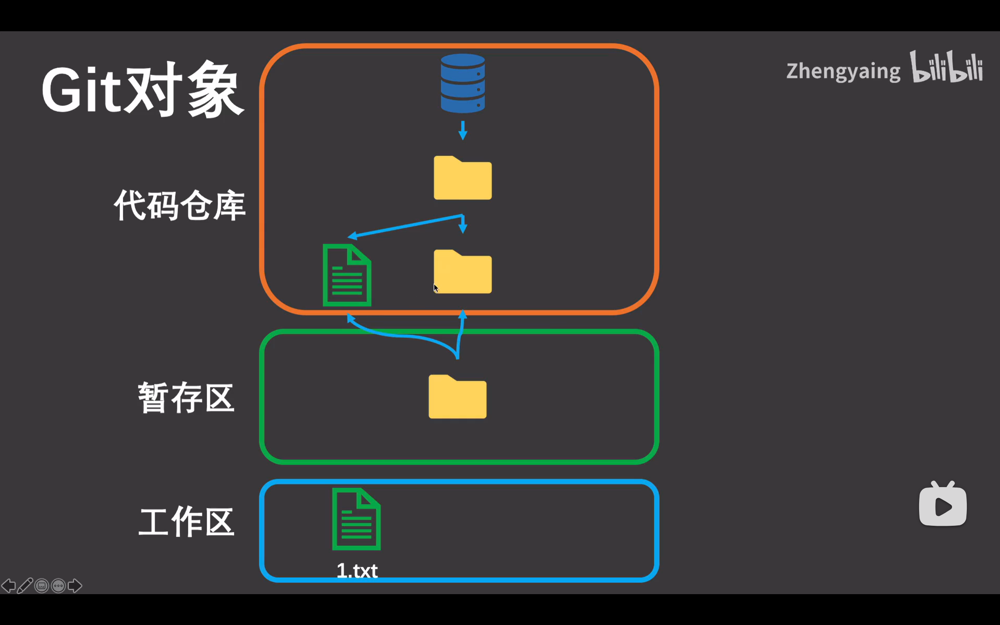

### 修改txt并add后

​	代码仓库直接存储了新的blob对象，并让暂存区的tree对象指向该对象。

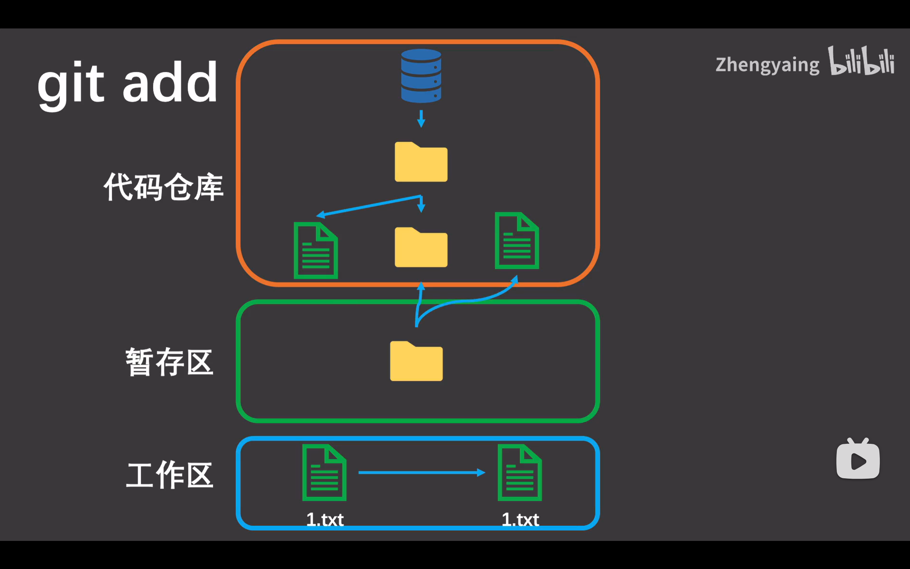

### commit后

​	代码仓库会复制暂存区的tree，然后生成一次新的commit指向该tree，同时设置指针指向上一次commit。

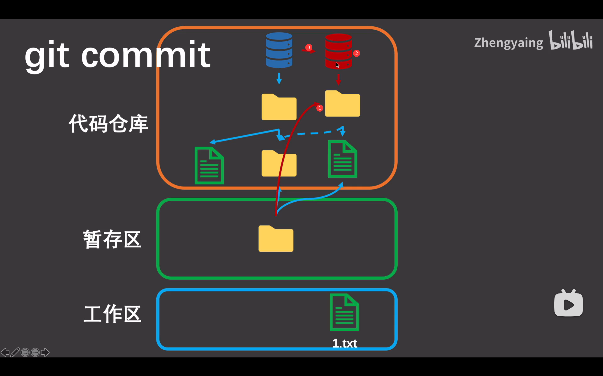

## 4. 相同文件处理

​	相同数据的文件只会保存一份blob的数据对象，在tree中有100个指针指向该blob对象。

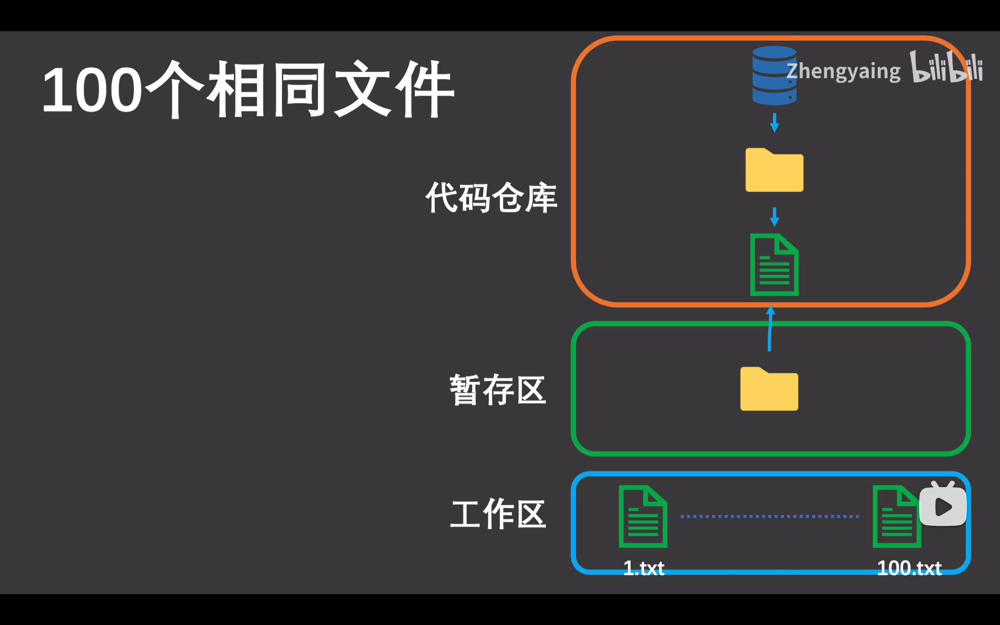

## 参考资料

* [【*原理*解析】让你完全搞明白*Git*是如何管理你的代码的](https://www.bilibili.com/video/BV11z4y1X79p/)