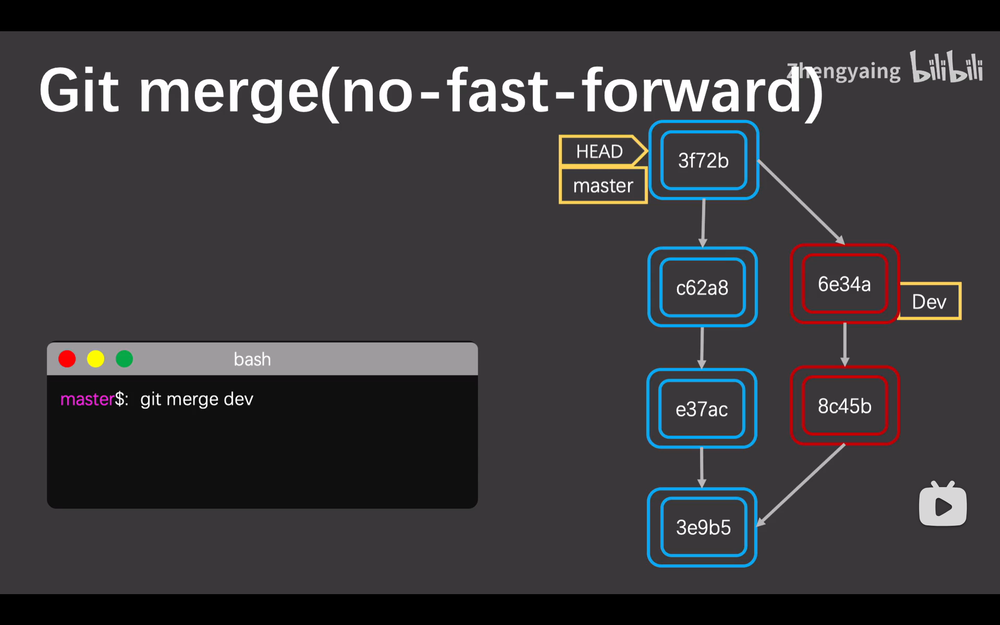
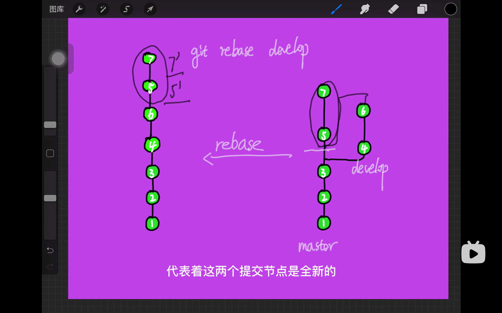

# git merge & git rebase

## git merge

​	git merge会合并两个分支，并形成一个新的commit在合并分支上，因为合并后数据增加，需要重新计算hash值。新的commit指向两个parent。

## git rebase

> git rebase用于精简合并后的分支结构。

​	git rebase同样会合并两个分支，但是是找到两个分支的公共祖先，将别的分支之后所有新的commit先放到公共祖先后，再将自己分支所有新的commit放到后面。

​	注意：这会导致自己分支新的每一个commit重新计算hash值，因为它仅与文件数据有关，而新增了dev分支的内容再次计算hash值，得出的结果自然不同。

## 参考资料

* [【*原理*解析】让你完全搞明白*Git*是如何管理你的代码的](https://www.bilibili.com/video/BV11z4y1X79p/)
* [五分钟学会git rebase和 git merge的区别](https://www.bilibili.com/video/BV1VG411F7rB?spm_id_from=333.1245.0.0)