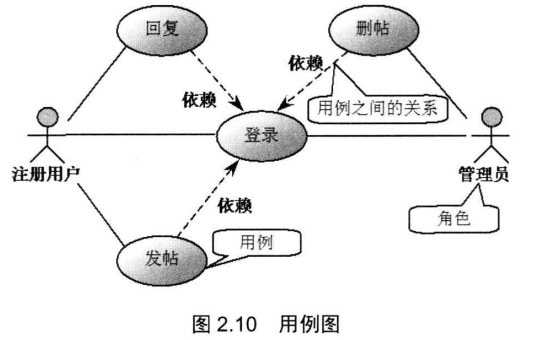
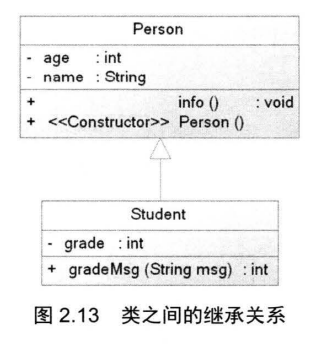
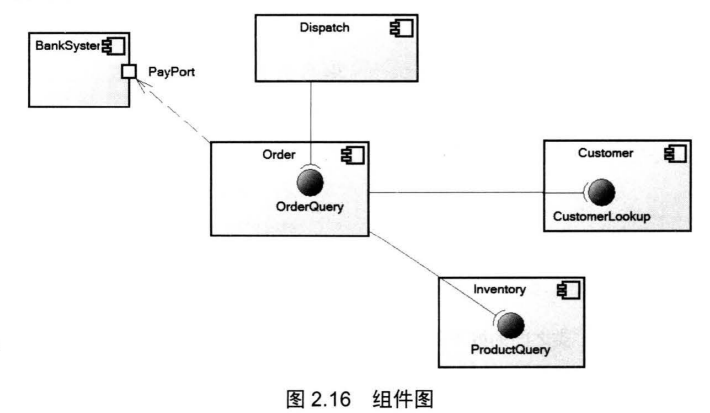

## 2.2UML介绍

#### 2.2.1用例图

> 用例图用于描述系统提供的系列功能 而每个用例则代表系统的一个功能模块。
>
> 用例图通常用于表达系统或者系统范畴的高级功能。

用例图包含：

* 用例：以一个椭圆表示 用例的名称放在椭圆的中 或椭圆下面。
* 角色：Actor，是与系统交互的其他实体，用一个人形符号表示。
* 角色和用例之间的关系：以简单的线段来表示
* 系统内用例之间的关系

#### 2.2.2类图

>类在类图上使用包含 个部分的矩形来描述，最上面的部分显示类的名称，中间部分包含类的属性，最下面的部分包含类的方法。

类之间有3种基本关系：

* **关联(包括聚合、组合)**
* **泛化(与继承同一个概念)**
* **依赖**

##### 1.关联

> 两个类存在关系时，即两个类关联。
>
> 关联具有方向性，从一个类单向访问到另一个类，称为单向关联。互相访问的称为双向关联。一个对象访问关联对象的数目称为多重性。单向关联用一个**带箭头的实线**表示。

**两种关联**

组合比聚合更加严格。聚合和组合的表示方法如下：

##### 2.泛化

> 泛化与继承是同 个概念，都是指子类是一种特殊的父类。
>
> 继承关系使用带**空心三角形**的实线表示。

##### 3.依赖

> 如果一个类的改动会导致另一个类的改动，则称两个类之间存在依赖。依赖关系使用带箭头的虚线
>
> 表示，其中箭头指向被依赖的实体。

依赖常见：

* 改动的类将消息发给另一个类。
* 改动的类以另一个类作为数据部分
* 改动的类以另一个类作为操作参数

注意：依赖是一种弱关系，很多时候是碰巧需要的，而不如关联存在的强语义上的联系。

[(19条消息) 关联和依赖的区别_Answer-3的博客-CSDN博客_关联和依赖](https://blog.csdn.net/u014805066/article/details/70255036)

---

#### 2.2.3组件图

> 一个组件常常含有多个或多组类组成，来完成一系列复杂功能。在Java中打包为JAR、WAR文件，在C++中打包为函数库或DLL形式。
>
> 组件图通常包含组件、接口和 Port 等图元， UML 使用带门符号的矩形来表示组件，使用圆圈代表接口，使用位于组件边界上的小矩形代表Port。

​	从图 2.16 可以看出，本系统绘制电子购物平台的几个核心组件，其中 Order 组件提供 OrderQuery接口，该接口允许 Dispatch 组件查询系统中的订单及其状态， Order 件又需要依赖于 Customer 组件的CustomerLookup 接口，通过该接口查询系统中的顾客信息; Order 组件也需要依赖于Inventory 组件的ProductQuery 接口，通过该接口查询系统中的产品信息。

